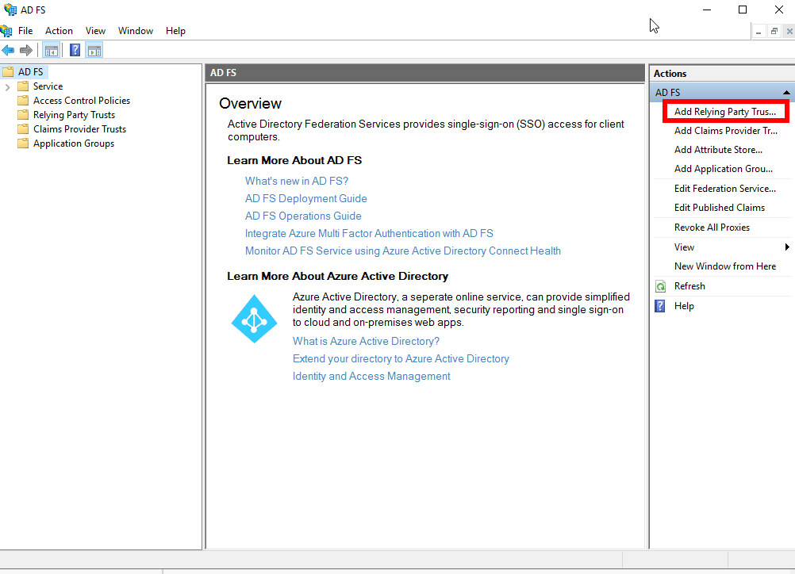

# Gravwellシングルサインオン

GravwellのGUIは、SAMLを使用したシングルサインオンをサポートしています。 理論的には、SAML準拠のIDプロバイダーを使用してログインできます。このページではGravwellのSSO構成オプションについて説明し、Windows AD FSサーバーで認証するようにGravwellを構成する方法の例を示します。

注：通常のユーザーはSSO経由でログインしますが、デフォルトの「admin」ユーザーはログインしません。 SSOをすぐに設定する場合でも、新しいシステムをセットアップするときは、必ず管理ユーザーのパスワードを変更してください。 Gravwell管理ユーザーは、必要に応じてGUI内から新しい非SSOユーザーアカウントを作成できることにも注意してください。

## Gravwell SSO構成パラメーター

GravwellインスタンスでSSOを有効にするには、SSOセクションをWebサーバーの`gravwell.conf`ファイルに挿入する必要があります。 Windows AD FSサーバーで動作する最小限の構成を次に示します。

```
[SSO]
	Gravwell-Server-URL=https://gravwell.example.org
	Provider-Metadata-URL=https://sso.example.org/FederationMetadata/2007-06/FederationMetadata.xml
```

基本的なSSO構成パラメーターは次のとおりです。

* `Gravwell-Server-URL` (必須): SSOサーバーが認証した後、ユーザーがリダイレクトされるURLを指定します。 これは、Gravwellサーバーのユーザー向けのホスト名またはIPアドレスである必要があります。
* `プロバイダーメタデータURL` (必須):SSOサーバーのXMLメタデータのURLを指定します。 上記のパス (`/FederationMetadata/2007-06/FederationMetadata.xml`) はAD FSサーバーで機能するはずですが、他のSSOプロバイダー用に調整する必要がある場合があります。
* `Insecure-Skip-TLS-Verify` [デフォルト：false]：trueに設定されている場合、このパラメーターはSSOサーバーとの通信時に無効なTLS証明書を無視するようGravwellに指示します。 このオプションは注意して設定してください！

以下は、SSOプロバイダーに基づいて調整する必要のある、より高度なパラメーターです。 デフォルトは、Microsoft AD FSサーバーに適しています。

* `ユーザー名属性` [デフォルト]: "http://schemas.xmlsoap.org/ws/2005/05/identity/claims/upn"]: ユーザー名を含むSAML属性を定義します。 Shibbolethサーバーでは、代わりに "uid" に設定する必要があります。
* `共通名属性` [デフォルト: "http://schemas.xmlsoap.org/claims/CommonName"]: ユーザーの"共通名"を含むSAML属性を定義します。Shibbolethサーバーでは、代わりに"cn"に設定する必要があります。
* `名の属性` [デフォルト: "http://schemas.xmlsoap.org/ws/2005/05/identity/claims/givenname"]: ユーザーの名を含むSAML属性を定義します。 Shibbolethサーバーでは、代わりに"givenName"に設定する必要があります。
* `姓属性` [デフォルト: "http://schemas.xmlsoap.org/ws/2005/05/identity/claims/surname"]: ユーザーの姓を含むSAML属性を定義します。
* `メール属性` [デフォルト: "http://schemas.xmlsoap.org/ws/2005/05/identity/claims/emailaddress"]: ユーザーのメールアドレスを含むSAML属性を定義します。 Shibbolethサーバーでは、代わりに"mail"に設定する必要があります。

## 例：Windows Server 2016のセットアップ

Gravwell SSOは、Windows Serverで提供されるMicrosoftのAD FS（Active Directoryフェデレーションサービス）とうまく機能します。 SSO認証用にAD FSとGravwellを構成する方法について説明します。

開始する前に、サーバーにActive DirectoryとAD FSがインストールされている必要があります。 これらのサービスの基本的なインストールとセットアップは、このドキュメントの範囲外です。SSOをセットアップする場合は、おそらくActive Directoryが既に構成されていると想定しています。

### Gravwellをセットアップする

AD FSを構成するには、GravwellインスタンスのSSOメタデータファイルが必要です。 したがって、最初にGravwellをセットアップします。 Gravwell GUIにSSOボタンが表示されますが、AD FSを構成するまで無効になります。 SSOを有効にするには、Gravwell WebサーバーでTLS証明書（自己署名またはその他）を設定する必要があります。 TLSのセットアップ手順については、[このドキュメントセクション](certificates.md)を参照してください。

`gravwell.conf`を開き、`[Global]`セクションの下に`[SSO]`セクションを追加します。 AD FSサーバーが「sso.example.org」にあり、Gravwell Webサーバーが「gravwell.example.org」にある場合、設定は次のようになります。

```
[SSO]
	Gravwell-Server-URL=https://gravwell.example.org
	Provider-Metadata-URL=https://sso.example.org/FederationMetadata/2007-06/FederationMetadata.xml
```

何らかの理由でAD FSサーバーで自己署名証明書を使用している場合、セクションに`Insecure-Skip-TLS-Verify=true`を追加する必要があります。

Gravwell Webサーバーを再起動します (`systemctl restart gravwell_webserver.service`)。 再び表示されるはずです。 そうでない場合は、設定のタイプミスを確認し、`/dev/shm/gravwell_webserver.service` and `/opt/gravwell/log/web/` でエラーを確認します。

### 証明書利用者を追加

ここで、Gravwellからの認証要求を受け入れるようにAD FSサーバーを構成する必要があります。 AD FS管理ツールを開き、"証明書利用者信頼の追加"を選択します。



これにより、証明書利用者信頼の追加ウィザードが開きます。 クレーム対応アプリケーションまたは非クレーム対応アプリケーションのどちらが必要かを最初に尋ねます。 [クレーム対応]を選択し、[開始]をクリックします。

Gravwellサーバーに関するメタデータ情報をAD FSに取得するには、2つの方法のいずれかを選択する必要があります。 Gravwellサーバーが適切に署名されたTLS証明書を使用する場合、最初のオプションの"フェデレーションメタデータアドレス"フィールドにURLを入力し、[次へ]をクリックするだけです。


ただし、Gravwellが自己署名証明書を使用している場合は、最初にメタデータを手動でダウンロードする必要があります。 Webブラウザーを開き、`https://gravwell.example.org/saml/metadata`に移動します。 プロンプトが表示されたらファイルを保存し、ウィザードに戻って2番目のオプションで適切なパスを設定します。


ウィザードの次のページで、表示名を設定するように求められます。 "Gravwell"またはそれに類似したもので十分です。 ウィザードの以降のページで、デフォルトのままにすることができます。

### 依拠当事者の請求発行ポリシーの編集

ここで、いくつかのクレーム発行変換ルールを依存ポリシーに追加する必要があります。 新しく作成された証明書利用者の"クレーム発行ポリシーの編集"を選択します。


3つのルールを作成する必要があります。 最初に、[ルールの追加]をクリックしてウィザードを開きます。"LDAP属性をクレームとして送信"を選択し、[次へ]をクリックして、次のように入力します。


次に、別のルールを作成します。今回は、"着信クレームの変換"を選択し、以下に示すように入力します。


最後に、"カスタムルールを使用してクレームを送信する"を選択し、次のテキストをフィールドに貼り付けて、別のルールを作成します。

```
c:[Type == "http://schemas.microsoft.com/ws/2008/06/identity/claims/windowsaccountname", Issuer == "AD AUTHORITY"]
=> issue(store = "Active Directory",
types = ("http://schemas.xmlsoap.org/ws/2005/05/identity/claims/emailaddress",
"http://schemas.xmlsoap.org/ws/2005/05/identity/claims/givenname",
"http://schemas.xmlsoap.org/ws/2005/05/identity/claims/surname"),
query = ";mail,givenName,sn;{0}", param = c.Value);
```


終了したら、次の3つのルールが必要です。


### テスト構成

AD FSとGravwellの両方を構成すると、GravwellログインページでSSOログインボタンが有効になります。


クリックすると、WindowsサーバーのAD FS認証ページが表示されます。 ユーザー名にドメインを含む、Active Directoryユーザーの1人として認証します（"jfloren"ではなく"jfloren@gravwell.io"と入力します）。


[サインイン]をクリックすると、Gravwell UIに戻ります。今回は適切なユーザーとしてログインします。