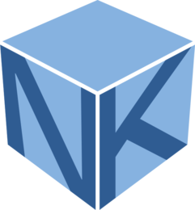

# 

# Soliton NK

Soliton NKは[Gravwell社](https://www.gravwell.io/)のデータ分析プラットフォーム技術を使用しています。
以下はGravwellのドキュメントの日本語訳です。

# Gravwell

このサイトには、Gravwellのドキュメントに加えて、変更ログなどの他のリソースが含まれています。

Gravwellを始めたばかりの場合は、最初に[Quickstart](quickstart/quickstart.md)を読んでから、[Search pipeline](search/search.md)ドキュメントに進んで詳細を確認することをお勧めします。

Gravwellは無料の[Community Edition](https://www.gravwell.io/download)を発表します。

[クイックスタート](quickstart/quickstart.md)

  * [ダウンロード](quickstart/downloads.md)

[Gravwellによる検索方法](search/search.md)

  * [検索モジュール](search/searchmodules.md)

  * [レンダリングモジュール](search/rendermodules.md)

[Gravwellシステムアーキテクチャ](architecture/architecture.md)

[Ingesters設定](ingesters/ingesters.md)

  * [サービス インテグレーション](ingesters/integrations.md)

[Gravwellのインストールと構成](configuration/configuration.md)

  * [Dockerの展開](configuration/docker.md)

  * [TLS/HTTPSのセットアップ](configuration/certificates.md)
  
  * [エクストラクターのセットアップ](configuration/autoextractors.md)
  
  * [データエイジアウト](configuration/ageout.md)
 
  * [データアーカイブ](configuration/archive.md)

  * [データ複製](configuration/replication.md)

  * [クエリ高速化](configuration/accelerators.md)

[//]: # (* [データの自動抽出](configuration/autoextractors.md))

  * [分散フロントエンド](distributed/frontend.md)

  * [環境変数](configuration/environment-variables.md)

  * [詳細な構成パラメーター](configuration/parameters.md)

[リソースシステム](resources/resources.md)

[オーケストレーション](scripting/scriptingsearch.md)

  * [スクリプティング](scripting/scripting.md)

[GUIユーザー設定](configuration/gui.md)

[コマンドラインクライアントの使用](cli/cli.md)

[API](api/api.md)

[ライセンス](license/license.md)

[変更ログ](changelog/list.md)

ドキュメント バージョン 2.0
