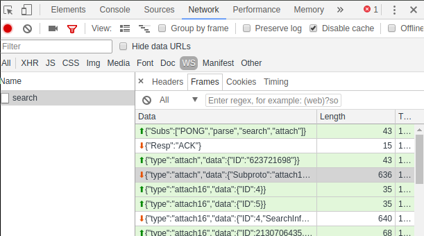

# レンダリングモジュールAPI

レンダリングモジュールは、検索に関する情報、検索の実際のエントリ、および検索に関する統計を取得するためのAPIを提供します。 APIコマンドは、検索の開始時に確立されたWebSocketサブプロトコルを介してJSONとして送信されます。 サブプロトコルと検索の開始については、[検索APIドキュメント](#!api/websocket-search.md)を参照してください。

これらの記事の内容以外に、render moduleコマンドがどのように機能するかを確認する最も簡単な方法は、Webブラウザーのコンソール（ChromeではF12）を使用することです。 Websocketトラフィックを表示するセクションを見つけて、送受信されたメッセージを参照します。



WebSocketトラフィックを監視する別の方法は、[Gravwell CLIクライアント](#！cli/cli.md）を`-debug`フラグを指定して実行することです。 フラグは引数としてファイル名を取ります。 WebSocketとの間で送受信されるJSONメッセージは、そのファイルに書き込まれます。

## すべてのレンダーモジュールに共通の操作ID

すべてのレンダリングモジュールは、次の要求に応答します：

| リクエスト名 | 16進数 | 10進数 | 説明 |
|--------------|-----------|---------------|-------------|
| REQ_CLOSE				| 0x1			| 1			| チャネルを閉じます |
| REQ_ENTRY_COUNT		| 0x3			| 3			| 見られたエントリの数を取得します |
| REQ_SEARCH_DETAILS	| 0x4			| 4			| 検索に関する詳細情報を取得します |
| REQ_SEARCH_TAGS		| 0x5			| 5			| 検索で使用されるタグマップを取得します |
| REQ_GET_ENTRIES		| 0x10			| 16		| インデックスで検索エントリのブロックをリクエストします |
| REQ_STREAMING			| 0x11			| 17		| 検索エントリが届いたら送信するように要求します |
| REQ_TS_RANGE			| 0x12			| 18		| 時間範囲ごとにエントリのブロックを要求します |
| REQ_GET_EXPLORE_ENTRIES	| 0xf010	| 61456		| [data exploration](explore.md)を適用して、インデックスでエントリのブロックをリクエストします |
| REQ_EXPLORE_TS_RANGE		| 0xf012	| 61458		| [data exploration](explore.md)を適用して、時間範囲ごとにエントリのブロックを要求します |
| REQ_STATS_SIZE		| 0x7F000001	| 2130706433| 統計データのサイズをリクエストします |
| REQ_STATS_RANGE		| 0x7F000002	| 2130706434| 利用可能な統計の時間範囲をリクエストします |
| REQ_STATS_GET			| 0x7F000003	| 2130706435| 統計をリクエストします |
| REQ_STATS_GET_RANGE	| 0x7F000004	| 2130706436| 特定の時間範囲からの統計を要求します |
| REQ_STATS_GET_SUMMARY	| 0x7F000005	| 2130706437| 統計の要約を要求します |
| REQ_SEARCH_METADATA   | 0x10001 | 65537 | クエリの列挙値メタデータ統計を要求します |

応答値は要求と同じですが、特別な応答コード`RESP_ERROR`（0xFFFFFFFF）が追加されています.

| 応答名 | 16進数 | 10進数 | 説明 |
|--------------|-----------|---------------|-------------|
| RESP_ERROR				| 0xFFFFFFFF	| 4294967295| (エラー)|
| RESP_CLOSE				| 0x1			| 1			| ソケットは閉じられます|
| RESP_ENTRY_COUNT			| 0x3			| 3			| エントリ数を返します|
| RESP_SEARCH_DETAILS		| 0x4			| 4			| 検索に関する情報を返します|
| RESP_SEARCH_TAGS			| 0x5			| 5			| 検索用のタグマップを返します|
| RESP_GET_ENTRIES			| 0x10			| 16		| 検索エントリを返します|
| RESP_STREAMING			| 0x11			| 17		| 検索エントリがストリーミングされます|
| RESP_TS_RANGE				| 0x12			| 18		| 時間範囲のエントリのブロックを返します |
| RESP_GET_EXPLORE_ENTRIES	| 0xf010	| 61456		| [data exploration](explore.md)が適用された状態で、エントリのブロックをインデックスで返します |
| RESP_EXPLORE_TS_RANGE		| 0xf012	| 61458		| [data exploration](explore.md)を適用して、時間範囲ごとにエントリのブロックを返します |
| RESP_STATS_SIZE			| 0x7F000001	| 2130706433| 統計データのサイズを返します |
| RESP_STATS_RANGE			| 0x7F000002	| 2130706434| 統計の時間範囲を返します |
| RESP_STATS_GET			| 0x7F000003	| 2130706435| 統計を返します |
| RESP_STATS_GET_RANGE		| 0x7F000004	| 2130706436| 時間範囲の統計を返します |
| RESP_STATS_GET_SUMMARY	| 0x7F000005	| 2130706437| 統計の要約を返します |
| RESP_SEARCH_METADATA           | 0x10001 | 65537 | クエリの列挙値メタデータ統計を返します |

APIリクエストは、検索の作成時に確立された検索サブプロトコルを介してJSONとして送信する必要があります。

## 応答形式

すべてのモジュールは同じコマンドに応答しますが、関連するデータ型の性質が異なるため、エントリを返す形式は異なります。[Renderer API Response Formatsドキュメント](websocket-render-responses.md)は、各レンダーモジュールで使用される応答フォーマットについて説明しています。 この記事の残りの部分に示されている例は、テキストレンダラーとテーブルレンダラーからの応答を示しています。

## チャネルを閉じる（リクエスト0x1）

検索への現在の接続を閉じるには、次の構造をWebSocketに送信します：

```
{
        "ID": 1
}
```

ソケットは応答する必要があります：

```
{
        "ID": 1,
        "EntryCount": 0,
        "AdditionalEntries": false,
        "Finished": false,
        "Entries": []
}
```

## エントリ数を取得します（リクエスト0x3）

REQ_ENTRY_COUNTコマンドは、レンダーモジュールに到達したエントリの総数を要求します：

```
{
        "ID": 3
}
```

この例では、モジュールは41のエントリがあると応答しました：

```
{
        "ID": 3,
        "EntryCount": 41,
        "AdditionalEntries": false,
        "Finished": true
}
```

重要：ここで報告される数は、**レンダラーが受信したエントリの総数**です。 REQ_GET_ENTRIESなどの他のコマンドを使用すると、返されるエントリが少なくなる場合があります。 これは、一部のレンダラー（表やグラフなど）が*凝縮*レンダラーであるためです。

## 検索の詳細を取得する（リクエスト0x4）

REQ_SEARCH_DETAILSコマンド（0x4）は、検索自体に関する情報を要求します：

```
{
        "ID": 4
}
```

応答には、統計情報と検索自体に関する情報が含まれています：

```
{
	"ID": 4,
	"Stats": {
		"Size": 0,
		"Set": [
			{
				"TS": "2018-04-02T07:56:47.422345249-06:00",
				"Stats": []
			},
<some entries elided for brevity>
			{
				"TS": "2018-04-02T10:17:24.922345249-06:00",
				"Stats": [
					{
						"Name": "packet",
						"Args": "packet ipv4.SrcIP",
						"InputCount": 1619,
						"OutputCount": 1619,
						"InputBytes": 2034920,
						"OutputBytes": 2052729,
						"Duration": 54936015
					},
					{
						"Name": "count",
						"Args": "count by SrcIP",
						"InputCount": 1619,
						"OutputCount": 88,
						"InputBytes": 2052729,
						"OutputBytes": 28931,
						"Duration": 129787584
					}
				]
			},
<some entries elided for brevity>
			{
				"TS": "2018-04-02T12:47:24.922345249-06:00",
				"Stats": []
			},
			{
				"TS": "2018-04-02T12:52:06.172345249-06:00",
				"Stats": [
					{
						"Name": "packet",
						"Args": "packet ipv4.SrcIP",
						"InputCount": 1,
						"OutputCount": 1,
						"InputBytes": 99,
						"OutputBytes": 110,
						"Duration": 14480829
					},
					{
						"Name": "count",
						"Args": "count by SrcIP",
						"InputCount": 1,
						"OutputCount": 1,
						"InputBytes": 110,
						"OutputBytes": 110,
						"Duration": 52235061
					}
				]
			}
		],
		"RangeStart": "2018-04-02T07:56:47.422345249-06:00",
		"RangeEnd": "2018-04-02T12:56:47.422345249-06:00",
		"Current": "2018-04-02T07:56:47.422345249-06:00"
	},
	"SearchInfo": {
		"ID": "677124412",
		"UID": 1,
		"UserQuery": "tag=pcap packet ipv4.SrcIP | count by SrcIP | table SrcIP count",
		"EffectiveQuery": "tag=pcap packet ipv4.SrcIP | count by SrcIP | table SrcIP count",
		"StartRange": "2018-04-02T07:56:47.422345249-06:00",
		"EndRange": "2018-04-02T12:56:47.422345249-06:00",
		"Descending": true,
		"Started": "2018-04-02T12:56:47.430572676-06:00",
		"LastUpdate": "0001-01-01T00:00:00Z",
		"StoreSize": 75960,
		"IndexSize": 32,
		"ItemCount": 1575,
		"TimeZoomDisabled": false,
		"RenderDownloadFormats": [
			"json",
			"csv",
			"lookupdata"
		],
		"Duration": "0s",
		"Tags": ["pcap"]
	},
	"EntryCount": 1575,
	"AdditionalEntries": false,
	"Finished": true
}
```

## タグマップの取得（リクエスト0x5）

タグマップを要求するには、リクエストID0x5を標準のWebSocketサブプロトコルに送信します：

```
{
        "ID": 0x5,
}
```

応答は次のようになり、タグ名から数値タグインデックスへのマップが表示されます：

```
{
        "ID": 0x5,
        "Tags": {
                "default": 0,
				"tagmctaggy": 1,
				"apache": 2,
				"syslog: 3,
				"gravwell": 4
			},
}
```

## エントリの取得（リクエスト0x10）

リクエスト0x10（10進数の16）は、レンダラーからのエントリのブロックをリクエストします。`First`フィールドと`Last`フィールドを使用して、必要なエントリを指定します。 レンダラーは、REQ_ENTRY_COUNT（0x3）要求に応答してエントリがいくつあるかを報告します。

このコマンドは、最初の1024エントリを要求します（指定されていない場合、`First`はデフォルトで0になります）。

```
{
	"ID": 16,
	"EntryRange": {
		"Last": 1024
	}
}
```

サーバーは、一連のエントリと追加情報で応答します。

```
{
	"ID": 16,
	"EntryCount": 1575,
	"AdditionalEntries": false,
	"Finished": true,
	"Entries": {
		"Rows": [
			{
				"TS": "2018-04-02T10:30:29-06:00",
				"Row": [
					"10.144.162.236",
					"9410"
				]
			},
<67 similar entries elided>
			{
				"TS": "2018-04-02T10:28:51-06:00",
				"Row": [
					"192.168.1.1",
					"2"
				]
			}
		],
		"Columns": [
			"SrcIP",
			"count"
		]
	}
}
```

`"AdditionalEntries"false`フィールドに注意してください。 これは、これ以上読み取るエントリがないことを意味します。 このフィールドがtrueに戻った場合は、「First」を1024に、「Last」を2048に設定してコマンドを再発行し、使用できるエントリがなくなるまで繰り返すことで、さらに多くのエントリを読み取ることができます。

## ストリーミング結果をリクエストする（リクエスト0x11）

リクエストID0x11を送信することで、クライアントはレンダラーがWebSocketを介してできるだけ早くエントリを送信するようにリクエストできます。エントリがすぐにディスクまたは他の簡単な操作に書き込まれない限り、これは一般的に推奨されません。 レンダリングモジュールは、クライアントが結果を処理するよりも速く結果を出力できることがよくあります。REQ_GET_ENTRIESコマンドを使用して、結果をブロックごとにフェッチすることをお勧めします。

ストリーミングをリクエストするには：

```
{
	"ID": 17
}
```

レンダラーは、エントリの大きなブロックをできるだけ早く送信し始めます:

```
{
	"ID": 17,
	"EntryCount": 1000,
	"AdditionalEntries": false,
	"Finished": false,
	"Entries": [
<1000 entries elided>
	]
}
<many other entry blocks elided>
{
	"ID": 17,
	"EntryCount": 861,
	"AdditionalEntries": false,
	"Finished": false,
	"Entries": [
<861 entries elided>
	]
}
{
	"ID": 17,
	"EntryCount": 0,
	"AdditionalEntries": false,
	"Finished": true,
	"Entries": []
}
```

この場合、レンダラーは1000エントリの多くのブロックを送信し、次に残りの861ブロックを含むブロック、および0エントリを含む最後のブロックを送信しました。 この0エントリの最後のブロックは、それ以上エントリが送信されないことを示します。

重要：ストリーミング結果を有効にするときは、細心の注意を払ってください。

## 特定の時間範囲からのエントリの要求（要求0x12）

リクエスト0x12（REQ_TS_RANGE）を使用して、検索範囲の特定の部分のエントリをフェッチします。 エントリの数も多い可能性があるため、REQ_GET_ENTRIESと同様に、`First`フィールドと`Last`フィールドを使用して、一度にブロックをフェッチします。この場合、最初の100エントリです：

```
{
	"ID":18,
	"EntryRange": {
		"First":0,
		"Last":100,
		"StartTS":"2018-04-02T16:19:51.579Z",
		"EndTS":"2018-04-02T16:42:28.649Z"
	}
}
```

サーバーは、要求された時間内に収まるエントリで応答します:

```
{
	"ID":18,
	"EntryCount":1575,
	"AdditionalEntries":false,
	"Finished":true,
	"Entries": {
		"Rows": [
			{
				"TS":"2018-04-02T10:30:29-06:00",
				"Row":["10.194.162.236","9410"]
			},
			{
				"TS":"2018-04-02T10:30:36-06:00",
				"Row":["192.168.1.101","8212"]
			},
<entries elided>
			{
				"TS":"2018-04-02T10:28:51-06:00",
				"Row":["192.168.1.1","2"]
			}
		],
		"Columns":["SrcIP","count"]
	}
}
```

この場合、エントリは100未満でした。 それ以上の場合、 `AdditionalEntries`フィールドは`true`に設定されます。 同じタイムスタンプで別のリクエストを送信し、「First」フィールドを100に、「Last」フィールドを200に変更して、100エントリの次のブロックをフェッチすることで、さらに多くのエントリをフェッチできます。

## 現在の統計エントリ数を取得します（クエスト0x7F000001）

検索が実行されると、統計エントリが生成されます。 エントリの数は、0x7F000001（REQ_STATS_SIZE）リクエストを使用して取得できます：

```
{
        "ID": 2130706433,
}
```

サーバーは、統計エントリの数で応答します：

```
{
        "ID": 2130706433,
        "Stats": {
			"Size": 466
		}
}
```

## 統計でカバーされている現在の時間範囲を取得します（リクエスト0x7F000002）

このコマンドは、検索統計が使用可能な時間範囲を返します。 コマンドを送信します：

```
{
        "ID": 2130706434,
}
```

サーバーは次のように応答します：

```
{
        "ID": 2130706434,
        "Stats": {
                "RangeStart": "2016-09-02T08:59:37.943271552-06:00",
                "RangeEnd": "2016-09-02T08:59:37.943271552-06:00",
                "Size": 2
        },
        "EntryCount": 510000
}
```

返されるサイズパラメータは、利用可能な最大の粒度を示します。 この例では、発行された検索は2秒しかカバーしていなかったため、クライアントは最大粒度2（または、1秒に相当するデータごとに1つの統計エントリ）を要求できます。 無制限の粒度を可能にする「フル解像度の統計」で検索が発行されない限り、Webサーバーには最大65kの統計エントリが保持されます（メモリとストレージで許可されている場合）

## 統計セットを要求する（リクエスト0x7F000003）

統計セットは、必要な「チャンク」の数を指定することによって要求されます。 たとえば、検索が1か月分のデータで実行された場合、65kの統計セットが存在する可能性がありますが、表示する場合は、10、100、または1000の増分でこれらの統計にさまざまな粒度を表示することができます。

さまざまな粒度を取得するには、StatsRequestでSetCountを送信します。 この例では、サイズ1のセットを要求します(すべてのモジュールを要約します)。

```
{
        "ID": 2130706435,
        "Stats": {
                "SetCount": 1
        }
}
```

応答には、統計エントリが1つだけ含まれています：

```
{
        "ID": 2130706435,
        "Stats": {
                "RangeStart": "0001-01-01T00:00:00Z",
                "RangeEnd": "0001-01-01T00:00:00Z",
                "Set": [
                        {
                                "Stats": [
                                        {
                                                "Name": "grep",
                                                "Args": "grep HEE",
                                                "InputCount": 510000,
                                                "OutputCount": 510000,
                                                "InputBytes": 52363340,
                                                "OutputBytes": 52363340,
                                                "Duration": 0
                                        },
                                        {
                                                "Name": "sort",
                                                "Args": "sort by time",
                                                "InputCount": 510000,
                                                "OutputCount": 500000,
                                                "InputBytes": 52363340,
                                                "OutputBytes": 51344450,
                                                "Duration": 0
                                        }
                                ],
                                "TS": "2016-09-02T08:59:37.943271552-06:00"
                        }
                ],
                "Size": 2
        },
        "EntryCount": 510000
}
```

## 特定の時間範囲にわたる統計セットを要求する（リクエスト0x7F000006）

この例では、2016-09-09T06：02：14Zと2016-09-09T06：02：16Zの間にサイズ1のセット（すべてのモジュールを要約）を要求します。 SetCount番号は、要求された範囲全体で均一な「ChunkSize」を生成するために使用されることに注意することが重要です。 たとえば、検索に2016-01-09T06：02：16Zから2016-12-09T06：02：16Z（11か月）のデータが含まれているが、1901-01-01T06：02：16Zから2016-01の範囲を指定した場合 -01T06：02：16ZおよびSetSizeが100の場合、その範囲とサイズの「ChunkSize」は実際にデータがある期間よりもはるかに大きいため、取得できる統計サイズは1つだけです。

```
{
        "ID": 2130706436,
        "Stats": {
                "SetCount": 1,
				"SetStart": "2016-09-09T06:02:14Z",
				"SetEnd": "2016-09-09T06:02:16Z",
        }
}
```

応答：

```
{
        "ID": 2130706436,
        "Stats": {
                "RangeStart": "0001-01-01T00:00:00Z",
                "RangeEnd": "0001-01-01T00:00:00Z",
                "Set": [
                        {
                                "Stats": [
                                        {
                                                "Name": "grep",
                                                "Args": "grep HEE",
                                                "InputCount": 510000,
                                                "OutputCount": 510000,
                                                "InputBytes": 52363340,
                                                "OutputBytes": 52363340,
                                                "Duration": 0
                                        },
                                        {
                                                "Name": "sort",
                                                "Args": "sort by time",
                                                "InputCount": 510000,
                                                "OutputCount": 500000,
                                                "InputBytes": 52363340,
                                                "OutputBytes": 51344450,
                                                "Duration": 0
                                        }
                                ],
                                "TS": "2016-09-09T06:02:14.943271552-06:00"
                        }
                ],
                "Size": 100
        },
        "EntryCount": 500000
}
```

## 統計セットの概要を要求する（リクエスト0x7F000005）

統計セットの要約を要求することは、サイズ1の統計セットを要求することと同じです：

```
{
	"ID":2130706437
}
```

応答：

```
{
    "AdditionalEntries": false,
    "EntryCount": 1575,
    "Finished": true,
    "ID": 2130706437,
    "Stats": {
        "Set": [
            {
                "Stats": [
                    {
                        "Args": "packet ipv4.SrcIP",
                        "Duration": 61425123,
                        "InputBytes": 27364970,
                        "InputCount": 24886,
                        "Name": "packet",
                        "OutputBytes": 27636389,
                        "OutputCount": 24861
                    },
                    {
                        "Args": "count by SrcIP",
                        "Duration": 215555286,
                        "InputBytes": 27636389,
                        "InputCount": 24861,
                        "Name": "count",
                        "OutputBytes": 541861,
                        "OutputCount": 1575
                    }
                ],
                "TS": "2018-04-02T09:06:41.441-06:00"
            }
        ],
        "Size": 0
    }
}
```

## 検索メタデータを要求する（リクエスト0x10001）

このメッセージは、パイプラインを通過した列挙値の高レベルの調査を要求します。 サンプルクエリと生成される可能性のあるメタデータの種類の例を以下に示します：

```
tag=syslog syslog Hostname Appname |
     length |
     stats sum(length) count by Hostname Appname |
     table Hostname Appname sum count
```


```
{
	"ID": 65537
}
```

応答:

```
{
	"ID": 65537,
	"EntryCount": 1575,
	"AdditionalEntries": false,
	"Finished": true,
	"Metadata": {
		"ValueStats": [
			{
				"Name": "count",
				"Type": "number",
				"Number": {
					"Count": 963,
					"Min": 1,
					"Max": 3
				},
				"Raw": {
					"Map": null,
					"Other": 0
				}
			},
			{
				"Name": "Hostname",
				"Type": "raw",
				"Number": {
					"Count": 0,
					"Min": 0,
					"Max": 0
				},
				"Raw": {
					"Map": {
						"ant": 25,
						"tracker": 25,
						"voice": 22,
						"warrior": 31,
						"whale": 29
					},
					"Other": 0
				}
			},
			{
				"Name": "Appname",
				"Type": "raw",
				"Number": {
					"Count": 0,
					"Min": 0,
					"Max": 0
				},
				"Raw": {
					"Map": {
						"alpine": 4,
						"time": 2,
						"zenith": 5
					},
					"Other": 865
				}
			},
			{
				"Name": "length",
				"Type": "number",
				"Number": {
					"Count": 963,
					"Min": 314,
					"Max": 812
				},
				"Raw": {
					"Map": null,
					"Other": 0
				}
			},
			{
				"Name": "sum",
				"Type": "number",
				"Number": {
					"Count": 963,
					"Min": 314,
					"Max": 1397
				},
				"Raw": {
					"Map": null,
					"Other": 0
				}
			}
		],
		"SourceStats": [
			{
				"IP": "192.168.1.1",
				"Count": 963
			}
		],
		"TagStats": {
			"rawsyslog": 963
		}
	}
}
```
