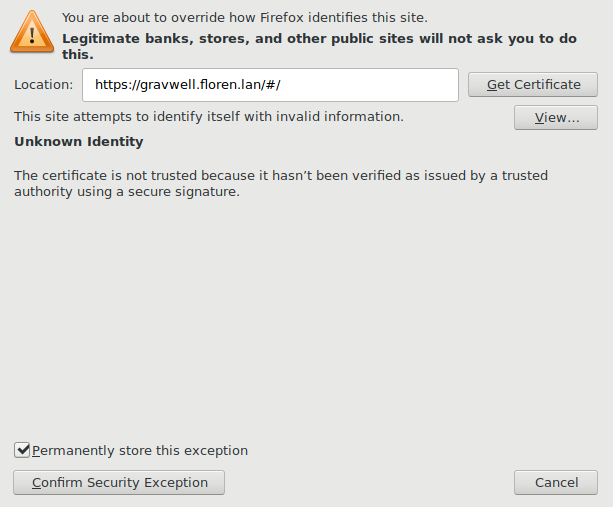
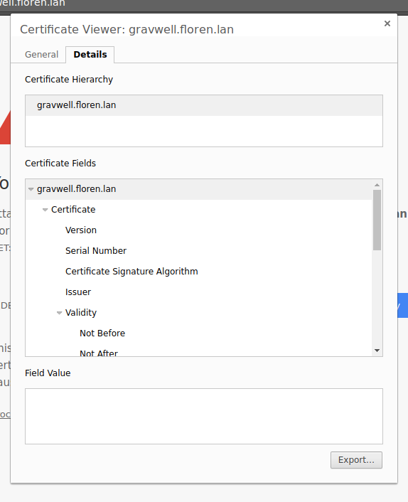
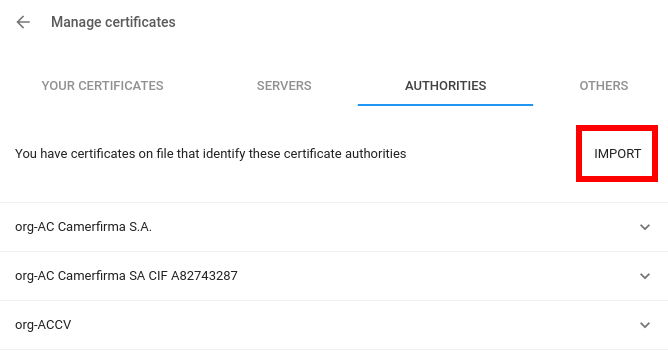

# Configuring TLS certificates

GravwellはデフォルトでTLS証明書なしで出荷されます。つまり、証明書を設定するまですべての通信は暗号化されません。これは、自動生成された自己署名証明書を使用すると、ブラウザの警告でユーザーを怖がらせ、誤った安心感を与える傾向があるためです。自己署名証明書を適切に検証することは困難であり、偽装されている可能性のある証明書を単に受け入れるようにユーザーをトレーニングすることは大きなリスクです。これは、予期しない方法で証明書の例外をタイムアウトさせる、Chromiumベースのブラウザの非常に厄介な動作によって悪化します（証明書を再承認するために、すべてのChromium / Chrome zygoteプロセスを強制的に閉じる必要があります）。

Gravwellシステムをインターネットに公開する予定の場合は、信頼できるプロバイダから完全に検証された証明書を取得することを強くお勧めします。 LetsEncryptの人々は適切な証明書の検証について学ぶための素晴らしい情報源であり、そして彼らはすべての主要なブラウザによって信頼される無料の証明書を提供します。

Gravwell管理者には、証明書に関する3つのオプションがあります。

*暗号化されていないHTTPのみを使用し続けます。 これは、信頼できるプライベートネットワーク上でのみアクセスされるインストール、またはGravwellがnginxなどのHTTPプロキシによって前面に置かれるインストールに適しています。
*適切に署名されたTLS証明書をインストールします。 これは理想的な構成ですが、通常はGravwellインスタンスにパブリックにアクセス可能なホスト名が必要です。
*自己署名証明書をインストールします。 Gravwellへのトラフィックを暗号化したいが、何らかの理由で適切に署名された証明書を取得できない場合、これは理にかなっています。

## HTTPのみを使用する

これはGravwellのデフォルト設定であり、それを使用するための変更は必要ありません。家庭用ネットワークでGravwellを試したり、実験用ネットワークで仕事用に評価したりするのに適しています。 Gravwell Webサーバーがnginxなどのロードバランサ/リバースプロキシを介してアクセスされる場合も、これは許容される構成です。これにより、プロキシはHTTPS暗号化/復号化を実行でき、Gravwellシステムの負荷が軽減されます。

証明書がないと、インジェスターはインデクサーへのトラフィックを暗号化できないことに注意してください。 ingesterトラフィックを暗号化するが、WebサーバーをHTTPのみのモードのままにする場合、他のセクションのいずれかで説明されているように証明書をインストールできますが、 `Certificate-File`、` Key-File`、および `TLS -gravwell.confのIngest-Port`オプション。 これにより、Webサーバーではなく、インデクサーのTLSが有効になります。

注：分散WebサーバーとHTTPSを無効にしたデータストアを設定する場合、データストアとWebサーバーの両方に対してgravwell.confで `Datastore-Insecure-Disable-TLS`フラグを設定する必要があります。

## 適切に署名されたTLS証明書をインストールする

適切に署名されたTLS証明書はGravwellにアクセスするための最も安全な方法です。ブラウザは自動的に不満なく証明書を受け入れます。

証明書の取得は、このドキュメントの範囲外です。 無料の証明書を入手するには、従来のプロバイダーのいずれかを介して証明書を購入するか、[LetsEncrypt](https://letsencrypt.org)を使用することを検討してください。

証明書を使用するには、証明書とキーファイルの場所をGravwellに伝える必要があります。 ファイルが `/etc/certs/cert.pem`および`/etc/certs/key.pem`にあると仮定して、gravwell.confを編集してコメントを外し、 `Certificate-File`および` Key-File`オプションを設定します。

```
Certificate-File=/etc/certs/cert.pem
Key-File=/etc/certs/key.pem
```

<span style="color: red; ">注：これらのファイルは、「gravwell」ユーザーが読み取り可能である必要があります。 ただし、他のユーザーからキーファイルを保護するように注意してください。 誰でも読み取り可能にすると、システム上のすべてのユーザーが秘密鍵にアクセスできます。</span>

ウェブサーバーでHTTPSを有効にするには、 `Web-Port`ディレクティブを80から443に変更し、` Insecure-Disable-HTTPS`ディレクティブをコメントアウトします。

TLS暗号化されたingester接続を有効にするには、 `TLS-Ingest-Port = 4024`の行を見つけてコメント解除します。

検索エージェントに対してHTTPSを有効にするには、/opt/gravwell/etc/searchagent.confを開き、Insecure-Use-HTTP = trueの行をコメントアウトして、Webserver-Address行のポートを80から443に変更します。

最後に、Webサーバー、インデクサー、および検索エージェントを再起動します。

```
systemctl restart gravwell_webserver.service
systemctl restart gravwell_indexer.service
systemctl restart gravwell_searchagent.service
```

<span style="color: red; ">注：データストアと複数のWebサーバを使用している場合、Webサーバが自己署名証明書を使用して相互に通信できるようにするには、Search-Forwarding-Insecure-Skip-TLS-Verifyパラメータをtrueに設定する必要があります。 データストアで自己署名証明書も使用されている場合は、WebサーバーでDatastore-Insecure-Skip-TLS-Verifyを設定して、データストアと通信できるようにします。</span>

## 自己署名証明書をインストールする

それは適切なTLS証明書ほど安全ではありませんが、自己署名証明書はユーザーとGravwellの間の暗号化された通信を保証します。 自己署名証明書を信頼するようにブラウザに指示することで、警告画面が繰り返し表示されるのを防ぐこともできます。

まず最初に、Gravwellのインストールに同梱されているプログラム`gencert`を使用して、`/opt/gravwell/etc`に1年間の証明書を生成します。

```
cd /opt/gravwell/etc
sudo -u gravwell ../bin/gencert -h HOSTNAME
```
HOSTNAMEは必ずGravwellシステムのホスト名またはIPアドレスに置き換えてください。 カンマで区切って複数のホスト名またはIPを指定できます。 `gencert -h gravwell.floren.lan,10.0.0.1,192.168.0.3`

では、gravwell.confを開き、 `Certificate-File` および `Key-File` ディレクティブのコメントを外します。 デフォルトは、作成した2つのファイルを正しく指しているはずです。

WebサーバーでHTTPSを有効にするには、 `Web-Port` ディレクティブを80から443に変更してから、`Insecure-Disable-HTTPS` ディレクティブをコメントアウトします。

TLS暗号化インジェスター接続を有効にするには、`TLS-Ingest-Port=4024`という行を見つけてコメント解除します。

検索エージェントに対してHTTPSを有効にするには、/opt/gravwell/etc/searchagent.confを開き、 `Insecure-Use-HTTP=true` の行をコメントアウトして、`Webserver-Address`行のポートを80から443に変更します。

最後に、Webサーバー、インデクサー、および検索エージェントを再起動します。

```
systemctl restart gravwell_webserver.service
systemctl restart gravwell_indexer.service
systemctl restart gravwell_searchagent.service
```

### ブラウザに自己署名証明書を信頼させる

証明書が認識されたルートCAによって署名されていない場合、ブラウザは警告を投げます。 ただし、手動でインストールすることでブラウザに証明書を信頼させることができます。

#### Firefox

Firefoxに証明書をインストールするのはとても簡単です。 まず、HTTPS経由でGravwellインスタンスに移動します。 Firefoxは次のような画面を表示するはずです。


[詳細設定]ボタンをクリックします。


次に、[例外を追加]をクリックします。



デフォルトは適切なはずですが、「この例外を永続的に保存する」がチェックされていることを確認してください。 [セキュリティ例外の確認]をクリックします。

証明書の有効期限が切れるまで、Firefoxは自己署名証明書を受け入れます。

#### Chrome

Chromeブラウザに証明書をインストールするのは少し複雑です。 まず、HTTPS経由でGravwellインスタンスに移動します。 Chromeは警告画面を表示します。


アドレスバーの[保護されていない]ラベルをクリックします。


次に、[証明書]の下の[無効]リンクをクリックします。 証明書ビューアウィンドウが開きます。 [詳細]タブをクリックします。



「エクスポート」ボタンをクリックしてください。 Chromeは証明書を保存するためのファイルダイアログを表示します。 どこかに保存して場所を覚えておいてください。

アドレスバーに[chrome://settings](chrome://settings)と入力するか、Chromeブラウザのメニューから[設定]を開きます。 一番下までスクロールして、[詳細設定]ボタンをクリックします。


[プライバシーとセキュリティ]セクションで、[証明書の管理]を探してクリックします。


「権限」タブを選択して「インポート」をクリックします。



ファイルダイアログが開きます。 以前に保存した証明書ファイルを選択してください。 次に、次のダイアログで[Webサイトを識別するためにこの証明書を信頼する]をオンにして[OK]をクリックします。


これで、SSLに関する警告が表示されることなくGravwellタブを更新できるはずです。
