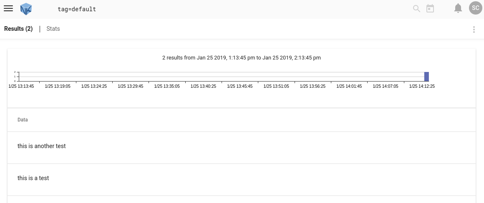

# GravwellをDockerにデプロイする

Docker Hubでビルド済みのDockerイメージを使用できるので、実験または長期使用のためにGravwellをDockerにデプロイするのは非常に簡単です。 この文書では、Docker内でGravwell環境を設定する方法を説明します。

Gravwellの有料顧客で、GravwellをDockerにデプロイしたい場合は、support @ gravwell.ioに連絡してください。 この[ウィキ](#!configuration/custom-docker.md)や[ブログ](https://www.gravwell.io/blog/gravwell-docker-deployment)で、カスタムDockerインスタンスのデプロイに関するいくつかの情報もあります。

Gravwellを設定したら、Gravwellを使用するためのいくつかの出発点について[クイックスタート ](#!quickstart/quickstart.md) をチェックしてください。

<span style="color: red; ">注意：MacOS上でDockerを実行しているユーザーは、[ここ](https://docs.docker.com/docker-for-mac/networking/)で説明されているように、MacOSホストがコンテナーへの直接IPアクセスを持っていないことに注意してください。 ホストからコンテナネットワークサービスにアクセスする必要がある場合は、追加のポートを転送する準備をしてください。</span>

## Dockerネットワークを作成する
Gravwellコンテナを他の実行中のコンテナから分離するために、`gravnet`というDockerネットワークを作成します。

	docker network create gravnet

## インデクサーとWebサーバーをデプロイする
GravwellインデクサーとWebサーバーフロントエンド、およびSimple Relayインジェスターは、便宜上単一のDockerイメージ([gravwell/gravwell](https://hub.docker.com/r/gravwell/gravwell/)) で出荷されます。 Webサーバーにアクセスするために、ホストのポート80をポート80に転送して起動します。

	docker run --net gravnet -p 8080:80 -p 4023:4023 -p 4024:4024 -d -e GRAVWELL_INGEST_SECRET=MyIngestSecret -e GRAVWELL_INGEST_AUTH=MyIngestSecret -e GRAVWELL_CONTROL_AUTH=MyControlSecret -e GRAVWELL_SEARCHAGENT_AUTH=MySearchAgentAuth --name gravwell gravwell/gravwell:latest

新しいコンテナは`gravwell`という名前です。インデクサーをインジェスターに向けるときにこれを使用します。

検討を要する環境変数をいくつか設定しました。彼らはGravwellの構成要素間の通信に使用される共有秘密を設定しました。通常これらは[設定ファイル](#!configuration/parameters.md)で設定されますが、より動的でDockerにやさしい設定のために[環境変数](#!configuration/environment-variables.md)で設定することもできます。後で `GRAVWELL_INGEST_SECRET=MyIngestSecret`値をインジェスターにも使用します。設定した変数は次のとおりです。

* `GRAVWELL_INGEST_AUTH = MyIngestSecret`は、インデクサーを認証するためにMyIngestSecretを使用するように* indexer *に指示します。
* `GRAVWELL_INGEST_SECRET = MyIngestSecret`は、インデクサーの認証にMyIngestSecretを使用するように*単純なリレーingester *に指示します。 これは、GRAVWELL_INGEST_AUTHの値と一致する必要があります。
* `GRAVWELL_CONTROL_AUTH = MyControlSecret`は、MyControlSecretを使用して相互に認証する必要があることを* frontend *および* indexer *に伝えます
* `GRAVWELL_SEARCHAGENT_AUTH = MySearchAgentAuth`は、検索エージェントの認証時にMySearchAgentAuthを使用するように* frontend *に指示します

<span style="color: red; ">注意：長期的に実行する場合、特に何らかの方法でインターネットに公開する場合は、これらの値を独自の秘密に設定することを強くお勧めします。</span>

<span style="color: red; ">重要：GRAVWELL_INGEST_AUTHの秘密の値はGRAVWELL_INGEST_SECRETと一致する必要があります</span>

### 永続ストレージの構成

デフォルトのGravwell Dockerデプロイメントでは、すべてのストレージにベースコンテナーが使用されます。つまり、コンテナーを削除すると、すべてのデータが失われます。 Dockerには、バインドやボリュームなど、基礎となるコンテナーから独立した永続ストレージを構成するためのいくつかのオプションがあります。 本番環境にgravwellをデプロイする場合、コンポーネントに応じて永続ストレージにいくつかのディレクトリを維持する必要があります。 永続ストレージの追加情報については、[Docker Volumes](https://docs.docker.com/storage/volumes/)のドキュメントを参照してください。

#### インデクサー永続ストレージ

Gravwellインデクサーは、保存されたデータシャードと `tags.dat`ファイルの2つの重要なデータセットを保持します。 インデクサーの他のほとんどすべてのコンポーネントは、データを失うことなく回復できますが、通常の操作では、いくつかのディレクトリを永続ストレージにバインドする必要があります。 重要なデータは、`storage`、`extractions`、 `resources`、`log`、および`etc`ディレクトリに存在します。 各ディレクトリは個々のボリュームにマウントするか、単一の永続ストレージディレクトリを指すように`gravwell.conf`ファイルで設定できます。 Docker内の永続ストレージを使用したDockerデプロイメント用に設計された例`gravwell.conf`は、各データディレクトリのストレージパスを変更して、`/opt/gravwell`ではなく`/opt/gravwell/persistent`内の代替パスを指すようにすることができます 。 すべての `gravwell.conf`設定パラメータに関する完全なドキュメントは、[詳細設定](parameters.md)ページにあります。

#### Webサーバー永続ストレージ

Gravwell Webサーバーには、構成データや検索結果が失われないように維持する必要があるいくつかのディレクトリがあります。`etc`、`extractions`、 `resources`、および`saved`ディレクトリには、コンテナのデプロイメント全体で維持する必要がある重要なディレクトリが含まれています。 `saved`ディレクトリには、ユーザーが保存することを選択した保存済み検索結果が含まれています。`etc`ディレクトリにはユーザーデータベース、ウェブストア、および`tags.dat`ファイルが含まれています。 これらはすべてGravwellの適切な動作に不可欠です。

#### インジェスター永続ストレージ

Gravwellインジェスターはデータを中継するように設計されており、通常は永続的なストレージを必要としません。1つの例外はキャッシュシステムです。 Gravwellの取り込みAPIには統合されたキャッシュシステムが含まれているため、インデクサーへのアップリンクが失敗した場合、インジェスターは永続的なストアにデータをローカルにキャッシュできるため、データは失われません。 ほとんどのインジェスターはデフォルトでキャッシュをデプロイしませんが、一般的なキャッシュストレージの場所は`/opt/gravwell/cache`です。`cache`ディレクトリを永続ストレージにバインドすると、インジェスターが状態を維持でき、コンテナーの再起動や更新でデータを失うことがなくなります。

## ライセンスをアップロードしてログインする

Gravwellが実行されているので、ホスト上のポートhttp://localhost:8080にWebブラウザを向けます。ライセンスのアップロードを促すはずです。


注：有料ユーザーおよび既存のCommunity EditionユーザーはEメールでライセンスを受けているはずです。 まだCommunity Editionにサインアップしていない場合は、[https://www.gravwell.io/download](https://www.gravwell.io/download)にアクセスしてライセンスを取得してください。

ライセンスをアップロードして確認すると、ログインプロンプトが表示されます。


デフォルトの認証情報**admin** / **changeme**でログインします。 あなたは今Gravwellにいます！ しばらくGravwellを実行する場合は、おそらくパスワードを変更する必要があります（パスワードを変更するには、右上のユーザーアイコンをクリックしてください）。

## テストにデータを追加する

gravwell / gravwell Dockerイメージには、Simple Relay[インジェスター](#!ingesters/ingesters.md)がプリインストールされた状態で出荷されています。 次のポートで待機します。
* 行区切りログ用のTCP 7777（ 'default'とタグ付けされている）
* syslogメッセージ用のTCP 601（ 'syslog'のタグ付き）
* syslogメッセージ用のUDP 514（ 'syslog'のタグ付き）

確実にデータをGravwellに取り込むために、netcatを使用してポート7777に行を書き込むことができます。ただし、VMを起動したときに、これらのポートをホストに転送しませんでした。 幸いなことに、Gravwellコンテナに割り当てられたIPアドレスを取得するために`docker inspect`を使うことができます。

	docker inspect -f '{{range .NetworkSettings.Networks}}{{.IPAddress}}{{end}}' gravwell

私たちの場合、それは**172.19.0.2**でした。 その後、netcatを使用していくつかの行を送信し、完了したらCtrl-Cを押します。

	$ netcat 172.19.0.2 7777
	this is a test
	this is another test

重要：コンテナーは実際にはLinux VM内で実行されるため、MacOSユーザーはIPでコンテナーに直接アクセスすることはできません。 Dockerコンテナー（同じコンテナーまたは新しいコンテナー）からnetcatを使用するか、Gravwellコンテナーを起動するときにポート7777をホストに転送することができます。
その後、過去1時間にわたってクイック検索を実行して、データが正しく入力され、Gravwellが正しく機能していることを確認できます。



## インジェスターを設定する
gravwell / gravwellイメージが付属しているSimple Relayインジェスターの他に、現在3つのビルド済みの独立型インジェスターイメージが用意されています。

* [gravwell/netflow_capture](https://hub.docker.com/r/gravwell/netflow_capture/) は、ポート2055でNetflow v5レコードを受信し、ポート6343でIPFIXレコードを受信するように構成されたNetflowコレクターです。
* [gravwell/collectd](https://hub.docker.com/r/gravwell/collectd/) は、ポート25826で収集された収集ポイントからハードウェアの統計情報を受け取ります
* [gravwell/simple_relay](https://hub.docker.com/r/gravwell/simple_relay/) は、コアイメージにプリインストールされているSimple Relay ingesterであり、個別に展開する場合にも使用します。

ここでNetflow ingesterを起動しますが、同じコマンド（名前とポートを変更）を他のインジェスターにも使用できます。

	docker run -d --net gravnet -p 2055:2055/udp --name netflow -e GRAVWELL_CLEARTEXT_TARGETS=gravwell -e GRAVWELL_INGEST_SECRET=MyIngestSecret gravwell/netflow_capture

環境変数を設定するための `-e`フラグの使用に注意してください。 これにより、摂取のために「gravwell」という名前のコンテナに接続し（GRAVWELL_CLEARTEXT_TARGETS = gravwell）、共有インジェストシークレットを「IngestSecrets」（GRAVWELL_INGEST_SECRET = IngestSecrets）に設定することで、ingesterを動的に構成できます。

`-p 2055:2055/udp` オプションは、UDPポート2055（Netflow v5取り込みポート）をコンテナーからホストに転送します。 これにより、Netflowレコードを取り込みコンテナに送信しやすくなります。

注：NetFlowインジェスタも、デフォルトでUDPを介してポート6343でIPFIXレコードを受け入れるように設定されています。IPFIXレコードも取り込む場合は、上記のコマンドラインに`-p 6343:6343/udp` を追加してください。

メニューのIngesters項目をクリックして、インジェスターがアクティブであることを確認できます。


これで、ホストのポート2055にレコードを送信するようにNetflowジェネレータを設定できます。 それらはコンテナに渡され、Gravwellに摂取されます。

## カスタマイズサービス

Gravwellの公式dockerコンテナには、コンテナ内の複数のサービスの起動と制御を非常に簡単にするサービス管理システムが含まれています。[マネージャ](https://github.com/gravwell/manager)は、サービスの再開、エラー報告、および制御の取り消しを制御します。 GravwellはBSD 3-Clauseライセンスの下で[github](https://github.com/gravwell)上のマネージャアプリケーションをオープンソース化しました。 だからあなたがあなたのdockerコンテナのための非常に小さくて簡単に設定されたSystemDのようなサービスマネージャを望むなら、それを持ってください。

公式のgravwell Dockerイメージには、完全なGravwellスタック（インデクサーとWebサーバー）とSimple Relay ingesterが含まれています。 デフォルトのマネージャー構成は次のとおりです。

```
[Global]
	Log-File=/opt/gravwell/log/manager.log
	Log-Level=INFO

[Error-Handler]
	Exec=/opt/gravwell/bin/crashReport

[Process "indexer"]
	Exec="/opt/gravwell/bin/gravwell_indexer -stderr indexer"
	Working-Dir=/opt/gravwell
	Max-Restarts=3 #three attempts before cooling down
	CoolDown-Period=60 #1 hour
	Restart-Period=10 #10 minutes

[Process "webserver"]
	Exec="/opt/gravwell/bin/gravwell_webserver -stderr webserver"
	Working-Dir=/opt/gravwell
	Max-Restarts=3 #three attempts before cooling down
	CoolDown-Period=30 #30 minutes
	Restart-Period=10 #10 minutes

[Process "searchagent"]
	Exec="/opt/gravwell/bin/gravwell_searchagent -stderr searchagent"
	Working-Dir=/opt/gravwell
	Max-Restarts=3 #three attempts before cooling down
	CoolDown-Period=10 #10 minutes
	Restart-Period=10 #10 minutes

[Process "simple_relay"]
	Exec="/opt/gravwell/bin/gravwell_simple_relay -stderr simple_relay"
	Working-Dir=/opt/gravwell
	Max-Restarts=3 #three attempts before cooling down
	CoolDown-Period=10 #10 minutes
	Restart-Period=10 #10 minutes
```

マネージャアプリケーションのためのこのデフォルト設定は私達がバグを識別して修正するのを助けるエラー報告システムを可能にします。 サービスがゼロ以外の終了コードで終了した場合、エラーレポートが表示されます。 エラー報告システムを無効にするには、 "[Error-Handler]"セクションを削除するか、または環境変数 "DISABLE_ERROR_REPORTING"に "TRUE"の値を渡します。

個々のサービスは、起動時に、サービス名を大文字で「TRUE」にアサインした「DISABLE_」を前に付けて渡すことによって無効にすることができます。

たとえば、エラー報告なしにgravwell dockerコンテナを起動するには、"-e DISABLE_ERROR_REPORTING=true"オプションを指定して起動します。

統合されたSimpleRelayインジェスターを無効にしたい場合は、"-e DISABLE_SIMPLE_RELAY=TRUE"を追加してください。あなただけを起動したい場合は、インデクサーがそれらをすべて次のように連鎖させてください。

```
docker run --name gravwell -e GRAVWELL_INGEST_SECRET=MyIngestSecret -e DISABLE_SIMPLE_RELAY=TRUE -e DISABLE_WEBSERVER=TRUE -e DISABLE_SEARCHAGENT=TRUE gravwell/gravwell:latest
```

サービスマネージャの詳細については、[githubページ](https://github.com/gravwell/manager)をご覧ください。

### インジェスターコンテナーのカスタマイズ
インジェスタコンテナを起動したら、デフォルト設定を多少変更することをお勧めします。 たとえば、Netflowインジェスタを別のポートで実行することにします。

上記で起動したNetflowインジェスタコンテナに変更を加えるには、コンテナ内でシェルを起動します。

	docker exec -it netflow sh

その後、viを使用して、[ingestersの資料](#!ingesters/ingesters.md)に記載されているように `/opt/gravwell/etc/netflow_capture.conf` を編集できます。 変更を加えたら、コンテナ全体を再起動します。

	docker restart netflow

## 外部（非Docker）インジェスターの設定
`gravwell/gravwell`イメージを起動するために使用した元のコマンドに戻って参照すると、ポート4023と4024がホストに転送されていることがわかります。これらはそれぞれ、インデクサー用のクリアテキストおよびTLS暗号化された取り込みポートです。他のシステムでインジェスターを実行している場合（おそらくLinuxサーバー上のどこかでログファイルを収集している場合）、インジェスター設定ファイルの`Cleartext-Backend-target`または`Encrypted-Backend-target`フィールドをDockerホストとインジェストを指すように設定できます。 Gravwellインスタンスへのデータの転送。

インジェスターの構成について詳しくは、[インジェスターの資料](#!ingesters/ingesters.md)を参照してください。

## セキュリティ上の考慮事項
転送されたコンテナポートをインターネットに公開する予定がある場合は、値を保護するために以下を設定することが重要です。

* 「admin」パスワードはデフォルトの「changeme」から変更する必要があります。
* インデクサーとWebサーバーの起動時に設定されるGRAVWELL_INGEST_SECRET、GRAVWELL_INGEST_AUTH、GRAVWELL_CONTROL_AUTH、およびGRAVWELL_SEARCHAGENT_AUTH環境変数（上記を参照）は、複雑な文字列に設定する必要があります。

## より多くの情報
Gravwellが稼働している状態で、システムの使用方法について詳しくは、[残りの資料](#!index.md)を参照してください。

Gravwellの有料顧客で、GravwellをDockerにデプロイしたい場合は、support @ gravwell.ioに連絡してください。[このウィキ](#!configuration/custom-docker.md) や[ブログ](https://www.gravwell.io/blog/gravwell-docker-deployment)で、カスタムDockerインスタンスのデプロイに関するいくつかの情報もあります。