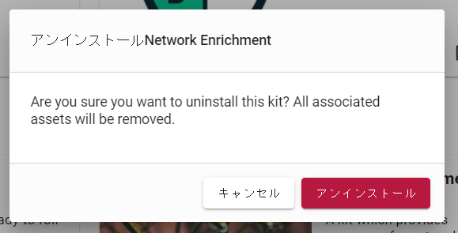

# キット

キットは、他のシステムに簡単にインストールできるように、多くの関連アイテム(ダッシュボード、クエリー、スケジュール検索、自動抽出器)を束ねたGravwellのためのツール集です。キットでは、Netflowデータを分析するためのツールや、ひょっとしたら自家醸造装置を監視するためのツールさえもとりまとめることができます。Gravwell Inc.は、一般的なユースケースのために構築済みのキットを提供していますが、ユーザーはGravwell UI内から独自のキットを構築することもできます。

## キットとはどんなものか

キットを構成する多くのコンポーネントがあります。まず、キットの中身ですが、2つのカテゴリーに分類されます。:

* アイテム: ダッシュボード、スケジュール検索、マクロ、アクショナブルなどの通常のGravwellコンポーネント
* 設定マクロ: これらはキットがそれ自身を設定するために使用する特殊なマクロで、使用するタグの選択などでより柔軟性を持たせることができます。たとえば、すべてのクエリで `tag=netflow` を使用するのではなく、Netflow キットは `tag=$NETFLOW_KIT_TAG` として、NETFLOW_KIT_TAG という名前の設定マクロを定義することができます。インストール時に、キットはユーザーに、どのようなタグにNetflowレコードが含まれているかを尋ねます。

キットの識別に役立ついくつかの情報項目ありますので、覚えておくと便利です:

* キットID: キットの識別子です。Gravwellは"io.gravwell.netflowv5"といった、Androidアプリケーションに似た名前空間を使用しています。
* バージョン: キットは時間の経過とともに更新されることがあり、バージョン番号でその更新を表すので、Gravwellは新しいキットのバージョンが出たことを自動的に通知することができます。
* 名前: "Netflow v5"など、キットの分かりやすい名前。
* 説明: キットが何をするかの詳細な説明。
* 最小バージョン/最大バージョン: キットによっては、特定のGravwell機能を必要とするものがあります。それらの機能を確実に利用できるようにするために、これらのフィールドでは、どのGravwellバージョンがキットと互換性があるかが示されます。
* 依存関係: キットは、Linux ディストリビューションのパッケージのように、他のキットに依存することがあります。例えば、Gravwell の Netflow v5 キットは Network Enrichment キットに依存します。依存関係のあるキットは、導入しようとしているキットと一緒に自動的にインストールされます。

## インストールされているキットのコンテキスト内容確認

キットは、メインメニューの「キット」ページで管理されます。キットページを読み込むと、最初にインストールされたキットのリストが表示されます。下の画像では、インストールされている 2 つのキットが表示されています:

キットをクリックすると、選択したキットの*コンテキスト*に入り、キットの内容が表示されます:

UIでキットの *コンテキスト* 内に入ると、コンテキストを出るまでそのキットのコンテンツだけが表示されます。例えば、メインメニューからダッシュボードページを閲覧すると、そのキットに含まれている 2 つのダッシュボードが表示されます:

ページの一番上にある「キット / Netflow v5 / ダッシュボード」というテキスト表示に注意してください。これは、特定のキットの中にいることを示しています。キットのコンテキストから離れるには、メインメニューボタンの横にある SolitonNK ロゴをクリックしてください。

## キットのインストール

キットをインストールするには、メインキットページの右上隅にある「キットの管理」ボタンをクリックして、キット管理モードに入る必要があります。キットがインストールされていない場合、UI は自動的に「使用可能なキット」タブに移動しますが、そうでない場合、デフォルトの表示には現在インストールされているキットが表示されます。キットを探してインストールするには、画面上部の「使用可能なキット」ラベルをクリックしてください。

キットの詳細を確認するには、「キットの詳細」ボタン（訳注：4.0.2RC9現在、「キットの詳細」ボタンは廃止され、キットの（画像と説明文を囲む）タイル）をクリックします。インストールするキットが決まったら、「デプロイ」ボタンをクリックします。システムがキットをダウンロードし、インストールのためのウィザードがポップアップします。下のスクリーンショットでは、IPFIX キットを選択した時の様子を表示しています。最初のページでは、選択したキットに含まれるアイテムのリストが表示されています:

内容を確認したら、「このキットの内容を確認し、デプロイによるリスクを理解しました。」のチェックボックスに印を入れ、「次へ」ボタンを選択します。ウィザードでは、キットに同梱されているライセンスが表示されます。複数のライセンスがある場合は、次に進む前に左側のリストから個別に選択し、各チェックボックスをクリックする必要があることに注意してください。

次に、キットで定義されている場合は、ウィザードは *設定マクロ* の入力を求めます。設定マクロでは、キットから提供されるクエリのインストール時の設定を行うことができます。このスクリーンショットでは、どのタグにIPFIXレコードが含まれているかを明確にする必要があります。

ウィザードの最後のページでは、追加オプションの入力を求められます。"既存アイテムを上書きする" のスイッチをオン（右）に入れると、システム上に既に存在しているかもしれない矛盾したオブジェクトを上書きします。例えば、"foo"という名前のリソースを既に作成していたとしても、キットは "foo"という名前のリソースも作成し上書きします。"グローバルインストール" のスイッチをオン（右）に入れると、そのキットに全ユーザーがアクセスできるようになります。（訳注：以下は4.0.2RC9ではobsolete？「グループアクセス」ドロップダウンでは、キットの内容を見ることができるグループをオプションで選択することができます。管理者ユーザーは、キットを *globally*、つまりすべてのユーザーが見ることができるようにインストールするオプションを持つことになります。）

 "デプロイ"ボタンをクリックすると、キットと、それに依存関係のあるキットが全てインストールされます。この作業には1分ほどかかることもありますが、最終的にはキットがインストールされたキットの1つとしてリストアップされます。

注意: インストールウィザードを中止すると、キットはインストールされませんが、ダウンロードしたキットは「自分のキット」ページの「展開待ちのキット」というラベルの下に、以下のように表示されます。ステージされたキットを削除するか、インストールウィザードを再起動するかを選択できます。

## キットのアップグレード

Gravwellは定期的に公式キットサーバーにアップデートをプッシュします。インストールされているキットにアップデートがあると、そのキットのタイルに「アップグレード」ボタンが表示されます:

「アップグレード」ボタンをクリックすると、インストールウィザードと同様のアップグレードウィザードが起動します。最も重要な違いは、**バックアップ**オプションです。キットに含まれていたアイテムを変更していた場合、ウィザードが通知し、変更したアイテムをコピーしたりダウンロードしたりするためのオプションを提供します。下のスクリーンショットでは、3つのリソースが変更され、ウィザードがそれらのダウンロードリンクを提供していることがわかります。ダッシュボードのような他のオブジェクトは、ダウンロードするのではなく、アップグレード中に「クローン」することができます。

変更された項目がない場合は、バックアップステップは表示されません。ウィザードの残りの部分はインストールウィザードと同じですが、グループアクセスなどのデフォルトはすでに設定されているはずです。

注意：キットを新しいバージョンにアップグレードするには、前のバージョンの内容を*完全に削除*する必要があります。前バージョンが削除されても問題ないよう対処ができてないうちに、ウィザードの最後にある「デプロイ」ボタンをクリックしないようにしてください。

## キットのアンインストール

インストールされたキットを削除するには、メインキットページの右上隅にある「キットの管理」ボタンをクリックして、キット管理モードに入ります。次に、アンインストールしようとしているキットのゴミ箱アイコンを選択します。確認のためのダイアログがポップアップします:

「アンインストール」をクリックすると、キットの内容を手動で変更していない限り、キットは削除されます。キットのアイテムを変更していた場合、その事実を警告する 2 番目のダイアログが表示され、処理を中止する最後のチャンスが与えられます:

## キットサーバー

デフォルトでは、Gravwellは利用可能なキットを `https://kits.gravwell.io/kits` でチェックします。もし "使用可能なキット"のタブページにキットがリストアップされていない場合は、Gravwellのウェブサーバーからそのサーバーにアクセスできることを確認してください。なお、Gravwellユーザーが自身で管理しているホストでのキットサーバーを運用できるようにするツールセットは、現在開発中です。