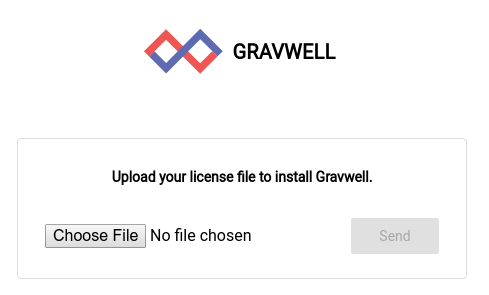
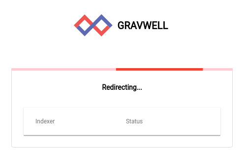
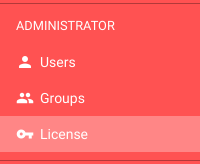
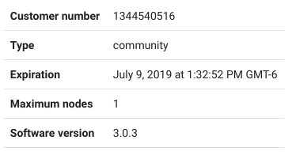
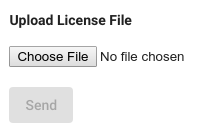

# Gravwellライセンスシステム

Gravwellは、追加の機能を有効にするいくつかのライセンス層を提供します。 最も基本的なライセンス層はCommunity Editionで、最も高度な層は無制限ライセンスです。 Community Editionライセンスは、単一のインデクサーでの制限された取り込みを許可し、無制限の取り込みではない唯一のライセンス層です。他のすべてのライセンス層には取り込みの制限がありません。

Gravwellインストールは、デフォルトでパス/opt/gravwell/etc/licenseにあるライセンスファイルを使用してライセンスされます。 [Global]構成ブロックでLicense-Location変数を設定することにより、gravwell.confファイルでライセンスの場所を制御できます。 Gravwellは各スタートアップでライセンスを検証し、定期的にチェックします。

## ライセンスのインストール

ライセンスは、GUI、CLIを介して、または単にライセンスファイルを適切な場所にコピーすることでインストールできます。 管理ユーザーのみがGUIまたはCLIを介してライセンスを更新できます。 起動時に、ライセンスがインストールされていないか、現在のライセンスが無効な場合、システムは有効なライセンスがインストールされるのを待ちます。 GUIはライセンスのアップロードを求め、起動を完了する前に有効なライセンスを待ちます。 ライセンスインストールAPIは、提供されたライセンスを検証し、無効なライセンスのインストールを許可しません。

CLIまたはGUIを使用してライセンスをインストールすると、Gravwellは接続されているすべてのインデクサーにライセンスを自動的に配布します。 Gravwellは、各インデクサーのインストール済みライセンスを検証し、接続ごとに必要に応じて更新します。 つまり、新しいインデクサーをオンラインにすると、Webサーバーの接続時に適切なライセンスが自動的に取得されます。

## ライセンスの更新

Gravwellライセンスの更新は、Gravwellを再起動せずにCLIまたはGUIを使用して実行できますが、ライセンスファイルを適切なディレクトリにコピーするだけの場合は、ライセンスを再読み込みするためにGravwellを再起動する必要があります。 GUIまたはCLIからライセンスファイルを更新できるのは管理者のみです。 ライセンスを更新するには、管理者としてGravwellにログインし、管理者パネルの下のライセンスセクションに移動します。 [ライセンス]ページには、ライセンスとその有効期限に関する詳細が表示され、新しいライセンスファイルを選択してアップロードし、Webサーバーと接続されているすべてのGravwellインデクサーを更新します。

## ライセンスの有効期限

すべてのGravwellライセンスには有効期限があり、ライセンスが期限切れになるとGravwellは起動しません。ライセンスは4つのステップで期限切れになります。

1. 有効期限に関する警告
2. 有効期限猶予期間
3. 取り込みが無効
4. 検索が無効

有効期限が切れる前に、Gravwellは、ライセンスの有効期限が切れることをGUIに通知します。有効期限に達すると、Gravwellが完全に機能する14日間の猶予期間があります。猶予期間によってGravwellの使用を続けることができますが、GravwellインデクサーまたはWebサーバーを再起動すると、Gravwellは停止して有効なライセンスを待ちます。Gravwellが期限切れになると、Gravwellは取り込みを無効にします。この状態でもデータを照会できますが、Gravwellは新しいデータを取り込みません。クエリ猶予期間が終了すると、Gravwellは検索機能を無効にします。

Gravwellは、ライセンスの有効期限のためにデータを削除することは決してなく、すべての保存データ、リソース、ダッシュボード、そしてクエリ履歴は保持されます。新しいライセンスがインストールされた場合、すべてはあなたがそれを残したところで正しいでしょう。

これは、ライセンスの有効期限が切れるまでのイベントについて説明した便利な表です。

| イベント | 説明 | ライセンスの有効期限 |
|-------|-------------|:--------------------------:|
| 警告 1 | ライセンスが30日以内に期限切れになることを示す通知 | T - 30 日 |
| 警告 2 | ライセンスが15日以内に期限切れになることを示す通知 | T - 15 日 |
| 有効期限 | ライセンスの有効期限が切れたことを示す通知、14日間の猶予期間が始まります | T - 0 |
| 取り込み無効 | 取り込みが無効になり、ライセンスが期限切れであることを示す通知 | T + 15 日 |
| クエリ無効 | 検索が無効になり、ライセンスが期限切れであることを示す通知 | T + 30 日 |
