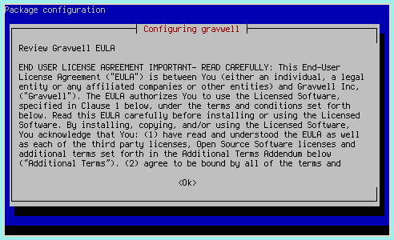
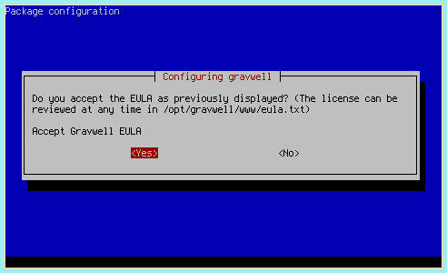
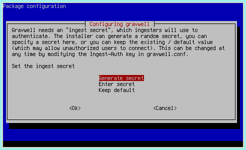
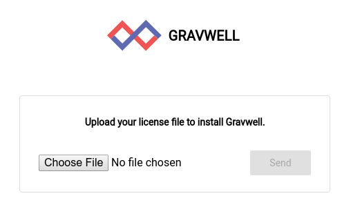
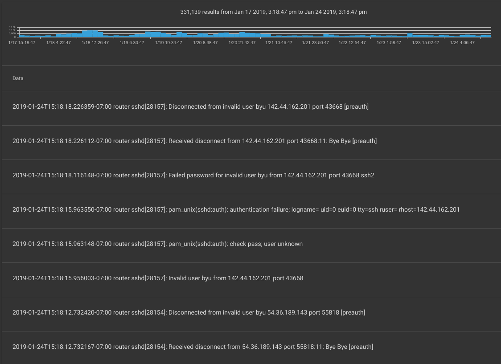

# Gravwell Community Edition

重要：この文書は、[universal quickstart](#!quickstart/quickstart.md)を支持して廃止されました。 既存のリンクを機能させるためにこれをそのままにしておきますが、更新はしません。

GravwellのCommunity Editionは、個人使用を目的とした無料のライセンスプログラムです。 通常のGravwellライセンスとは異なり、Community Editionライセンスは1日あたり2GBの取り込みデータに制限されています。 私たちの経験では、これはすべてのホームネットワークアプリケーションに十分すぎることがわかりました（すべてのパケットをキャプチャしてからNetflixのストリーミングを開始する場合を除きます！）。

Gravwell Community Editionの入手は簡単です。 最初に、Debianパッケージリポジトリからソフトウェアをインストールするか、Dockerコンテナーを実行するか、ディストリビューションに依存しない自己完結型インストーラーを使用します。 次に、無料ライセンスにサインアップして、メールで送信します。 最後に、新しくインストールされたGravwellインスタンスにより、ライセンスファイルをアップロードするように求められます。 アップロードされると、Gravwellの使用を開始する準備が整います。

## ソフトウェアのインストール

Gravwell Community Editionは、Dockerコンテナ、ディストリビューションに依存しない自己解凍インストーラー、Debianパッケージリポジトリの3つの方法で配布されます。 システムがDebianまたはUbuntuを実行している場合はDebianリポジトリを使用し、Dockerセットアップがある場合はDockerコンテナーを使用し、それ以外の場合は自己解凍インストーラーを使用することをお勧めします。

### Debianリポジトリ

Debianリポジトリからのインストールは非常に簡単です：

```
# Get our signing key
curl https://update.gravwell.io/debian/update.gravwell.io.gpg.key | sudo apt-key add -
# Add the repository
echo 'deb [ arch=amd64 ] https://update.gravwell.io/debian/ community main' | sudo tee /etc/apt/sources.list.d/gravwell.list
sudo apt-get install apt-transport-https
sudo apt-get update
# Install the package
sudo apt-get install gravwell
```

インストールプロセスでは、Grabwellのコンポーネントが使用するいくつかの共有シークレット値を設定するよう求められます。 セキュリティのために、インストーラーがランダムな値（デフォルト）を生成できるようにすることを強くお勧めします。







### Dockerコンテナ

Gravwellは、Webサーバーとインデクサーの両方を含む単一のコンテナーとしてDockerhubで利用できます。 GravwellをDockerにインストールする詳細な手順については、[Dockerのインストール手順](#!configuration/docker.md)を参照してください。

### 自己完結型インストーラー

Debian以外のシステムの場合、[自己完結型インストーラー](https://update.gravwell.io/files/gravwell_2.2.4.sh)をダウンロードして確認します。

```
curl -O https://update.gravwell.io/files/gravwell_2.2.4.sh
md5sum gravwell_2.2.4.sh #should be f549d11ed30b1ca1f71a511e2454b07b
```

次に、インストーラーを実行します。

```
sudo bash gravwell_2.2.4.sh
```

プロンプトに従い、完了後、実行中のGravwellインスタンスが必要です。

## ライセンスを取得する

ライセンスファイルを取得するには、 [https://www.gravwell.io/download](https://www.gravwell.io/download)に進み、フォームに入力します。 Logbotはすぐにメールを送信します。

Gravwellをインストールしたら、Webブラウザーを開いてサーバーに移動します（例：[https://localhost/](https://localhost/)）。 ライセンスファイルをアップロードするよう求められます。



重要：Gravwellのデフォルトのユーザー名/パスワードはadmin/changemeです。 できるだけ早く管理者パスワードを変更することを強くお勧めします！

## 取り込みを開始してください！

新たにインストールされたGravwellインスタンス自体は退屈です。 一部のインジェスターにデータを提供してもらいたいでしょう。 Debianリポジトリからインストールするか、[ダウンロードページ](downloads.md)に移動して、各期の自己解凍インストーラーを取得します。

Debianリポジトリで利用可能なインジェスターは、 `apt-cache search gravwell`を実行することで表示できます：

```
root@debian:~# apt-cache search gravwell
gravwell - Gravwell community edition (gravwell.io)
gravwell-federator - Gravwell ingest federator
gravwell-file-follow - Gravwell file follow ingester
gravwell-netflow-capture - Gravwell netflow ingester
gravwell-network-capture - Gravwell packet ingester
gravwell-simple-relay - Gravwell simple relay ingester
```

メインGravwellインスタンスと同じノードにインストールする場合、インデクサーに接続するように自動的に構成する必要がありますが、ほとんどの場合、データソースを設定する必要があります。 その手順については、[ingester設定ドキュメント](#!ingesters/ingesters.md) を参照してください。

最初の実験として、File Follow ingester（gravwell-file-follow）をインストールすることを強くお勧めします。 Linuxログファイルを取り込むように事前に設定されているため、`tag=auth`などの検索を発行することにより、いくつかのエントリをすぐに表示できるはずです。



Debianベースのリポジトリを使用していない場合は、自己完結型インストーラーの[ダウンロードセクション](downloads.md)にアクセスしてください。

### インジェスターの構成

各ingesterのインストールと構成に関する追加情報は、[Ingestersのセットアップ](/ingesters/ingesters.md)セクションにあります。

## 次のステップ

Gravwellは強力で複雑な製品です。 専門知識を構築するには時間がかかりますが、単純なクエリから開始し、必要に応じてより複雑な概念を調べることで、すぐに有用な質問に答えることができます！

開始方法のアイデアについては、[標準バージョンクイックスタートドキュメント](quickstart.md#Feeding_Data)の継続セクション、特に[検索セクション](quickstart.md#Searching)から始めることをお勧めします。 必要なデータをシステムに取り込むには、[ingester configuration documents](#!ingesters/ingesters.md) を参照する必要がある場合があります。

[検索ドキュメント](#!search/search.md)は、検索クエリを構築するための究極のリソースです。 [Search Modules](#!search/searchmodules.md)および[Render Modules](#!search/rendermodules.md)セクションには、各モジュールのオプションの例と詳細な説明がたくさんあります。

最後に、[Gravwellブログ](https://www.gravwell.io/blog)には、インスピレーションとして役立つ可能性のあるGravwellの実際のアプリケーションを示すケーススタディと例があります。

ヘルプが必要な場合は、[Keybaseのオープンコミュニティ](https://keybase.io/team/gravwell.community)に参加するか、support @ gravwell.ioにメールしてください。 Gravwellを使用して、他の人がデータから価値を得るのを支援できることを楽しみにしています！