# クイックスタート手順

このセクションには、Gravwellを起動して実行するための基本的な「クイックスタート」手順が含まれています。 これらの指示は、最も一般的な使用事例をサポートし、Grabwellの紹介として機能します。「クイックスタート」の手順では、Cluster Editionで利用可能な分散検索およびストレージに関するより高度なGravwell機能を利用していません。より高度な設定が必要な場合は、このガイドの「高度なトピック」セクションをご覧ください。

このガイドは、Community Editionユーザーおよび有料シングルノードGravwellサブスクリプションをお持ちのユーザーに適しています。

注：Community Editionユーザーは、インストールを開始する前に[https://www.gravwell.io/download](https://www.gravwell.io/download)から独自のライセンスを取得する必要があります。 有料ユーザーは、すでに電子メールでライセンスファイルを受け取っているはずです。

## 設置
Gravwellを1台のマシンにインストールするのは非常に簡単です。このセクションの指示に従ってください。 複数のシステムを含むより高度な環境については、「高度なトピック」セクションを確認してください。

### Gravwell Indexerとフロントエンドをインストールする

Gravwellは3つの方法で配布されます：Dockerコンテナ経由、配布に依存しない自己解凍インストーラー経由、Debianパッケージリポジトリ経由。 システムがDebianまたはUbuntuを実行している場合はDebianリポジトリを使用し、Dockerセットアップがある場合はDockerコンテナーを使用し、それ以外の場合は自己解凍インストーラーを使用することをお勧めします。 Gravwellはすべての主要なLinuxディストリビューションでテストされ、正常に動作しますが、Ubuntu Server LTSが推奨されます。 Ubuntuのインストールに関するヘルプは、 https://tutorials.ubuntu.com/tutorial/tutorial-install-ubuntu-server.にあります。

### Debianリポジトリ

Debianリポジトリからのインストールは非常に簡単です。 GravwellのPGP署名キーとDebianパッケージリポジトリを追加するには、最初にいくつかの手順を実行する必要がありますが、その後は単に`gravwell`パッケージをインストールするだけです。

```
curl https://update.gravwell.io/debian/update.gravwell.io.gpg.key | sudo apt-key add -
echo 'deb [ arch=amd64 ] https://update.gravwell.io/debian/ community main' | sudo tee /etc/apt/sources.list.d/gravwell.list
sudo apt-get install apt-transport-https
sudo apt-get update
sudo apt-get install gravwell
```

インストールプロセスでは、Grabwellのコンポーネントが使用するいくつかの共有シークレット値を設定するよう求められます。 セキュリティのために、インストーラーがランダムな値（デフォルト）を生成できるようにすることを強くお勧めします。

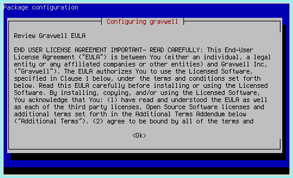

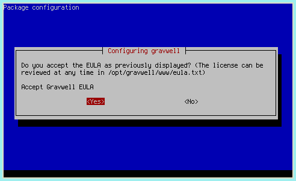

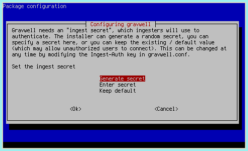

### Dockerコンテナ

Gravwellは、Webサーバーとインデクサーの両方を含む単一のコンテナーとしてDockerhubで利用できます。 GravwellをDockerにインストールする詳細な手順については、[Dockerのインストール手順](#!configuration/docker.md) を参照してください。

### Self-contained 設置

Debian以外のシステムの場合、[ダウンロードページ](#!quickstart/downloads.md)から自己完結型のインストーラーをダウンロードします。

次に、インストーラーを実行します。

```
sudo bash gravwell_X.X.X.sh
```

プロンプトに従い、完了後、実行中のGravwellインスタンスが必要です。

注：ディストリビューションがSystemDを使用していない場合、インストール後にGravwellプロセスを手動で開始する必要があります。 サポートが必要な場合は、support@gravwell.ioまでご連絡ください。

## ライセンスの構成

Gravwellをインストールしたら、Webブラウザーを開いてサーバーに移動します（例：[https：// localhost /](https://localhost/)）。 ライセンスファイルをアップロードするよう求められます。


ライセンスがアップロードされて検証されると、Gravwellはログイン画面を表示する必要があります。 パスワード「changeme」で「admin」としてログインします。

重要：Gravwellのデフォルトのユーザー名/パスワードの組み合わせはadmin / changemeです。 できるだけ早く管理者パスワードを変更することを強くお勧めします！ これを行うには、ナビゲーションサイドバーから[アカウント設定]を選択するか、右上の[ユーザー]アイコンをクリックします。


## インジェスターの構成

新たにインストールされたGravwellインスタンス自体は退屈です。 一部のインジェスターにデータを提供してもらいたいでしょう。 Debianリポジトリからインストールするか、[ダウンロードページ](downloads.md)に移動して、各期の自己解凍インストーラーを取得します。

Debianリポジトリで利用可能なインジェスターは、`apt-cache search gravwell`を実行することで表示できます：

```
root@debian:~# apt-cache search gravwell
gravwell - Gravwell data analytics platform (gravwell.io)
gravwell-federator - Gravwell ingest federator
gravwell-file-follow - Gravwell file follow ingester
gravwell-netflow-capture - Gravwell netflow ingester
gravwell-network-capture - Gravwell packet ingester
gravwell-simple-relay - Gravwell simple relay ingester
```

メインGravwellインスタンスと同じノードにインストールする場合、インデクサーに接続するように自動的に構成する必要がありますが、ほとんどの場合、データソースを設定する必要があります。 その手順については、[ingester設定ドキュメント](#!ingesters/ingesters.md) を参照してください。

最初の実験として、File Follow ingester（gravwell-file-follow）をインストールすることを強くお勧めします。 Linuxログファイルを取り込むように事前に設定されているため、`tag=auth`などの検索を発行することにより、いくつかのエントリをすぐに表示できるはずです。

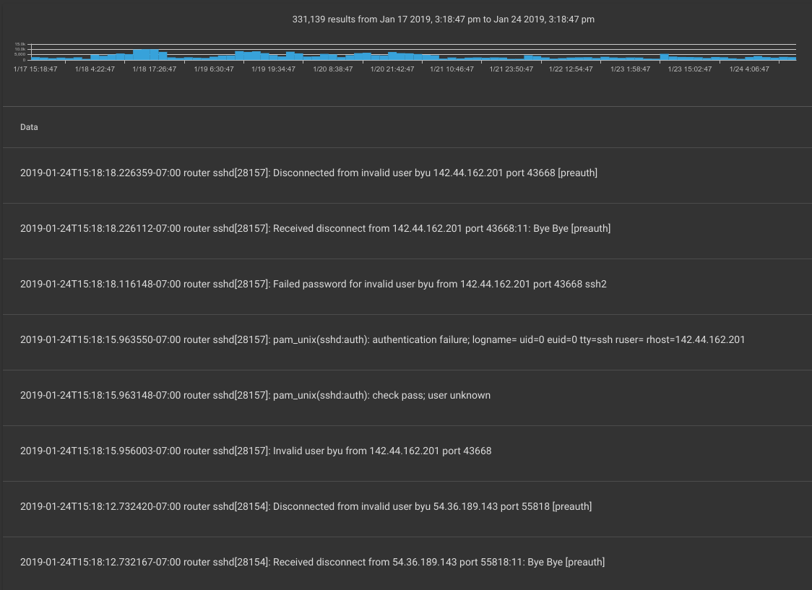

### ファイルインジェスター

File Follower ingesterは、標準のLinuxログファイルを取り込むように事前に構成されているため、ログをGravwellに取り込む最も簡単な方法の1つです。

Gravwell Debianリポジトリを使用している場合、インストールはただ1つのaptコマンドです。

```
apt-get install gravwell-file-follow
```

それ以外の場合は、[ダウンロードページ](#!quickstart/downloads.md)からインストーラーをダウンロードします。 Gravwellサーバー上のターミナルを使用して、次のコマンドをスーパーユーザーとして（たとえば、「sudo」コマンド経由で）発行して、ingesterをインストールします。

```
root@gravserver ~ # bash gravwell_file_follow_installer.sh
```

Gravwellサービスが同じマシンに存在する場合、インストールスクリプトは自動的に`Ingest-Auth`パラメーターを抽出して設定し、適切に設定します。 ただし、ご使用のコンピューターが既存のGravwellバックエンドと同じマシンに常駐していない場合、インストーラーは認証トークンとGravwellインデクサーのIPアドレスの入力を求めます。 インストール時にこれらの値を設定するか、空白のままにして、`/opt/gravwell/etc/file_follow.conf`の設定ファイルを手動で変更できます。 ingesterの構成の詳細については、[ingesters documentation](#!ingesters/ingesters.md)を参照してください。

### シンプルリレーインジェスター

Gravwellの「シンプルリレー」グループは、ネットワーク経由で行区切りまたはsyslog形式のメッセージを取り込むことができます。 既存のデータソースからデータをGravwellに取り込むもう1つの良い方法です。

Gravwell Debianリポジトリを使用している場合、インストールはただ1つのaptコマンドです。

```
apt-get install gravwell-simple-relay
```

それ以外の場合は、[ダウンロードページ](#!quickstart/downloads.md)からインストーラーをダウンロードします。 Gravwellサーバー上のターミナルを使用して、次のコマンドをスーパーユーザーとして（たとえば、「sudo」コマンド経由で）発行して、ingesterをインストールします。

```
root@gravserver ~ # bash gravwell_simple_relay_installer.sh
```

Gravwellサービスが同じマシンに存在する場合、インストールスクリプトは自動的に`Ingest-Auth`パラメーターを抽出して設定し、適切に設定します。 ただし、ご使用のコンピューターが既存のGravwellバックエンドと同じマシンに常駐していない場合、インストーラーは認証トークンとGravwellインデクサーのIPアドレスの入力を求めます。 インストール時にこれらの値を設定するか、空白のままにして、`/opt/gravwell/etc/simple_relay.conf`の設定ファイルを手動で変更できます。 ingesterの構成の詳細については、[ingesters documentation](#!ingesters/ingesters.md)を参照してください。

### インジェスター　メモ

これらのクイックスタート手順にあるように、インストールが1台のマシンに完全に含まれている場合、ingesterインストーラーは構成オプションを抽出し、適切に構成します。 すべてのGravwellコンポーネントが単一のシステムで実行されているわけではない高度なセットアップを使用している場合は、ドキュメントの[インジェスター](#!ingesters/ingesters.md)セクションを確認してください。

Gravwellサーバーで実行されているFile FollowおよびSimple Relayサービスがあります。 File Followは、`/var/log/`のいくつかのファイルからログエントリを自動的に取り込みます。 デフォルトでは、「auth」タグ付きの/var/log/auth.log、「dpkg」タグ付きの/var/log/dpkg.log、および/ var / log / dmesgおよび/var/log/kern.logを取り込みます 「カーネル」タグ付き。

簡易リレーは、TCPポート601またはUDPポート514で送信されたsyslogエントリを取り込みます。 これらは「syslog」タグでタグ付けされます。 Simple Relay構成ファイルには、ポート7777で行区切りデータをリッスンするエントリも含まれています。これは、syslogのみを使用する場合は無効にできます。 設定ファイルの`[Listener "default"]`セクションをコメントアウトして、シンプルなリレーサービスを再起動してください。 このサービスの設定ファイルは`/opt/gravwell/etc/simple_relay.conf`にあります。 高度な設定オプションについては、[Ingesters documentation](#!ingesters/ingesters.md)のSimple Relayセクションを参照してください。

## Gravwellへのデータの供給
このセクションでは、データをGravwellに送信するための基本的な手順を説明します。 他のデータインジェスターをセットアップする手順については、[ingesters](#!ingesters/ingesters.md)セクションを確認してください。

Gravwellの「システム統計」ページは、Grabwellサーバーがデータを受信しているかどうかを確認するのに役立ちます。 データが報告されず、それがエラーだと思われる場合、インジェスターが実行されていることを再確認してください(`ps aux | grep gravwell`は`gravwell_webserver`、`gravwell_indexer`、`gravwell_simple_relay`、および`gravwell_file_follow`を表示する必要があります) それらの構成ファイルは正しいです。

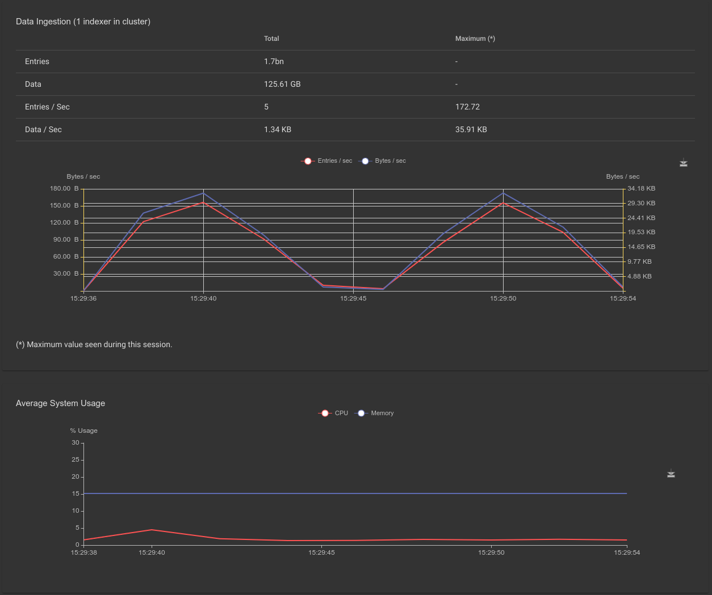

### Syslogの取り込み
Gravwellサーバーがインストールされ、Simple Relayテキストingesterサービスが実行されると、syslogプロトコルを介してGravwellへのログまたはテキストデータの供給を開始できます。 デフォルトでは、Simple Relay ingesterはポート601でTCP syslog、ポート514でUDP syslogをリッスンします。

rsyslogを実行しているLinuxサーバーからGravwellにsyslogエントリーを送信するには、サーバーに`/etc/rsyslog.d/90-gravwell.conf`という名前の新しいファイルを作成し、UDP syslogの次の行を貼り付けます。

```
*.* @gravwell.addr.goes.here;RSYSLOG_SyslogProtocol23Format
```

または、代わりにTCP syslogにこれを使用します。

```
*.* @@gravwell.addr.goes.here;RSYSLOG_SyslogProtocol23Format
```
（UDP構成での@の使用とTCPでの@@の使用に注意してください）

次に、rsyslogデーモンを再起動します。

```
sudo systemctl restart rsyslog.service
```

多くのLinuxサービス（DNS、Apache、sshなど）は、syslogを介してイベントデータを送信するように構成できます。 これらのサービスとGravwellの「間」としてsyslogを使用することは、多くの場合、イベントをリモートで送信するようにこれらのサービスを構成する最も簡単な方法です。

たとえば、Apache構成エントリにこの行を追加すると、すべてのApacheログがrsyslogに送信され、それらがGravwellに転送されます。

```
CustomLog "|/usr/bin/logger -t apache2.access -p local6.info" combined
```

### アーカイブされたログ
Simple Relay ingesterは、ファイルシステム上にある古いログ（Apache、syslogなど）を取り込むためにも使用できます。 netcatのような基本的なネットワーク通信ツールを利用することにより、Simple Relay ingesterの行区切りのリスナーにあらゆるデータをシャベルで取り込むことができます。 デフォルトでは、簡易リレーはTCPポート7777で回線配信エントリをリッスンします。

たとえば、Gravwellで分析したい古いApacheログファイルがある場合、次のようなコマンドを実行してそれらを取り込むことができます。

```
user@webserver ~# cat /tmp/apache-oct2017.log | nc -q gravwell.server.address 7777
```
注：複数のファイルで非常に大きなログのセットを取り込む場合、MassFileIngesterユーティリティを使用して、Simple Relay ingesterを介してリレーするのではなく、事前に最適化してまとめて取り込むことをお勧めします。

### ネットワークパケットインジェスター

Gravwellの主な強みは、バイナリデータを取り込む機能です。 ネットワークingesterを使用すると、後で分析するためにネットワークから完全なパケットをキャプチャできます。 これにより、Netflowまたはその他の凝縮されたトラフィック情報を単純に格納するよりもはるかに優れた柔軟性が提供されますが、ストレージの使用量は増えます。

Gravwell Debianリポジトリを使用している場合、インストールはただ1つのaptコマンドです。
```
apt-get install libpcap0.8 gravwell-network-capture
```

それ以外の場合は、[ダウンロードページ](#!quickstart/downloads.md)からインストーラーをダウンロードします。 ネットワークingesterをインストールするには、rootとしてインストーラーを実行するだけです（ファイル名は若干異なる場合があります）。

```
root@gravserver ~ # bash gravwell_network_capture_installer.sh
```
ネットワークingesterには、libpcap共有ライブラリが必要です。 スタンドアロンインストーラーを使用する場合は、ライブラリもインストールされていることを確認する必要があります。 パッケージはDebianでは `libpcap0.8`です。

Gravwellバックエンドがすでにインストールされているマシン上で感染している場合、インストーラーは自動的に正しい「Ingest-Secrets」値を取得し、それを設定ファイルに追加する必要があります。 いずれにしても、実行する前に  `/opt/gravwell/etc/network_capture.conf`の設定ファイルを確認してください。 Interfaceフィールドがシステムのネットワークインターフェースの1つに設定された状態で、少なくとも1つの「Sniffer」セクションのコメントが外されていることを確認してください。 詳細については、[Ingesters documentation](#!ingesters/ingesters.md)を参照してください

注：Debianパッケージとスタンドアロンインストーラーの両方が、キャプチャ元のデバイスを要求する必要があります。 選択を変更したい場合は、 `/opt/gravwell/etc/network_capture.conf`を開き、目的のインターフェイスを設定し、 `service gravwell_network_capture restart` を実行して、ingesterを再起動します。

## 検索中
Gravwellサーバーが稼働し、データを受信すると、検索パイプラインの能力が利用可能になります。

このクイックスタート設定で取り込まれたデータのタイプに基づいた検索の例を次に示します。 これらの例では、syslogデータがLinuxサーバーによって生成され、Simple Relayテキストingesterを介して取り込まれ、前のセクションで説明したようにパケットがネットワークからキャプチャされていると想定しています。

### syslogの例
Syslogは、Unixのロギングおよび監査操作のコアコンポーネントです。 UNIXインフラストラクチャのデバッグと防御を行いながら、ログイン、クラッシュ、セッション、またはその他のサービスアクションを完全に可視化することが重要です。 Gravwellを使用すると、多くのリモートマシンからsyslogデータを中央の場所に簡単に取得し、クエリの準備ができます。この例では、いくつかのSSHログを追跡し、管理者またはセキュリティの専門家がSSHアクティビティを監視する方法を調べます。

この例では、SSHログインデータをGravwellインスタンスに送信するサーバー。 SSH関連のすべてのエントリのリストを表示するには、次のような検索を実行できます。

```
tag=syslog grep ssh
```

検索コマンドの内訳は次のとおりです。

* `tag=syslog`: 「syslog」とタグ付けされたデータのみを見てください。 SimpleRelay ingesterは、TCPポート601またはUDPポート514を介して入ってくるときに「syslog」タグでデータをタグ付けするように設定されています。
* `grep ssh`: 「grep」モジュール（同様のlinuxコマンドにちなんで命名）は、特定のテキストを検索します。 この場合、検索は「ssh」を含むエントリを探します。

検索結果は、概要グラフと一連のログエントリとして返されます。概要グラフは、パイプラインを通過した一致レコードの頻度プロットを示します。このグラフを使用して、ログエントリの頻度を特定し、検索の時間枠内を移動して、検索を再発行せずにビューを絞り込むことができます。ほぼすべての検索には、時間枠を再調整して調整する機能があります。時間の順序を変更する検索のみに概要グラフはありません。

「ssh」を含むすべてのエントリの結果を以下に示します。

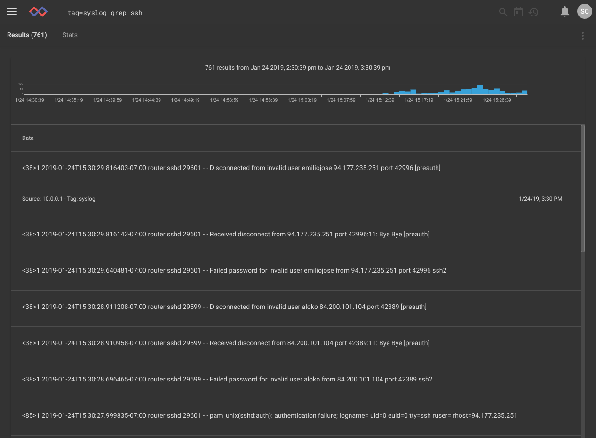

これらの結果は非常に広範な洞察を与えるかもしれませんが、有用な情報を真に抽出するには、検索を絞り込む必要があります。この例では、成功したSSHログインを抽出します。 また、ログレコードから特定のフィールドを抽出して、結果の表示を簡単にします。

```
tag=syslog syslog Appname==sshd Message~Accepted | regex -e Message "Accepted\s(?P<method>\S+)\sfor\s(?P<user>\S+)\sfrom\s(?P<ip>\S+)"
```

検索の内訳：

* ```tag=syslog```: 「syslog」とタグ付けされたデータに検索を制限する
* ```syslog Appname==sshd Message~Accepted```: これにより、syslogモジュールが呼び出され、「sshd」アプリケーションによって生成されたsyslogメッセージのみにフィルタリングされ、メッセージ本文に「Accepted」という文字列が含まれます。
* ```regex -e Message "Accepted\s(?P<method>\S+)\sfor\s(?P<user>\S+)\sfrom\s(?P<ip>\S+)"```: これは、syslogモジュールを使用して抽出されたメッセージ本文のみで動作する正規表現です。 ユーザー、IP、および成功したログイン方法を抽出します。

結果はログインのみに絞り込まれます：

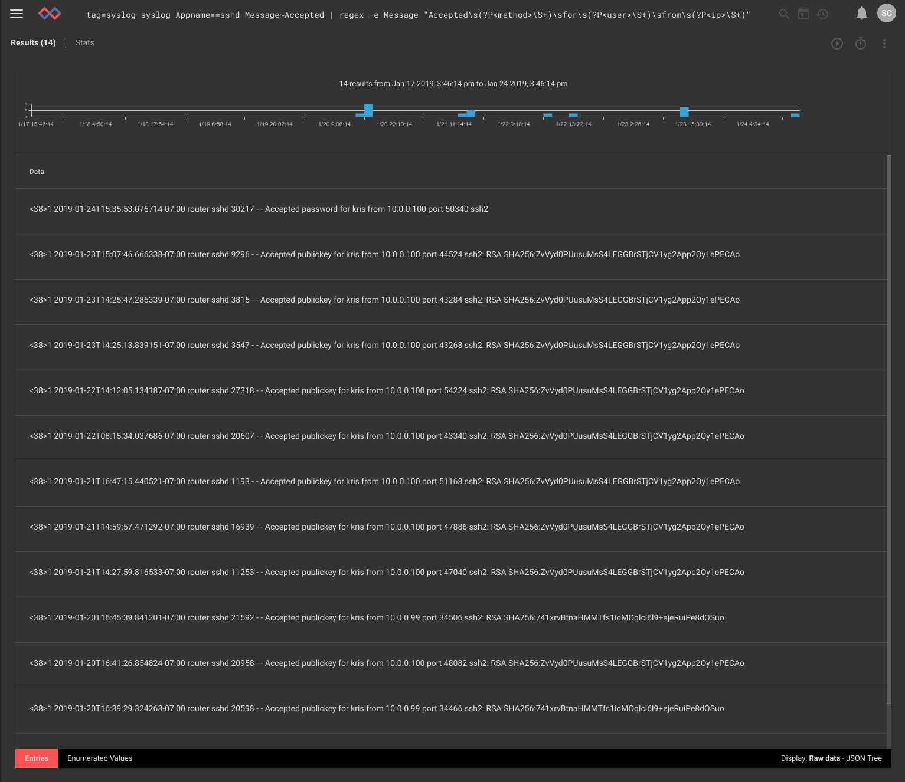

結果の下部にある「列挙値」ボタンをクリックすると、この検索で抽出された使用可能な列挙値がすべて表示されます。

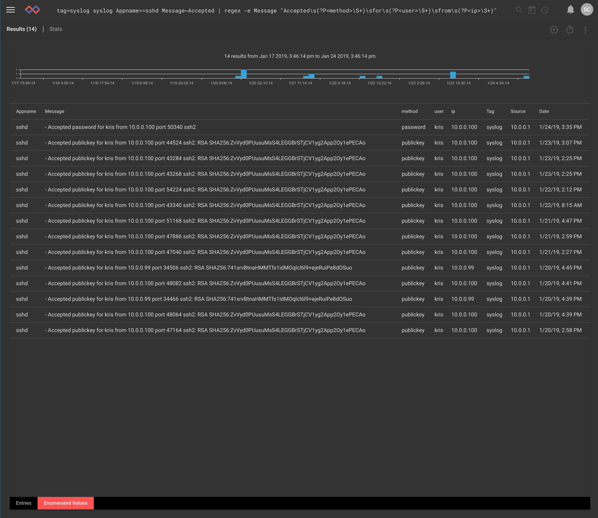

クエリの最後に*レンダリングモジュール*を指定して、結果の表示方法を変更できます。 ログインしたすべてのユーザー名のグラフが必要な場合は、次の検索を実行できます。

```
tag=syslog syslog Appname==sshd Message~Accepted | regex -e Message "Accepted\s(?P<method>\S+)\sfor\s(?P<user>\S+)\sfrom\s(?P<ip>\S+)" | count by user | chart count by user
```

新しい検索クエリアイテムの内訳は次のとおりです。

* ```ユーザーごとにカウント```:`count`モジュールは（regexによって抽出された）各`user`値が出現する回数をカウントします。
* ```ユーザー別のチャート数```: カウントモジュールの出力をチャートレンダラーにパイプし、カウントモジュールの結果によって決定される大きさでユーザーごとに個別の線を描画します。

結果には、検索期間中にシステムにログインしたすべてのユーザーの素晴らしいグラフが表示されます。 グラフの種類を変更してデータにさまざまなビューを表示したり、概要チャートを使用して結果のより短い時間枠を選択したりできます。 IT管理者「クリス」は、予想どおり最近これらのシステムにログインする唯一のユーザーのようです。

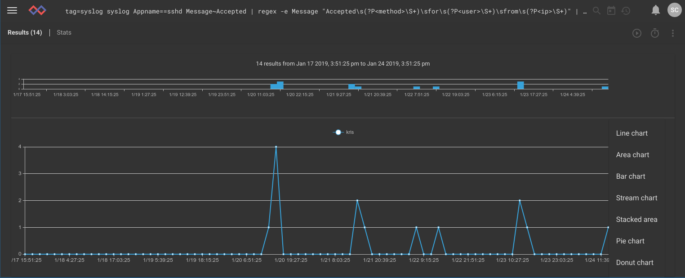

チャートアイコン（ジグザグ線）をクリックして、チャートのタイプを変更することもできます。 これは、棒グラフに表示されるまったく同じデータです。

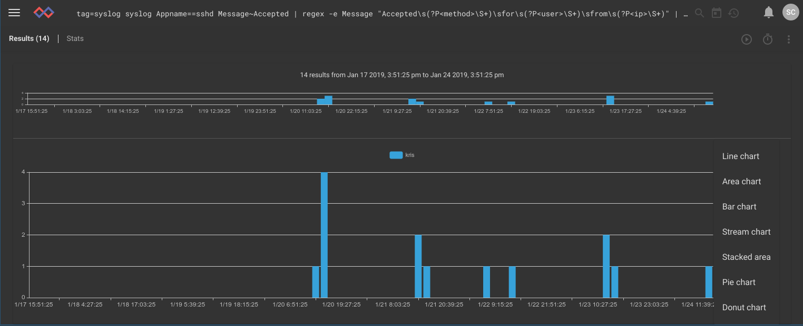

### ネットワーク例
ユーザーがLinuxルーターでパケットキャプチャingesterを設定し、インターネットとの間で送受信されるすべてのパケットをキャプチャするホームネットワークの例を考えてみましょう。 このデータを使用して、特定のゲームがプレイされるときなど、使用パターンを分析できます。 サンプルハウスは10.0.0.0/24ネットワークサブネットを使用し、Blizzard Entertainmentゲームはゲームトラフィックにポート1119を使用します。 次の検索では、BlizzardゲームをプレイしているPCとそのタイミングが表示されます。

```
tag=pcap packet ipv4.DstIP !~ 10.0.0.0/24 tcp.DstPort==1119 ipv4.SrcIP | count by SrcIP | chart count by SrcIP
```

検索コマンドのレビューは次のとおりです。

* ```tag=pcap```: Gravwellに、「pcap」というタグの付いたアイテムのみを検索するように指示します。
* ```packet```: パケット解析検索パイプラインモジュールを呼び出し、このコマンドの残りのオプションを有効にします。
  * ```ipv4.DstIP !~ 10.0.0.0/24```: Gravwellパケットパーサーは、パケットをさまざまなフィールドに分割します。 この場合、検索は宛先IPを比較し、10.0.0.xクラスCサブネットにないものを探しています。
  * ```tcp.DstPort == 1119```: 宛先ポートを指定します。 これにより、ほとんどのBlizzard Entertainmentゲームで使用されるポート1119宛てのパケットのみがフィルターされます。
  * ```ipv4.SrcIP```: 比較演算子なしでこのフィールドを指定すると、パケットパーサーはソースIPを抽出してパイプラインに配置します。
* ```count by SrcIP```: フィルタリングされた結果をパケットパーサーから数学カウントモジュールにパイプし、各ソースIPが表示される回数をカウントするように指示します。
* ```chart count by SrcIP```: カウント結果をグラフ表示レンダラーにパイプして表示し、ソースIP値ごとに個別の線を描画します。

結果：2つのシステムがポート1119にトラフィックを送信しています。黄色（10.0.0.6）で表されるIPはパッシブトラフィックであるように見えますが、青色の10.0.0.183はBlizzardゲームサービスとアクティブに通信しています。

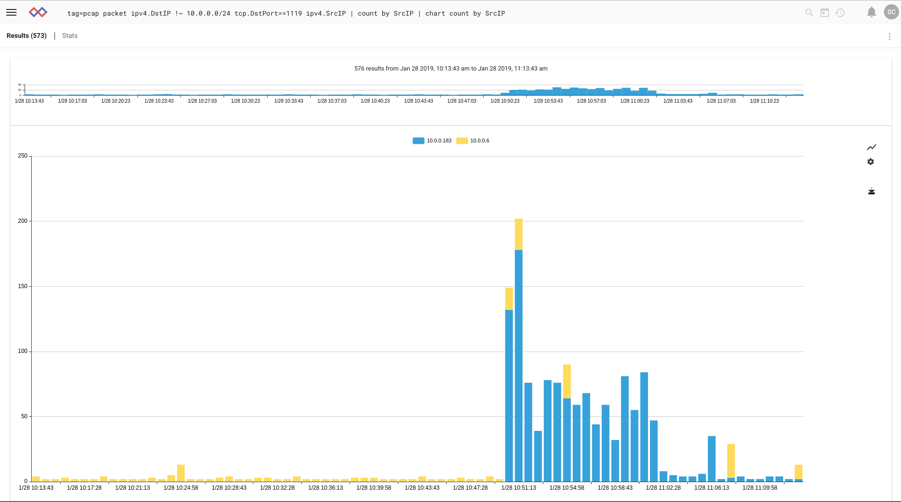

パケット解析検索モジュールの使用の詳細については、[パケット検索モジュールのドキュメント](#!search/packet/packet.md)を参照してください。

## ダッシュボード
ダッシュボードは、データの複数の側面を一度に表示する検索の集約ビューです。

「ダッシュボード」ページに移動し（左上のメニューを使用）、「+追加」ボタンをクリックして新しいダッシュボードを作成します。これを「SSH auth monitoring」と呼びます。次に、検索を追加します。この例では、 以前のSSH認証検索。その検索を再発行し、結果画面から、右上の3ドットメニューを使用して[ダッシュボードに追加]を選択し、新しいダッシュボードを選択します。 検索がダッシュボードに追加され、そのダッシュボードに移動するためのリンクが提供されていることを確認して、リンクをクリックします。
ダッシュボードで検索用のタイルが自動的に作成されているはずですが、サイズを変更することもできます。 タイルのメニューから[タイルの編集]を選択すると、タイルの表示方法を変更できます。

### 動作中のダッシュボード
Gravwellの一般的な使用例の1つは、ネットワークアクティビティの追跡です。 ここには、アウトバウンドおよびインバウンドの帯域幅レート、wifi上のアクティブなMAC、Windowsネットワークイベント、および一般的なパケット頻度をレポートするダッシュボードがあります。 このデータはすべて、pcap、netflow、およびWindowsイベントから抽出されます。

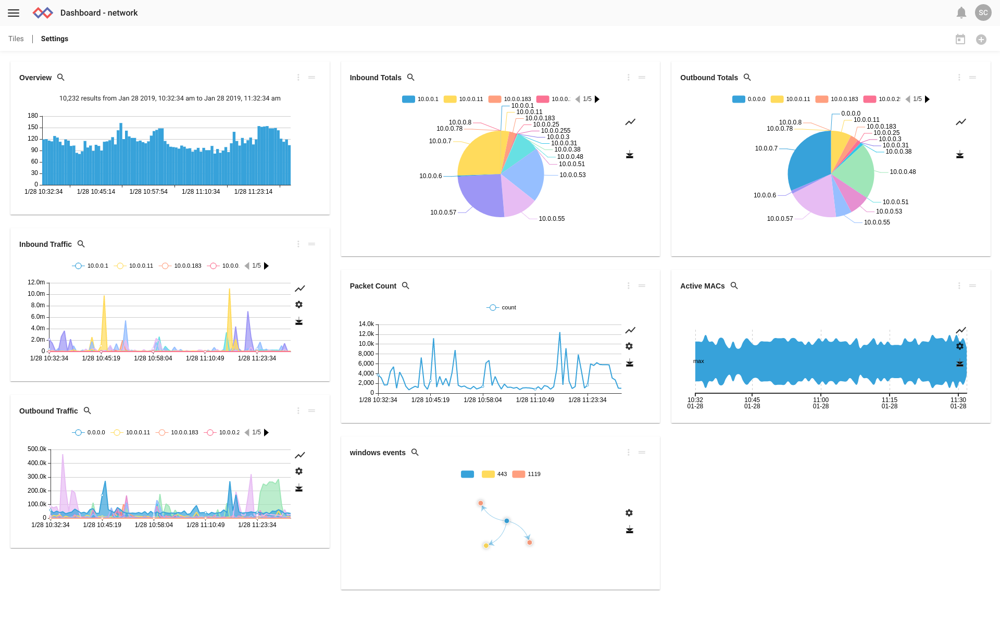

アウトバウンドトラフィックチャートは、午前10時34分ごろの静かなシステムでかなり大きなスパイクを示しているため、概要チャートで短い時間枠を「ブラッシング」して拡大します。 デフォルトでは、1つの概要を拡大すると、このダッシュボードに関連付けられている他の検索が拡大されます。 そのため、成功したログインを拡大すると、残りのグラフが更新され、この短い時間範囲が反映されます。 ズームインすると、アドレス10.0.0.57のスパイクを確認できます。 さらに調査するには、事前に構築されたネットワーク調査ダッシュボードを使用できますが、これはこのクイックスタートの範囲外です。

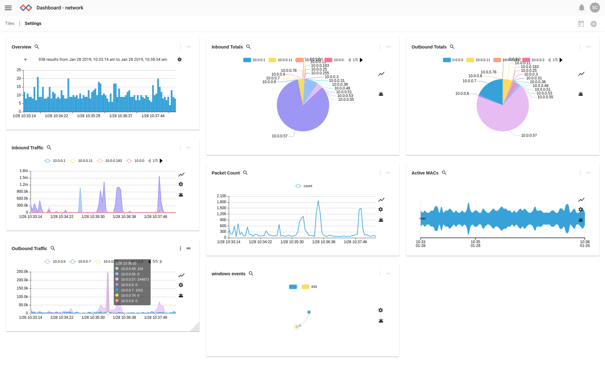

## 高度なトピック

### クラスター化された構成

マルチノードライセンスを持つユーザーは、複数のインデクサーとWebサーバーのインスタンスを展開し、ネットワーク上でそれらを調整できます。 このようなセットアップを展開する前に、Grabwellのサポートチームと調整することを強くお勧めしますが、このドキュメントの基本的な手順の概要を説明します。

ほとんどのユースケースでは、単一のWebサーバーと複数のインデクサーノードが望ましいでしょう。 簡単にするために、Webサーバーがインデクサーの1つと同じノードに存在する環境について説明します。

最初に、ヘッドノードとなるシステムで、上記のシングルノードGravwellインストールを実行します。 これにより、ウェブサーバーとインデクサーがインストールされ、認証シークレットが生成されます。
```
root@headnode# bash gravwell_installer.sh
```

次に、`/opt/gravwell/etc/gravwell.conf`のコピーを別の場所に作成し、「Indexer-UUID」で始まる行を削除します。 このgravwell.confファイルとインストーラーを各インデクサーノードにコピーします。 インデクサーノードで、追加の引数をインストーラーに渡して、ウェブサーバーのインストールを無効にし、新しいファイルを生成するのではなく、既存のgravwell.confファイルを使用するように指定します。

```
root@indexer0# bash gravwell_installer.sh --no-webserver --no-searchagent --use-config /root/gravwell.conf
```

インデクサーノードごとにこのプロセスを繰り返します。
インストールの最後のステップは、これらすべてのインデクサーをWebサーバーに通知することです。 *ヘッドノード*で、`/opt/gravwell/etc/gravwell.conf`を開き、 'Remote-Indexers'行を見つけます。`Remote-Indexers=net:127.0.0.1:9404`のようになります。 次に、その行を複製し、他のインデクサーを指すようにIPを変更します（IPアドレスまたはホスト名を指定できます）。 たとえば、ローカルマシンとindexer0.example.net、indexer1.example.net、indexer2.example.netという3つの他のマシンにインデクサーがある場合、設定ファイルには次の行が含まれている必要があります。

```
Remote-Indexers=net:127.0.0.1:9404
Remote-Indexers=net:indexer0.example.net:9404
Remote-Indexers=net:indexer1.example.net:9404
Remote-Indexers=net:indexer2.example.net:9404
```

コマンド`systemctl restart gravwell_webserver`でウェブサーバーを再起動します。 これで、「システム統計」ページを表示して「ハードウェア」タブをクリックすると、4つのインデクサープロセスのそれぞれのエントリが表示されます。
