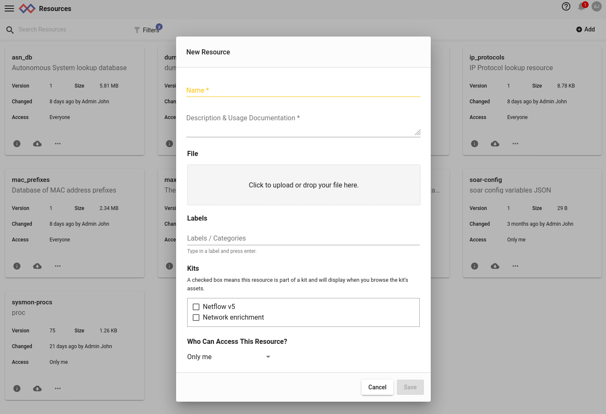

# リソースシステムの説明

リソースを使用すると、ユーザーは検索で使用する永続データを保存できます。 リソースはユーザーが手動でアップロードするか、検索モジュールで自動的に作成できます。 リソースはookupルックアップテーブルを格納するためにモジュールによって使用され、anko`スクリプトを格納するためにモジュールによって使用されます。

リソースの形式は制限されていません。 Gravwellの観点から見ると、リソースは単なるバイトのストリームです。 そのバイトストリームから意味を引き出すのは検索モジュール次第です。単にテキストファイルとしてrソースを扱う`lookup`間、特定のバイナリエンコーディングのデータを予期`anko`ます。「anko」モジュール用に書かれたスクリプトは、それ自体がJSONエンコードされたテキストなどのさまざまな形式のリソースを作成してアクセスする場合があります。

## リソースの基本

すべてのリソースは、リソースの作成時に割り当てられるUUIDで一意に識別されます。リソースには、ユーザーが選択したわかりやすい名前もあります。 GUIDまたは名前のいずれかを指定することでリソースにアクセスできますが、名前を変更できることに注意してください。他のユーザーと共有するダッシュボードまたは検索クエリを作成するときは、GUIDを使用してリソースを参照することをお勧めします。

グローバルリソースは、すべてのユーザーがアクセスできるように管理者レベルのユーザーが作成したリソースです。リソースは特定のグループと共有することもできます。

リソースの作成は、そのリソースにデータを入力する行為とは別に保持されます。最初に、作成者が指定した名前と説明でリソースが作成されます。 Gravwellはこの時点でリソースにUUIDを割り当て、システムに空のリソースを作成します。次に、ユーザーはリソース（名前またはUUIDで指定）にデータを入力できます。

リソースデータは、手動で、または検索を実行して生成できます。たとえば、テーブル表示をもたらす検索は、「lookupdata」としてダウンロードし、リソースシステムにアップロードできます。

<span style="color: red; ">注：リソースを実際にシステムにアップロードする場合、データをGravwell検索モジュールで使用できるようにするには、データの形式を変換または変更する必要がある場合があります。たとえば、ユーザーがルックアップモジュールで使用するホスト名とMACアドレスのcsvを持っている場合、最初にcsvを「lookupdata」ファイルタイプに変換する必要があります。</span>

### リソース名解決

リソースシステムは、一意のリソース名を強制しません。 複数のユーザーが“foo”という名前のリソースを持つことができます。実際、1人のユーザーが“foo”という名前の複数のリソースを所有できます。 したがって、リソースシステムがリソース名を一意のGUIDに解決する方法を認識することが重要です。

検索でのankoスクリプトの呼び出し例： `anko myscript`を考えてみましょう。 リソースマネージャは、次の順序で「myscript」という名前のリソースを見つけようとします。

*呼び出し元のユーザーに名前の付いたリソースがあるかどうかを確認してくださいmyscript。その名前のリソースが複数ある場合は、最初の一致が返されます。
*ユーザーが属する各グループを確認します。 ユーザーのグループのいずれかと共有される「myscript」という名前のリソースがある場合、そのリソースが返されます。
* `myscript`という名前のグローバルリソースがあるかどうかを確認します。

ユーザーはグループAおよびBのメンバーになることができ`myscript`、グループAと共有という名前の1つのリソースと`myscript`、グループB と共有という名前の別の固有のリソースがある可能性があることに注意してください。どのリソースが返されるかは定かではありません。同様に、名前付きのグローバルリソースが複数ある場合は`myscript`、それらのうちのどれでも返すことができます。

このあいまいさは2つの方法で克服できます。 最も安全な選択は、リソースをGUIDとして指定することです。これは、以下のリソース管理セクションに示すように、リソース編集ページで見つけることができますが、GUIDは非常に扱いにくく、ユーザーに有用なコンテキストをほとんど提供しません。

幸いなことに、リソース名の前に名前空間を付けることで、より正確に名前でリソースを選択することもできます。 以下は有効なネームスペースの選択です。

* `GLOBAL：myscript`は、` myscript`という名前のグローバルリソースを指定します。 これにより、呼び出し元ユーザーが所有するリソースはすべて無視され、グローバルリソースに直接移動します。
* `user = jfloren：myscript`は、ユーザー` jfloren`に属する `myscript`という名前のリソースを指定します。 呼び出し元のユーザーがこのリソースにアクセスできない場合、これは失敗することに注意してください。
* `group = security：myscript`は、グループ` security`に共有される `myscript`という名前のリソースを指定します。 呼び出し元のユーザーがセキュリティグループのメンバーでない場合、これは失敗することに注意してください。

##GUIによるリソース管理

リソースは、ユーザーインターフェイスのメインメニューを介して管理されます。 メニューを開き、「Resource」を選択します。


このメニューからリソースを作成および削除できます。

### リソースを削除する

既存のリソースを削除するには、リスト内の目的のリソースの横にあるごみ箱アイコンをクリックします。 システムは現在、リソースを削除する前に確認を求めないため、注意が必要です。

### リソースを作成する

新しいリソースを作成するには、右上の「追加」ボタンを選択します。



必要に応じてリソース名と説明を設定し、リソースを読み込めるグループを選択してから、アップロードするファイルを選択します。 [保存]ボタンを押すまで、リソースは作成またはアップロードされません。

### リソースを編集する

既存のリソースを編集するには、リソースリストの目的のリソースの下にある鉛筆の「Edit」アイコンをクリックします。 これにより、リソース編集画面が開きます。


名前、説明、およびグループの共有はすべてこの画面から管理できます。 管理者ユーザーは、リソースをグローバルにするか非グローバルにするかを選択することもできます。

リソースの実際の内容を変更するには、新しいリソースを作成するときとまったく同じように、ファイルをグレーの「ファイル」領域にドラッグするか、または新しいファイルをクリックして選択します。別のファイルをアップロードすると、[バージョン]、[ハッシュ]、[サイズ]、および[最終更新日]の各フィールドが変わります。

<span style="color: red; ">重要：リソースの説明に対する変更は、「保存」ボタンをクリックしない限り保存されません。</span>

## リソースを使う

リソースは一部の検索モジュールで使用されます。 この例では、「lookup」モジュールを使用して、ホスト名に対するMACアドレスの基本的な参照ルックアップを実行します（これは、元々csvファイルから生成されたものです）。

csvの例は次のようになります。
```
mac,hostname
mobile-device-1,40:b0:fa:d7:af:01
desktop-1,64:bc:0c:87:bc:71
mobile-device-2,40:b0:fa:d7:ae:02
desktop-2,64:bc:0c:87:9a:11
```

リソースを利用するモジュールは、リソースの指定に「-r」スイッチを使用します。 この例では、次の一般的な構文を持つルックアップモジュールを使用します。

```
lookup -r <resource name> <enumerated value> <column to match> <column to extract> as <valuename>
```

mac-> hostnameルックアップの例を適用すると、次のようなクエリになります。

```
tag=pcap packet eth.SrcMAC | count by SrcMAC | lookup -r macnames SrcMAC mac hostname as devicename |  table SrcMAC devicename count
```

リソースの正確な構文と利用は、それを利用する検索モジュールによって定義されます。特定のモジュールによるリソース使用量の詳細については、特定のモジュールの資料を参照してください。

ユースケースと例は、https://www.gravwell.io/blog/ のブログからも入手できます。

##アクセス制御

各リソースは単一のユーザーに属します。 リソースの変更または削除を許可されているユーザーは、所有者と管理者のみです。

所有者は、リソースへのアクセスを許可されているグループのリストを設定できます。 彼らはそれを読むことができますが、修正や削除はできません。

## CLIを使用したリソースの管理

Gravwell CLIクライアントには、リソース管理に対して基本的なサポートをしています。クライアントを起動したら、 `resource`コマンドを実行してリソースモードに入ります。

	#>  resource
	resource>

`list`コマンドは既存のリソースのリストを出力します。

	resource>  list
	+-----------------------------------------+-------------------+------------------------------+----------+-----------+----------------------+
	|                                    GUID |              Name |                Creation Date |    Owner |    Groups |          Description |
	+=========================================+===================+==============================+==========+===========+======================+
	|    98abb985-52ef-4b09-9353-c4352603d863 |               foo |    2018-01-24T12:28:44-07:00 |     john |           |           a resource |
	+-----------------------------------------+-------------------+------------------------------+----------+-----------+----------------------+
	|    cce311fd-96d9-4a39-b36e-c088d2ee8546 |    globalresource |    2018-01-24T12:42:45-07:00 |    admin |           |    a global resource |
	+-----------------------------------------+-------------------+------------------------------+----------+-----------+----------------------+


<span style="color: red; ">注：クライアントによって生成された表は幅が広いため、一部の画面では折り返さずに表全体を表示できない場合があります。</span>

ユーザー「john」が所有する「foo」という名前のリソースと、「admin」が所有する「globalresource」という名前の別のリソースがあることがわかります。

`create`コマンドを使用して新しいリソースを作成します：

	resource>  create
	Name>  myresource
	Description>  My new resource
	Created new resource with GUID b6c36f76-3a45-44a3-9ff1-f6ebb47bb329

リソースが作成されたら、それにデータをアップロードできます。

	resource>  update
	+-----------------------------------------+-------------------+------------------------------+----------+-----------+----------------------+
	|                                    GUID |              Name |                Creation Date |    Owner |    Groups |          Description |
	+=========================================+===================+==============================+==========+===========+======================+
	|    98abb985-52ef-4b09-9353-c4352603d863 |               foo |    2018-01-24T12:28:44-07:00 |     john |           |           a resource |
	+-----------------------------------------+-------------------+------------------------------+----------+-----------+----------------------+
	|    cce311fd-96d9-4a39-b36e-c088d2ee8546 |    globalresource |    2018-01-24T12:42:45-07:00 |    admin |           |    a global resource |
	+-----------------------------------------+-------------------+------------------------------+----------+-----------+----------------------+
	|    b6c36f76-3a45-44a3-9ff1-f6ebb47bb329 |        myresource |    2018-01-24T12:45:15-07:00 |     john |           |      My new resource |
	+-----------------------------------------+-------------------+------------------------------+----------+-----------+----------------------+
	GUID>  b6c36f76-3a45-44a3-9ff1-f6ebb47bb329
	file path>  /tmp/mydata

この`update`コマンドを実行すると、クライアントはまず既存のリソースを出力します。 作成したばかりのリソースのGUIDを選択し、アップロードするファイルを指定します（この場合は `/tmp/mydata`）

最後に、 この`delete`コマンドを使用して、不要になったリソースを削除できます。

```
resource>  delete
+-----------------------------------------+-------------------+------------------------------+----------+-----------+----------------------+
|                                    GUID |              Name |                Creation Date |    Owner |    Groups |          Description |
+=========================================+===================+==============================+==========+===========+======================+
|    cce311fd-96d9-4a39-b36e-c088d2ee8546 |    globalresource |    2018-01-24T12:42:45-07:00 |    admin |           |    a global resource |
+-----------------------------------------+-------------------+------------------------------+----------+-----------+----------------------+
|    b6c36f76-3a45-44a3-9ff1-f6ebb47bb329 |        myresource |    2018-01-24T12:45:15-07:00 |     john |           |      My new resource |
+-----------------------------------------+-------------------+------------------------------+----------+-----------+----------------------+
|    98abb985-52ef-4b09-9353-c4352603d863 |               foo |    2018-01-24T12:28:44-07:00 |     john |           |           a resource |
+-----------------------------------------+-------------------+------------------------------+----------+-----------+----------------------+
GUID>  b6c36f76-3a45-44a3-9ff1-f6ebb47bb329
resource>  list
+-----------------------------------------+-------------------+------------------------------+----------+-----------+----------------------+
|                                    GUID |              Name |                Creation Date |    Owner |    Groups |          Description |
+=========================================+===================+==============================+==========+===========+======================+
|    98abb985-52ef-4b09-9353-c4352603d863 |               foo |    2018-01-24T12:28:44-07:00 |     john |           |           a resource |
+-----------------------------------------+-------------------+------------------------------+----------+-----------+----------------------+
|    cce311fd-96d9-4a39-b36e-c088d2ee8546 |    globalresource |    2018-01-24T12:42:45-07:00 |    admin |           |    a global resource |
+-----------------------------------------+-------------------+------------------------------+----------+-----------+----------------------+
```
