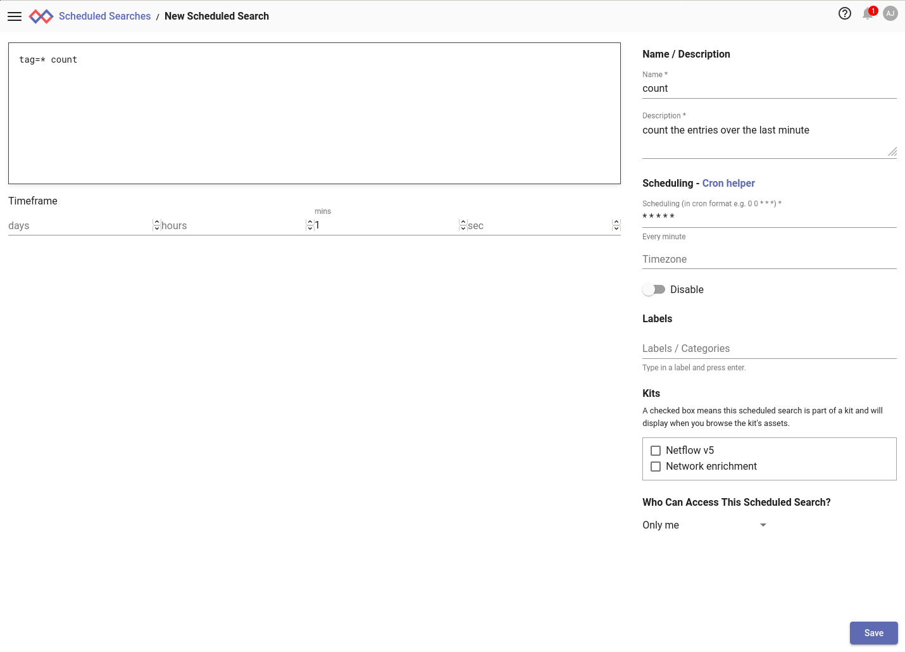
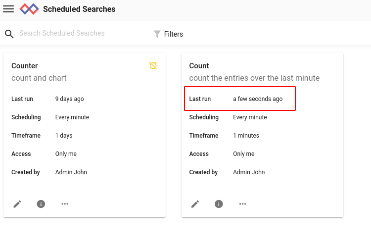
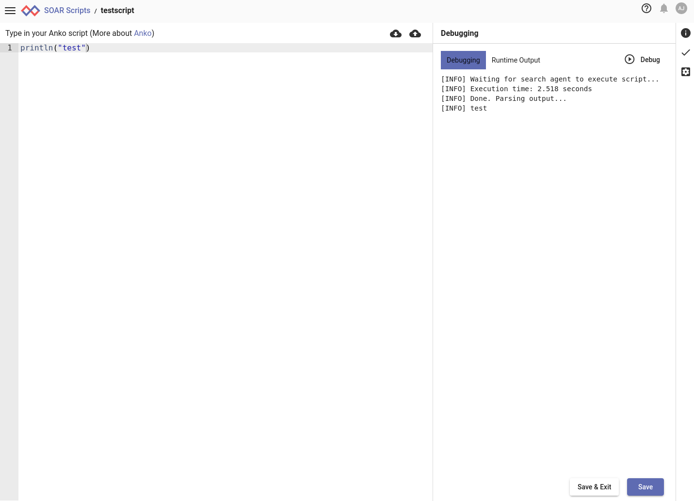
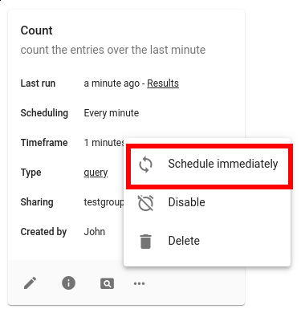

# 検索エージェントを使用した検索とスクリプトのスケジューリング

例えば、毎朝検索を実行して前の晩の悪意のある動作を検出したい場合など、検索やスクリプトを自動的に実行できれば多くの場合有利です。Gravwellの検索エージェントを使用すると、カスタマイズされたスケジュールで検索と[検索スクリプト](scriptingsearch.md)を実行できます。

スケジューリング機能により、ユーザーは通常の検索と[検索スクリプト](scriptingsearch.md)の両方をスケジュールできます。

## 検索エージェントのセットアップ

Gravwell Search AgentはGravwellのメインインストールパッケージに含まれており、デフォルトでインストールされます。`--no-webserver`フラグでwebserverコンポーネントを無効にするか、`--no-searchagent`フラグを設定すると、検索エージェントのインストールが無効になります。 検索エージェントはGravwell Debianパッケージによって自動的にインストールされます。

検索エージェントの設定（または無効化）の詳細については、[検索エージェント](searchagent.md)を参照してください。

## スケジュール検索の管理

スケジュール検索は、メインメニューの「オートメーション」サブメニューの下にある「スケジュール検索」ページから管理できます。次のスクリーンショットは、1時間ごとに実行される1つのスケジュール検索を示しています。

### スケジュール検索の作成

新しいスケジュール検索を作成するには、[スケジュール検索]ページの右上隅にある[追加]ボタンをクリックします。 新しいページが開きます：

検索文を入力し、実行する時間枠を指定し、名前と説明を与え、スケジュールを定義する必要があります。また、メンバーがこのスケジュール検索の結果を見ることができる1つ以上のグループを選択したり、[ラベル](#!gui/labels/labels.md)を定義したり、スケジュール検索をインストールされたキットに割り当てることもできます。

注：Gravwellは、cronスケジュール形式を使用して、検索をいつ実行するかを指定します。cronに慣れていない場合は、[Wikipedia](https://en.wikipedia.org/wiki/Cron)を確認し、[この](https://cron.help/)サイトでスケジューリングを試してみてください。

以下は、毎分ごとに実行される、最後の1分間に入力されたエントリの数をカウントする単純なスケジュール検索の定義です。

ここでは「保存後に実行」オプションを選択していることに注意してください。これは、できるだけ早く検索を実行し、それから通常のスケジュールを開始するように検索エージェントに指示します。これは、ルックアップテーブルを更新するために検索を実行している場合に特に便利です。

[保存]をクリックすると、検索がスケジュール検索リストに表示され、すぐに実行され、[最終実行]フィールドが更新されます。

## スケジュールスクリプトの管理

スケジュールスクリプトは、メインメニューの「オートメーション」サブメニューの下にある「スクリプト」ページから管理できます。スクリプトは、スケジュール検索と全く同じ方法で管理され、同じコントロールが利用できます。

### スケジュールスクリプトの作成

スケジュールスクリプトを作成するには、スクリプトページの右上にある「追加」ボタンをクリックします。これにより、スクリプトを入力するためのテキストエリアがある新しいスクリプトページが開きます。

スクリプト、名前、説明、スケジュールを入力したら、「保存」または「保存して終了」をクリックしてスクリプトを作成します。

### スクリプトのデバッグ

デフォルトでは、スクリプト編集ページの右側に「情報」タブが表示されますが、右端にアイコンの列があることに注意してください。チェックマークをクリックすると「デバッグ」タブが開き、スクリプトのテストに使用できます。「デバッグ」ボタンをクリックすると、検索エージェントは、*印刷機能を有効にした状態*で、できるだけ早くスクリプトを実行します。これは、問題のあるスクリプトをデバッグする際に非常に便利です。以下の例は、非常にシンプルなスクリプトとデバッグ出力を示しています。

## 検索結果の表示

スケジュールされた検索の最後の結果を表示するには、「結果の表示」アイコンをクリックします。

スケジュール検索の最新の結果セットがロードされます。

## スケジュール検索やスクリプトを無効にする

スケジュール検索を無効にすると、再び有効にするまでは実行されなくなります。 検索を無効にするには、3ドットメニューを開いて追加のオプションを表示し、無効を選択します。

再度有効にするには、プロセスを繰り返します。「無効」ではなく、メニューに「有効」と表示されます。

## 検索/スクリプトを強制実行

スケジュール検索やスクリプトを、いつでも強制実行することができます。その検索/スクリプトの3ドットメニューを開き、「すぐにスケジュールする」を選択します。これで、検索エージェントが可能な限り早く検索を実行します。

## スケジュール検索やスクリプトの削除

スケジュール検索を削除するには、「削除」オプションを選択します。

