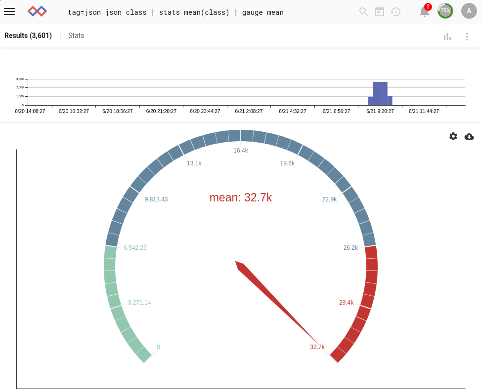
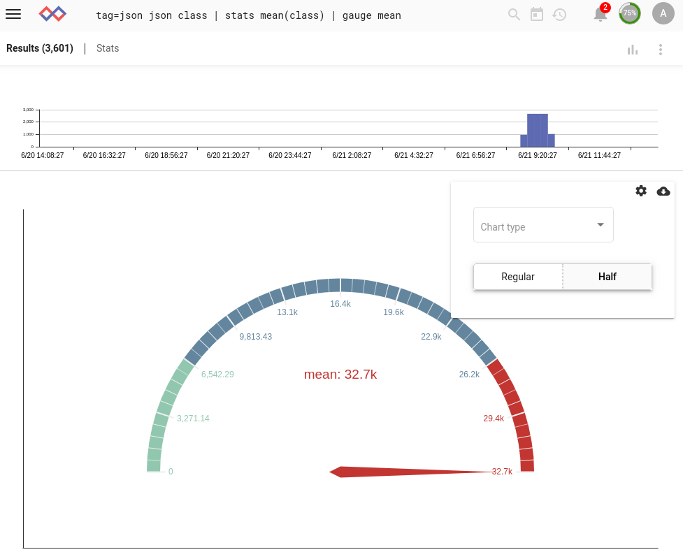
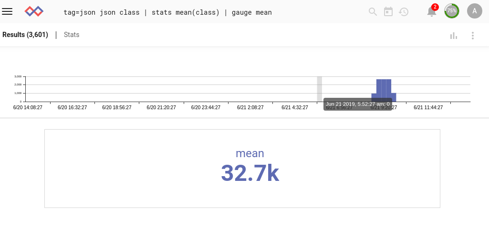
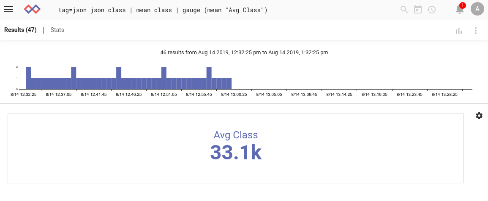
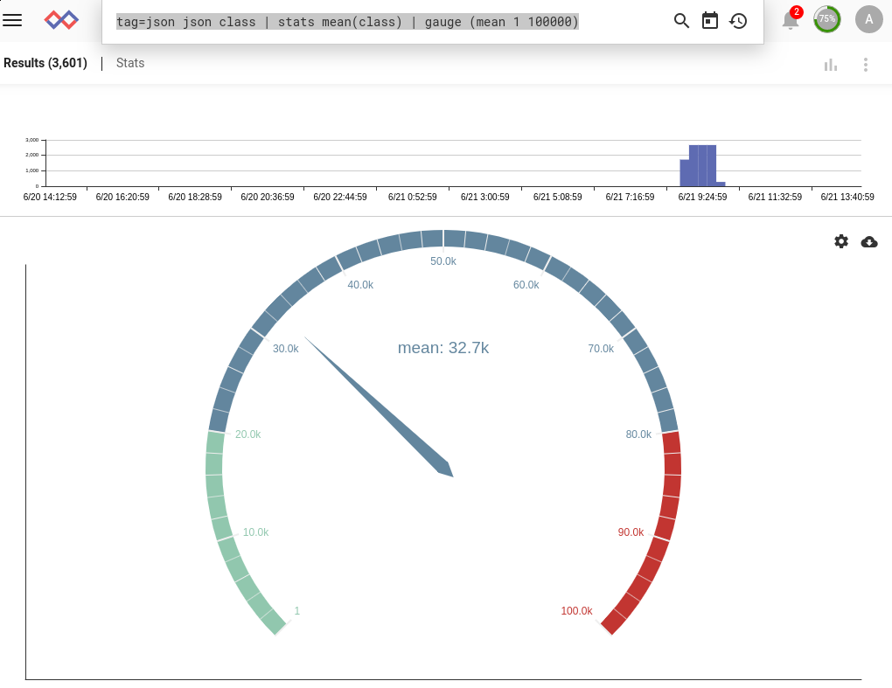
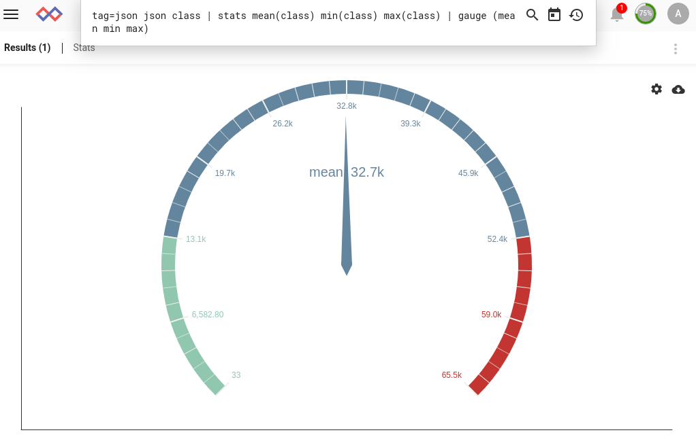
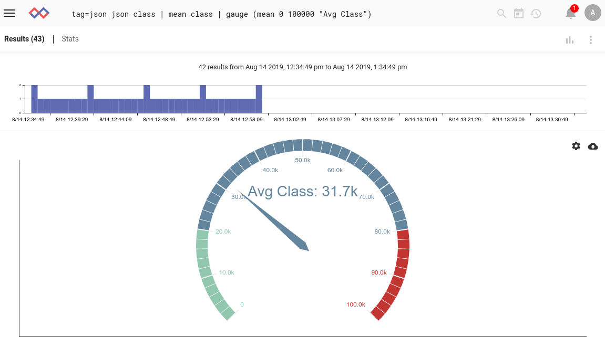
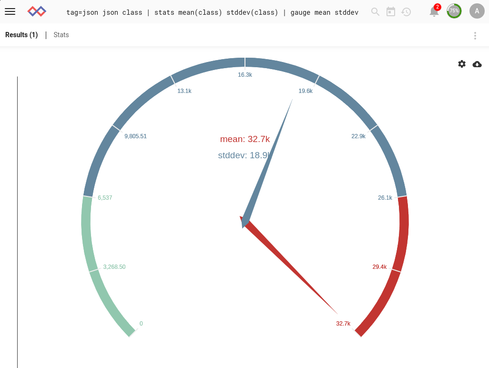
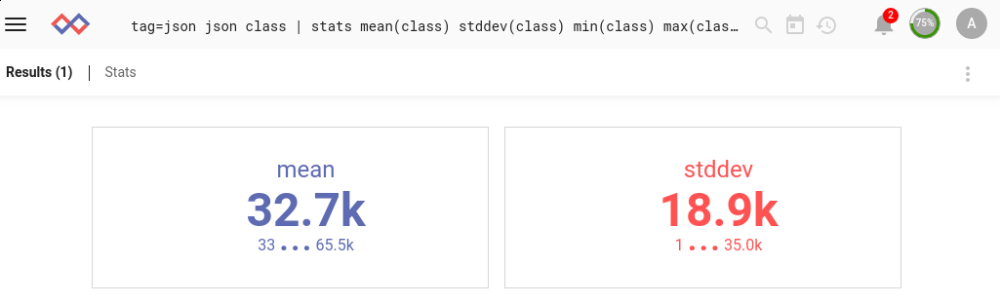

# Gauge

gaugeレンダラーは、エントリを"ゲージ"として表示するのに適した1つ以上の最終値に変換するために使用される圧縮レンダラーです。たとえば、過去1時間のブルートフォース試行の合計数を検索し、ダッシュボードに表示することができます。これはテーブルレンダラーを使用して実現できますが、ゲージレンダラーは一目で理解できるより魅力的な結果をもたらします。

## 基本的な使用方法

ゲージレンダラーを使用する最も簡単な方法は、単一の列挙値引数を渡すことです:

```
tag=json json class | stats mean(class) | gauge mean
```



歯車のアイコンを選択すると、ゲージの一部のオプションを変更できます。 'Half'をクリックすると、ゲージ表示のスタイルが変更されます:



チャートタイプのドロップダウンで'Number card'を選択すると、表示が他の種類のゲージに変更されます:



## ラベルの指定

特にダッシュボードで使用するゲージを作成する場合、デフォルトのラベルは必ずしも理想的ではありません。より有益なラベルが必要な場合は、次のように、大きさの列挙値と目的のラベルを括弧で囲みます:

```
tag=json json class | mean class | gauge (mean "Avg Class")
```



## 最大および最小制限の指定

振幅列挙値と目的の最小/最大値を括弧で囲むことにより、ゲージの最小値と最大値を指定できます:

```
tag=json json class | stats mean(class) | gauge (mean 1 100000)
```



列挙値によって最小値と最大値を指定することもできます:

```
tag=json json class | stats mean(class) min(class) max(class) | gauge (mean min max)
```



または、定数と列挙値を組み合わせて使用します:

```
tag=json json class | stats mean(class) max(class) | gauge (mean 1 max)
```

## 最大/最小とラベルの組み合わせ

もちろん、最小値と最大値の両方でゲージとラベルを指定できます:

```
tag=json json class | mean class | gauge (mean 0 100000 "Avg Class")
```



## 複数のゲージ

複数の列挙値をリストして、ゲージに複数の針を配置できます:

```
tag=json json class | stats mean(class) stddev(class) | gauge mean stddev
```



必要に応じて各針の最小値/最大値を個別に指定できますが、デフォルトのシングルゲージレンダラーは、最小値と最大値を選択して表示し、他は無視します。そのため、構成メニューで「複数のゲージ」オプションを選択することをお勧めします:

```
tag=json json class | stats mean(class) stddev(class) min(class) max(class) | gauge (mean min max) (stddev 1 35000)
```


レンダラーは、複数のアイテムを含む"number card"モードでも適切に動作します:


