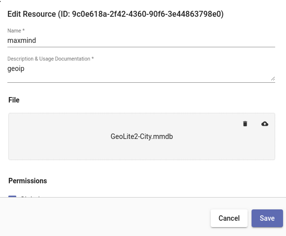
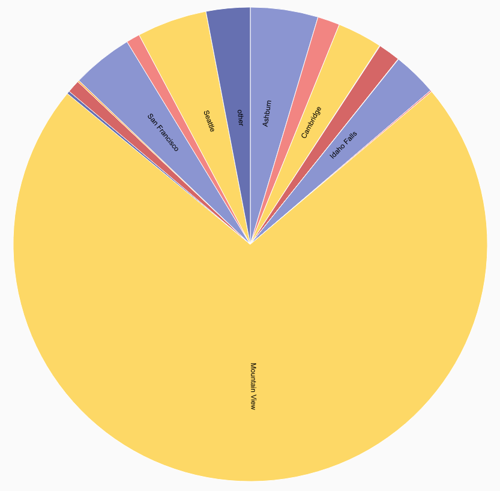
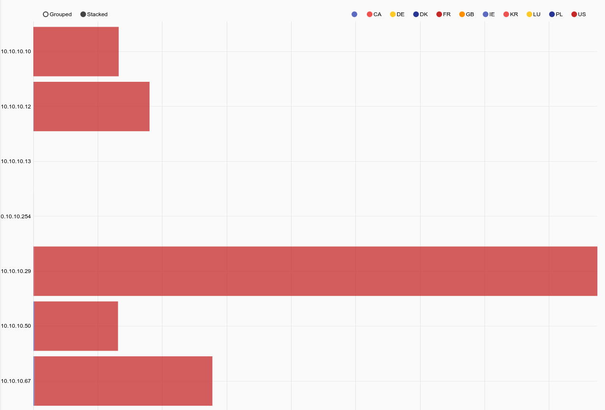

## Geoip

geoipモジュールは[MaxMind](https://maxmind.com/)GeoIPデータベースを使用して、IPアドレスに関する位置情報を抽出します。おおよその緯度/経度、都市名、国名、大陸名を抽出できます。また、ASN番号とIPに関連付けられたASN組織を抽出することもできます

### データベースのセットアップ

geoipモジュールを使用する前に、MaxMindデータベースを含む[リソース](#!resources/resources.md)をインストールする必要があります。[無料の限定データベースをダウンロードする](https://dev.maxmind.com/geoip/geoip2/geolite2/)か、エンタープライズバージョンを購入することができます。 CityデータベースとASNデータベースの両方をインストールすることをお勧めします。 Webサイトで、以下に示すようにMaxMind DBバージョンを選択し、結果のtarファイルを解凍して、必要なファイル（GeoLite2-City.mmdbおよびGeoLite2-ASN.mmdb）を見つけます。

注：必ずバイナリバージョンをダウンロードし、tar.gzファイルから.mmdbファイルを抽出してください。 Gravwellは、ネイティブのMaxmindDB形式を使用して、優れたスループットを保証します。

[](https://dev.maxmind.com/geoip/geoip2/geolite2/)

デフォルトでは、geoipモジュールはMaxMind "city"データベース（GeoLite2-City.mmdb）が "maxmind"という名前のリソースにあることを想定しています。これにより、リソース名を明示的に指定せずにGeoIP抽出を行うことができます。



SNデータベースにはデフォルトの名前はありませんが、入力を減らすために"asn"のような単純な名前を付けることをお勧めします:

![](asn.png

### サポートされているオプション

* `-r <arg>`: “ -r”オプションは、Maxmind geoipデータベースを含むリソース名またはUUIDを指定します。  "-r"が指定されていない場合、geoipモジュールはデフォルトの "maxmind"リソース名を使用します。
* `-s`:-s”オプションは、geoipモジュールが厳密モードで動作することを指定します。  ストリクトモードでは、指定されたオペレータのいずれかがIPを解決できない場合、エントリはドロップされます。

### 処理オペレータ

geoipエクストラクタは、geoipモジュールで非常に高速なフィルタリングを可能にする直接演算子をサポートします。  Tこれらのフィルタは、場所、ISP、所有者などに基づくエントリの高速フィルタリングを可能にします。  各オペレータによってサポートされるフィルタは、抽出されたアイテムのデータタイプによって決定されます。  整数値や浮動小数点数が完全な数値比較演算子をサポートする場合、ISP、国、都市などの文字列は、（!=）と等しい（==）だけをサポートします。  Locationエクストラクタは、経度と緯度の両方で構成されるデータ構造を生成し、フィルタ演算子をサポートしません。  geoipモジュールの1回の呼び出しで複数の演算子を指定でき、出力された列挙値の名前は "as"ディレクティブを使って変更できます。  これにより、1つのエントリで2つのIPアドレスに関連付けられている国を取得し、結果に2つの異なる列挙値を入力できます。

| オペレーター | 名 | 説明
|----------|------|-------------
| == | 等しい | フィールドは等しくなければなりません
| != | 等しくない | フィールドは等しくてはいけません
| < | 未満 | フィールドはより小さい
| > | より大きい | フィールドはより大きくなければなりません
| <= | 以下 | フィールドは以下でなければなりません
| >= | 以上 | フィールドは以上でなければなりません
| ~ | サブセット | フィールドはメンバーでなければなりません
| !~ | サブセットではない | フィールドはメンバーであってはいけません

### データ項目抽出

標準のMaxMind GeoIPデータベースでは、次の抽出が可能です。

| 抽出器 | オペレータ | 説明 | 例 
|-----------|-----------|-------------|----------
| ISP | == != | IPを所有するISP（MaxMindエンタープライズデータベースでのみ使用可能） | SrcIP.ISP != Comcast
| Country | == != | IPの国コード | DstIP.Country == "US"
| CountryName | == != | IPの国名 | SrcIP.CountryName != "United States"
| City |  == != | IPの都市名 | DstIP.City
| Continent |  == != | IPの大陸| SrcIP.Continent == NA
| ContinentName |  == != | IP大陸名 | DstIP.ContinentName != "North America"
| TZ |  == != | IPのタイムゾーン | SrcIP.TZ != "MST"
| Location |  | IPの緯度/経度 | SrcIP.Location
| Lat | > < <= >= == != | IPの緯度 | DstIP.Lat < 22.5432
| Long |  > < <= >= == != | IPの経度 | DstIP.Long > -15.1234

以下には、個別のASNデータベース（-rフラグで指定）が必要です:

| 抽出器 | オペレータ | 説明 | 例 
|-----------|-----------|-------------|----------
| ASNOrg |  == != | IPの自律システム番号組織の所有者 | DstIP.ASNOrg != Google
| ASN |  > < <= >= == != |  自律システム番号 | DstIP.ASN >= 1024


### 例

#### 国のフィルタリングとその都市の解決の要求

```
tag=pcap packet IPv4.SrcIP ~ 10.0.0.0/16 IPv4.DstIP | geoip -s DstIP.Country == US DstIP.City | count by City | chart count by City
```



#### IP国別トラフィックの表示

```
tag=pcap packet ipv4.SrcIP ~ 10.10.10.0/24 ipv4.DstIP !~ 10.0.0.0/8 ipv4.Length  | geoip DstIP.Country as DestCountry | sum Length by SrcIP,DestCountry | stackgraph DestCountry SrcIP sum
```



#### 2つのIPの都市の抽出

```
tag=pcap packet ipv4.SrcIP ipv4.DstIP | geoip DstIP.City as dest SrcIP.City as src | fdg -b src dst
```

#### ASN組織の抽出

```
tag=pcap packet ipv4.SrcIP !~ PRIVATE | geoip -r asn SrcIP.ASNOrg | table
```


