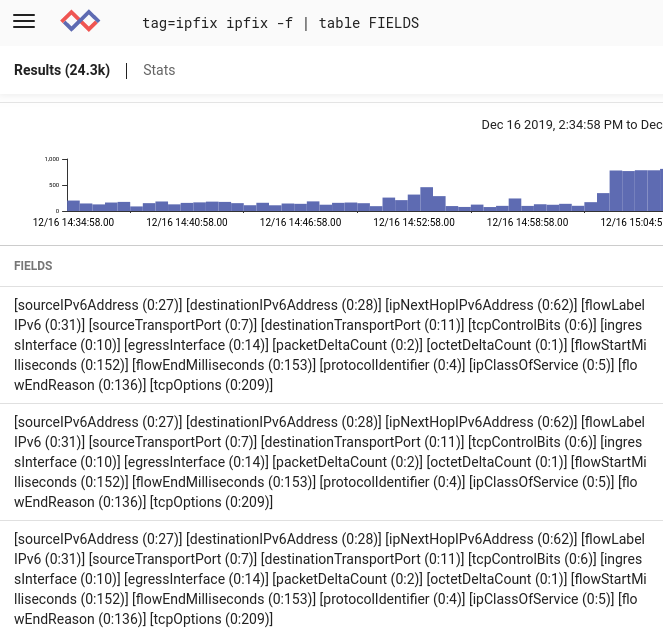

# IPFIXとNetflow V9

ipfixプロセッサは、生のIPFIXとNetflow V9データフレームを抽出してフィルタリングするように設計されており、ネットワークフローを素早く識別したり、ポート上でフィルタリングしたり、一般的に集約されたフローの動作を監視したりすることができます。 Gravwell には、ネイティブの IPFIX + Netflow インジェスターがあります。これはオープンソースで、 https://github.com/gravwell/ingesters 、または [クイックスタートセクション](/#!quickstart/downloads.md) のインストーラーとして利用できます。

## テンプレートについての注意点

Gravwellはエントリーの順番に関しては柔軟性があります。古いエントリから新しいエントリへ、新しいエントリから古いエントリへ、あるいは他の基準に基づいて完全にエントリをソートすることができます。

残念ながら、この柔軟性は IPFIX や Netflow V9 とはうまく相互作用しません。これらのプロトコルは、データレコードの形式を記述する *templates* を定義しています。テンプレートは滅多に送信されません。任意の IPFIX メッセージがテンプレートレコードを含むことはほとんどありませんが、以前に定義されたテンプレートを参照しているデータレコードはあります。適切なテンプレートにアクセスできなければ、データレコードは無意味です。これは、IPFIXメッセージを新しいものから古いものへと解析する(あるいは他の方法でソートする)ことが、追加のステップを**踏まない限り**、適切に動作しないことを意味します。

私たちは、最も簡単な対策は、着信する IPFIX/Netflow V9 メッセージのすべてを、そのデータレコードに適切なテンプ レートでインジェスターにリパックすることであると判断しました。これにより、保存される各メッ セージのサイズは大きくなりますが、メッセージは通常数十個のデータレコードを含んでいるため、その増加は大きくはありません。これはまた、一つ一つのメッセージ(エントリ)が完全にそれ自身で独立しており、解析のために以前のメッセージに依存しないことを意味しています。

## サポートされているオプション

* `-e <name>`: "e" オプションは、列挙された値で動作させることを指定します。 列挙された値で操作すると、上流のモジュールを使って ipfix フレームを抽出しているときに便利です。 
* `-s`: "s" オプションは ipfix モジュールを strict モードにします。strict モードでは、指定された抽出が成功しなければならず、そうでなければエントリは削除されます。
* `-f`: f" フラグは、モジュールが見た各 IPFIX データレコードの利用可能なフィールドのリストを抽出し、人間が読める形式で、"FIELDS" と呼ばれる列挙された値にドロップするように指示します。これは、フィールド抽出とは相互に排他的であり、 fを指定した場合、抽出するフィールドを指定することはできません。

## 処理オペレータ

各IPFIXフィールドは、高速フィルターとして機能できる一連の演算子をサポートします。  各演算子でサポートされているフィルタは、フィールドのデータ型によって決まります。  数値はすべてをサポートしますが、サブセット演算子とIPアドレスはサブセット演算子だけをサポートします

| オペレーター | 名 | 説明
|----------|------|-------------
| == | 等しい | フィールドは等しくなければなりません
| != | 等しくない | フィールドは等しくてはいけません
| < | 未満 | フィールドはより小さい
| > | より大きい | フィールドはより大きくなければなりません
| <= | 以下 | フィールドは以下でなければなりません
| >= | 以上 | フィールドは以上でなければなりません
| ~ | サブセット | フィールドはメンバーでなければなりません
| !~ | サブセットではない | フィールドはメンバーであってはいけません


## データ項目

ipfix 検索モジュールは、生の IPFIX & Netflow v9 メッセージを処理するように設計されています。 1 つの IPFIX (または NFv9) メッセージは、ヘッダと N 個のデータレコードで構成されています。IPFIX/NFv9 と Netflow v5 の本質的な違いは、Netflow v5 のすべてのフィールドが事前に定義されているのに対し、IPFIX/NFv9 のデータレコードは、生成デバイスによって指定されたテンプレートに準拠しており、以前のメッセージで送信されたものです。したがって、ある IPFIX/NFv9 ジェネレーターがフローの送信元と送信先の IP とポートを送信するのに対し、スイッチはパケットカウントを含むレコードを送信するだけです。

IPFIX/NFv9メッセージ*header*のすべての要素は、データレコード内の要素自体と同様にフィルタリングに使用することができます。ヘッダーデータ項目でフィルタリングする場合、フィルタはメッセージ内の*すべての*レコードに適用されます。 ヘッダデータ項目が最初に処理され、ヘッダフィルタがフレームをドロップしない場合にのみ、個々のレコードが処理されます。

ipfix プロセッサは拡張モジュールです。拡張モジュールは入力エントリを複数の出力エントリに分割します。モジュールは、IPFIX メッセージ全体に対応する個々のエントリを取り込みます。そして、メッセージ内の各データレコードを処理し、*各レコードに対して*新しいエントリを出力します。

注意: ヘッダ項目*のみ*を指定した場合 (例: `ipfix Version Sequence`)、エントリは展開されません。それぞれの着信エントリは、1つの発信エントリを超えることはありません。ヘッダーとデータ項目の混在を指定すると、拡張が開始される。

### IPFIXヘッダーデータ項目

| フィールド |       説明        | サポートされている演算子 | 例 |
|-------|--------------------------|---------------------|---------|
| Version | 使用中のNetflowのバージョン。10 は IPFIX、9 は Netflow v9 を意味する | > < <= >= == != | Version != 0xa
| Length | IPFIX：この IPFIX メッセージの全長。Netflow v9：このメッセージに含まれるレコードの数 | > < <= >= == != | Length > 1000
| Sec | センサーデバイスのUnixタイム | > < <= >= == != | Sec == 1526511023
| Uptime | 検出デバイスがオンラインになったミリ秒数 (Netflow v9 のみ) | > < <= >= == != | Sec == 3516293216
| Sequence | センシングデバイスが送信した総メッセージのシーケンスカウンタ  | > < <= >= == != | Sequence == 1
| Domain | レコードの元となった観測領域 | > < <= >= == != | Domain == 0x1A


### データレコード項目

IPFIX と Netflow v9 はデータレコードを構成するフィールドを定義しています。Netflow は数十個のフィールドを定義していますが、それらは [RFC3954](https://tools.ietf.org/html/rfc3954#section-8)に記載されています。Netflow v9 フ ィ ール ド は、 フ ィ ール ド ID （正の整数）、 デー タ 型 （16 ビ ッ ト 符号なし整数など）、 名前 （L4_SRC_PORT など） で定義 さ れます。

IANA は、IPFIX のための同様のフィールドのセットを定義しており、それは [ここで見つけることができます](https://www.iana.org/assignments/ipfix/ipfix.xhtml#ipfix-information-elements)。IPFIX のフィールドは Netflow v9 のフィールドと似ていますが（フィールド ID、タイプ、名前を持っています）、IPFIX では Netflow v9 で使用されているフィールド ID に加えて _enterprise ID_ という概念が導入されています。エンタープライズ ID を使用すると、ユーザーは、定義済みのフィールドに加えて、独自のフィールドのセットを定義することができ、すべてのフィールドは 0 のエンタープライズ ID を持っています。

注意: IPFIX と Netflow v9 はテンプ レートベースのため、任意のデータレコードには以下に説明するフィールドが含まれている場合と含まれていない場合があります。例えば「sourceIPv4PrefixLength」などを抽出しようとしても空の結果が得られる場合は、IPFIX レコードにそのフィールドが含まれていない可能性があります。

最も一般的な IPFIX と Netflow v9 フィールドを以下に挙げます。


| IPFIX Name | Netflow v9 Name |      説明        | サポートされている演算子 | 例 |
|-------|--------------------------|---------------------|---------|
| octetDeltaCount | IN_BYTES | 観測点での本フローの受信パケットの前回レポート以降のオクテット数（ある場合）。オクテット数には、IPヘッダとIPペイロードが含まれる | > < <= >= == != | octetDeltaCount == 80
| packetDeltaCount | IN_PKTS | 観測点における本フローの前回レポート以降の受信パケット数（ある場合） | > < <= >= == != | packetDeltaCount == 80
| deltaFlowCount | FLOWS | この集約フローに寄与している元フローの保守的な数であり、valueDistributionMethod情報要素で表されるいずれかの方法で分配される | > < <= >= == != | packetDeltaCount == 80
| protocolIdentifier | PROTOCOL | Protocol フローを表すナンバー (TCP = 6, UDP = 17 | > < <= >= == != | protocolIdentifier == 17
| ipClassOfService | TOS | IPv4パケットの場合、IPv4パケットヘッダのTOSフィールドの値、 IPv6パケットの場合、IPv6パケットヘッダのTraffic Classフィールドの値 | > < <= >= == != | ipClassOfService != 0
| tcpControlBits | TCP_FLAGS | 本フローのパケットで観測されたTCP制御ビット | > < <= >= == != | tcpControlBits != 0x0004
| sourceTransportPort | L4_SRC_PORT | フローのソースポート。 プロトコルがポートを持っていない場合、値はゼロになる | > < <= >= == != | sourceTransportPort != 0
| sourceIPv4Address | IPV4_SRC_ADDR| フローのIPv4ソースアドレス | ~ !~ == != | sourceIPv4Address ~ 10.0.0.0/24 
| sourceIPv4PrefixLength | SRC_MASK | IPv4ソースアドレスのプレフィックスの長さ | > < <= >= == != | sourceIPv4PrefixLength < 24
| sourceIPv6Address | IPV6_SRC_ADDR | フローのIPv6ソースアドレス | ~ !~ == != | sourceIPv6Address == ::1
| sourceIPv6PrefixLength | IPV6_SRC_MASK | IPv6ソースアドレスのプレフィックスの長さ | > < <= >= == != | sourceIPv6PrefixLength < 64
| destinationTransportPort | L4_DST_PORT | フローの宛先ポート。 プロトコルがポートを持たない場合、値はゼロになる | > < <= >= == != | destinationTransportPort != 0
| destinationIPv4Address | IPV4_DST_ADDR | フローのIPv4宛先アドレス | ~ !~ == != | destinationIPv4Address ~ 10.0.0.0/24 
| destinationIPv4PrefixLength | DST_MASK | IPv4の宛先アドレスのプレフィックスの長さ | > < <= >= == != | destinationIPv4PrefixLength < 24
| destinationIPv6Address | IPV6_DST_ADDR | フローのIPv6宛先アドレス | ~ !~ == != | destinationIPv6Address == ::1
| destinationIPv6PrefixLength | IPV6_DST_MASK | IPv6の宛先アドレスのプレフィックスの長さ | > < <= >= == != | destinationIPv6PrefixLength < 64

注意：一般的に、IPFIX メッセージを抽出する際には Netflow v9 のフィールド名を指定することができ、その逆も可能です。ただし、データ型は 2 つのプロトコル間で若干異なるため、IPFIX を処理するときには IPFIX フィールド名を、Netflow を処理するときには Netflow 名を使用するのが最も安全です。

このモジュールでは、便利な「ショートカット」も用意されています:

| フィールド |       説明        | サポートされているオペレータ | 例 |
|-------|--------------------------|---------------------|---------|
| src | このフローのソースアドレス（IPv4またはIPv6） | ~ !~ == != | src == ::1
| dst | このフローの宛先アドレス (IPv4またはIPv6) | ~ !~ == != | dst !~ PRIVATE
| srcPort | このフローのソースポート | > < <= >= == != | srcPort == 80
| dstPort | このフローの宛先ポート | > < <= >= == != | dstPort == 80
| ip | フィルタにマッチする最初の IP を抽出。 フィルタが指定されていない場合は Src が使用される | ~ !~ == != | ip ~ 10.0.0.0/24
| port | フィルタに一致する最初のポートを抽出する。 フィルタが指定されていない場合は、より低い値が使用される | > < <= >= == != | port == 80
| vlan | フィルタに一致する最初の VLAN を抽出する。VLAN は vlanId または dot1qVlanId フィールドのいずれかから描画される | > < <= >= == != | vlan == 100
| srcMac | フローのソースMACアドレスを抽出する | == != | srcMac==01:23:45:67:89:00
| dstMac | フローの宛先MACアドレスを抽出する | == != | dstMac==01:23:45:67:89:00
| bytes | `octetDeltaCount` と `postOctetDeltaCount` の値を足したもの | > < <= >= == != | bytes <= 10000
| packets | `packetDeltaCount` と `postPacketDeltaCount` の値を足したもの | > < <= >= == != | packets > 0xffffff 
| flowStart | フローの開始タイムスタンプを指定する。flowStartSeconds`, `flowStartMilliseconds`, `flowStartMicroseconds`, `flowStartNanoseconds` のいずれかのフィールドを使用し、適切なタイムスタンプを出力する | | flowStart
| flowEnd | フローの終了タイムスタンプ。flowEndSeconds`, `flowEndMilliseconds`, `flowSEndMicroseconds`, `flowEndNanoseconds` のいずれかのフィールドを使用し、適切なタイムスタンプを出力する | | flowStart
| flowDuration | `flowStart`と`flowEnd`から計算される継続時間の値 | == != < > <= >= | flowDuration > 1m 

#### 他のフィールドでのフィルタリング

また、"0x1ad7:0x15"のように、企業IDとフィールドIDをコロンで区切ってフィールドを指定することもできます。この場合は、`ipfix 0x1ad7:0x15 as foo` というように、より便利な名前で抽出することをお勧めします。Netflow v9 のフィールドをこの方法で抽出したい場合は、エンタープライズ ID を 0 と仮定して、例えば `ipfix 0:7 as srcport` とするとソースポートが抽出されます。

## 例

### 送信元IP別のHTTPSフロー数の推移

```
tag=ipfix ipfix destinationIPv4Address as Dst destinationTransportPort==443 | count by Dst | chart count by Dst
```


### どのIPが80番ポートを使用しているかを調べる

```
tag=ipfix ipfix port==80 ip ~ PRIVATE | unique ip | table ip
```

### Netflow v9 の記録で最も一般的なプロトコルを検索

This example filters down to only Netflow v9 records, then extracts the protocol and counts how many flows appeared for each.

```
tag=v9 ipfix Version==9 PROTOCOL | count by PROTOCOL | table PROTOCOL count
```

### 各データレコードのフィールドのリストを抽出

```
tag=ipfix ipfix -f | table FIELDS
```


