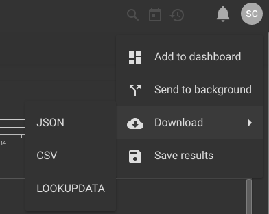

## Lookup

ルックアップモジュールは、リソースに格納されている静的なルックアップテーブルからデータのエンリッチメントと変換を行うために使用されます。1つ以上の*列挙された値*の内容が*matchカラム*の値と比較され、一致するものが見つかるまで比較され、その行の*extractカラム*の値が別の列挙された値に抽出されます。

```
lookup -r <resource name> <enumerated value> <column to match> <column to extract> as <valuename>
```

注意: 構文に加えて ``as <valuename>```` を指定しなかった場合、ルックアップは "抽出する "カラムの名前を持つ列挙型の値を作成します。

lookupモジュールを一度に呼び出す際には、追加の操作を文字列化することで複数のルックアップ操作を指定することができます。

```
lookup -r mytable A B C as foo D E F
```

一致するごとに複数の列を抽出することもできます。次の例は列挙された値Aの内容と列Bの値をマッチさせ、マッチした場合は列Cと列Dの両方を抽出します。

```
lookup -r mytable A B (C as foo D as bar)
```

これは、列挙された値のセットと列のセットを一致させることができることを意味します。 ベクターマッチは、マッチリストと抽出リストを指定して実行されます。 ベクターマッチを行う場合、抽出された列挙された値の数はマッチするカラムの数とほぼ一致します。

```
lookup -r mytable [A B] [A B] (C as foo D as bar)
```

### サポートされているオプション
* `-r <arg>`. r" オプションは、どのルックアップリソースをデータを充実させるために使用するかをルックアップモジュールに通知する。
* `-s`: s" オプションは、ルックアップモジュールがすべての抽出に成功しないとエントリが削除されることを要求することを指定する。
* `-v`: v" フラグはルックアップモジュールのフローロジックを反転させ、成功したマッチは抑制され、 失敗したマッチは引き継がれることを意味する。 v "と"-s "フラグを組み合わせることで、指定されたルックアップテーブルに 存在しない値のみを渡す基本的なホワイトリストを提供することができる。

注意: `-s` または `-v` フラグを使用する際には、抽出を行わないように指定することが有効である。 この操作は、ホワイトリスト化やブラックリスト化を行う際に便利です。

ここでは、列挙された値 `A` と `B` が `X` と `Y` の列に存在することを保証しますが、データのエンリッチを行わない例を示します。

```
lookup -v -r mytable [A B] [X Y] ()
```

### ルックアップデータリソースの設定

ルックアップデータは、互換性のあるレンダーモジュール（テーブルモジュールなど）からダウンロードして、共有と利用のためのリソースに保存することができます。検索結果ページのメニューを使用して、「lookupdata」を選択することで、この形式の検索結果のテーブルをダウンロードすることを選択できます。



テーブルレンダラ](#!search/table/table.md)には、検索結果のテーブルを自動的に保存する `save` オプションもあります。

```
tag=syslog regex "DHCPACK on (?P<ip>\S+) to (?P<mac>\S+)" | unique ip mac | table -save ip2mac ip mac
```

上記の例では、テーブルレンダラは自動的に「ip2mac」という名前のリソースを作成します。

#### CSV テーブル

CSVデータは、ルックアップモジュールにも使用できます。Gravwellのルックアップ検索モジュールでCSVファイルをリソースとして使用するためには、CSVには列に一意のヘッダが含まれていなければなりません。

### 例題

#### 基本的な抽出

この例では、以下のcsvから作成された "macresolution "というリソースがあります。
```
mac,hostname
mobile-device-1,40:b0:fa:d7:af:01
desktop-1,64:bc:0c:87:bc:71
mobile-device-2,40:b0:fa:d7:ae:02
desktop-2,64:bc:0c:87:9a:11
```

次にパケットデータから検索を行い、lookupモジュールを使ってホスト名を含むようにデータストリームを豊かにします。

```
tag=pcap packet eth.SrcMAC | count by SrcMAC | lookup -r macresolution SrcMAC mac hostname as devicename | table SrcMAC devicename count
```

その結果、以下のようなテーブルができました。

```
64:bc:0c:87:bc:71	|	desktop-1       	|	52183
40:b0:fa:d7:ae:02	|	mobile-device-2 	|	21278
64:bc:0c:87:9a:11	|	desktop-2       	|	 2901
40:b0:fa:d7:af:01	|	mobile-device-1 	|	  927
```

#### ホワイトリスト化

上記と同じ "macresolution "の表を使って

```
tag=pcap packet eth.SrcMAC | count by SrcMAC | lookup -v -s -r macresolution SrcMAC mac hostname | table SrcMAC count
```

これにより、ルックアップリストに**なかった**macアドレスを含むテーブルが作成されます。 システム管理者は"-v "と"-s "フラグを使って基本的なホワイトリストを作成したり、 ネットワーク上の新しいデバイスやイベントストリーム内の新しいログを識別したりすることができます。

```
64:bc:0c:87:bc:60	|	24382
40:b0:fa:d7:ae:13	|	93485
64:bc:0c:87:9a:02	|	11239
40:b0:fa:d7:af:fe	|	   21
```

#### 多重抽出

placesという名前の以下のルックアップテーブルを考えてみましょう。

```
name,lat,long
Albuquerque,35.122,-106.553
Santa Fe,35.6682,-105.96
Sacramento,38.527,-121.347
```

都市名を指定すると、緯度と経度の両方の値を抽出できるようにしたいと思います。JSONのエントリに "City "フィールドが含まれていると仮定すると、以下のクエリはまさにそれを実現します。

```
tag=default json City | lookup -r places City name (lat long) | table
```

これは、列挙された値Cityをテーブルの "name "カラムと照合し、一致するものが見つかった場合、以下のように "lat "と "long "の両方を抽出します。


