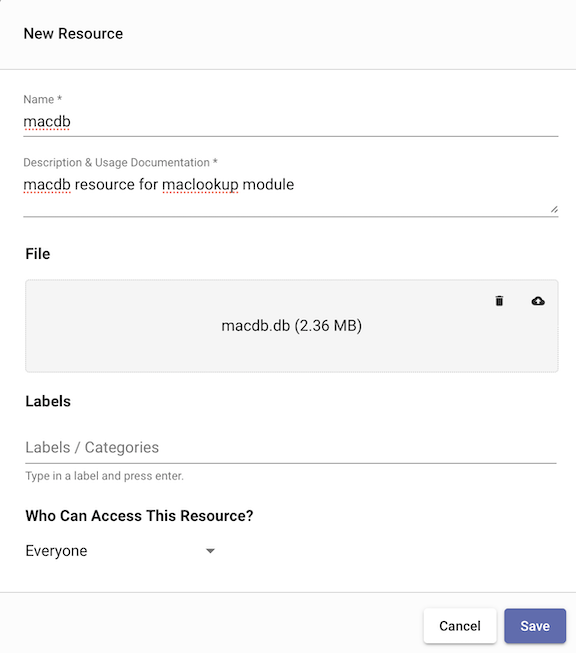
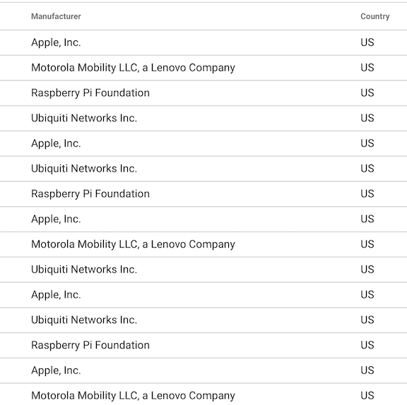
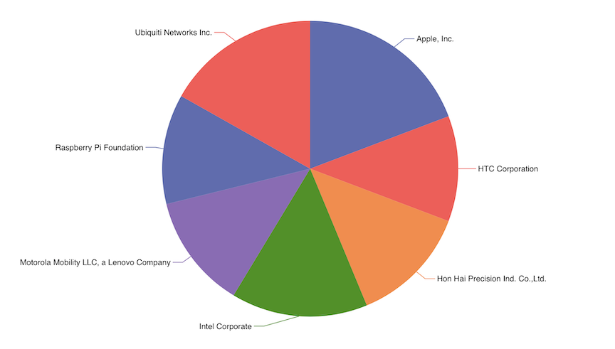

## maclookup

maclookupモジュールは、カスタムMACプレフィックスデータベースを使用して、MACアドレスのブロックの所有者に関する製造元、アドレス、および国の情報を抽出します。

### データベースのセットアップ

maclookupモジュールを使用する前に、macdbデータベースを含む[resource](#!resources/resources.md)をインストールする必要があります。

デフォルトでは、maclookupモジュールはmacdbデータベースが「macdb」という名前のリソースにあることを期待しています。これにより、リソース名を明示的に指定せずに抽出を行うことができます。



### サポートされているオプション

* `-r <arg>`: 「-r」オプションは、macdbデータベースを含むリソース名またはUUIDを指定します。「-r」が指定されない場合、geoipモジュールはデフォルトの「macdb」リソース名を使用します。
* `-s`: 「-s」オプションは、maclookupモジュールが厳格モードで動作することを指定します。厳格モードでは、指定された演算子のいずれかがMACを解決できない場合、エントリは削除されます。

### 演算子

maclookup抽出は、モジュール内で非常に高速なフィルタリングを可能にするダイレクト演算子をサポートしています。これらのフィルタは、製造元、住所、または国に基づくエントリの高速フィルタリングを可能にします。抽出フィルタは、等しい (==)、等しくない (!=)、およびサブセット (~) の演算子をサポートしています。複数の演算子を一度のmaclookupモジュールの呼び出しで指定することができ、出力される列挙された値の名前は、"as" ディレクティブを使用して変更することができます。

| 演算子 | 名 | 説明
|----------|------|-------------
| == | 等しい | フィールドは等しくなければなりません
| != | 等しくない| フィールドは等しくてはいけません
| ~ | サブセット | フィールドはメンバーでなければなりません
| !~ | サブセットではない | フィールドはメンバーであってはいけません

### データ項目抽出

maclookupデータベースでは、以下のような抽出が可能です：

| 抽出 | 演算子 | 説明 | 例
|-----------|-----------|-------------|----------
| Manufacturer | == != ~ !~ |「アップル社」「IBM」などのメーカー名 | mac.Manufacturer~Apple
| Address | == != ~ !~ | 住所 | mac.Address~Cupertino as addr
| Country | == != ~ !~ | 国別コード | mac.Country == "US"

### 例

### PCAPから米国のメーカーをリストアップ

```
tag=pcap packet eth.MAC | maclookup MAC.Manufacturer MAC.Country == US | table
```



### メーカーの円グラフ

```
tag=pcap packet eth.MAC | maclookup mac.Manufacturer | count by Manufacturer | chart count by Manufacturer
```


