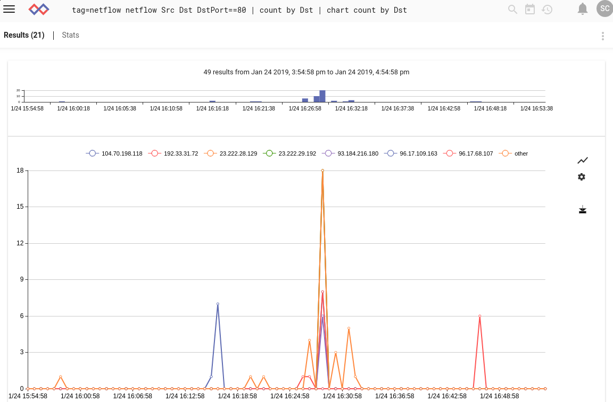

## ネットフロー

ネットフロープロセッサは、生のネットフローデータフレームを抽出してフィルタリングするように設計されており、ネットワークフローを素早く識別したり、ポート上でフィルタリングしたり、一般的に集約フローの動作を監視したりすることができます。 Gravwell には、ネイティブのネットフローインゲスターがあり、オープンソースで https://github.com/gravwell/ingesters または [クイックスタートセクション] (#!quickstart/downloads.md) のインストーラーとして利用できます。

### サポートされているオプション

* `-e`: e」オプションは、ネットフローモジュールが列挙値で動作する必要があることを指定します。列挙値での操作は、上流のモジュールを用いてネットフローフレームを抽出した場合に有用です。 生の PCAP からネットフローフレームを抽出して、そのフレームを netflow モジュールに渡すことができます。

### 処理演算子

各ネットフローフィールドは、高速フィルタとして動作する演算子のセットをサポートしています。 各演算子によってサポートされるフィルタは、フィールドのデータ型によって決定されます。数値はサブセット演算子以外のすべてをサポートし、IP アドレスはサブセット演算子のみをサポートします。

|  演算子  | 名前 |    説明     |
|----------|------|-------------|
| == | Equal | フィールドは等しくなければなりません。
| != | Not equal | フィールドは等しくてはいけません。
| < | Less than | フィールドは、以下でなければなりません。
| > | Greater than | フィールドは、次の値以上でなければなりません。
| <= | Less than or equal | フィールドは、次の値以下でなければなりません。
| >= | Greater than or equal | フィールドは、以下の値以上でなければなりません。
| ~ | Subset | フィールドはメンバーでなければなりません。
| !~ | Not subset | フィールドはメンバーであってはなりません。


### データ項目

netflow 検索モジュールは、 生のネットフローフレームを処理するように設計されています。1つのネットフローフレームは、ヘッダとN個のレコードで構成されています。ネットフローレコード内の各データ項目を抽出してフィルターとして使用することができます。ヘッダーデータ項目でフィルタリングする場合、フィルタはフレーム内のすべてのレコードに適用されます。ヘッダーデータ項目が最初に処理され、ヘッダーフィルタがフレームを落とさない場合にのみ、レコードが処理されます。 ネットフロープロセッサは拡張モジュールであり、拡張モジュールは入力項目を複数の出力項目に分割します。これは、ネットフローモジュールを使用すると、入力された項目よりも多くの項目がパイプラインから 出てくる可能性があることを意味します。

#### Netflow v5 ヘッダーデータ項目

| フィールド |       説明        | サポートされている演算子 | 例 |
|-------|--------------------------|---------------------|---------|
| Count | ネットフローフレーム内のレコード数 | > < <= >= == != | Count >= 10
| Version | ネットフローのフレーム版 | > < <= >= == != | Version == 5
| Uptime | ネットフローセンサーがアクティブになった総秒数 | > < <= >= == != | Uptime > 0x100000
| Sec | センシングデバイスの現在のUnixタイムスタンプ | > < <= >= == != | Sec == 1526511023
| NSec | センシングデバイスの現在の時間の残留ナノ秒 | > < <= >= == != | Sec == 1526511023
| Sequence | センシングデバイスの総流量のシーケンスカウンタ | > < <= >= == != | Nsec > 0x100101
| EngineType | フロー切替エンジンの種類 | > < <= >= == != | Sequence == 1
| EngineID | フローセンシングエンジンのID | > < <= >= == != | EngineID == 0x00
| SampleMode | センシングエンジンのサンプリングモードの 2 ビット ID | > < <= >= == != | SampleMode == 0x01
| SampleInterval | センシングエンジンのサンプリング間隔を表す14ビット値 | > < <= >= == != | SampleInterval > 0x100
| Timestamp | Sec と NSec をフレンドリなタイムスタンプ値に変換するヘルパー抽出器。フィルタリングはサポートされていません。 | |

#### Netflow v5 データ項目の記録

| フィールド |       説明        | サポートされている演算子 | 例 |
|-------|--------------------------|---------------------|---------|
| IP | フィルタにマッチする最初の IP を抽出します。 フィルタが指定されていない場合は Src が使用されます。 | ~ !~ == != | IP ~ 10.0.0.0/24 
| Port | フィルタにマッチする最初のポートを抽出します。 フィルタが指定されていない場合は SrcPort が使用されます。 | > < <= >= == != | Port == 80
| Src | フローレコードのソースIPv4アドレス | ~ !~ == != | Src !~ 192.168.1.0/24
| Dst | フローレコード内の宛先IPv4アドレス | ~ !~ == != | Dst ~ 10.0.0.0/16
| Next | フローレコードの次のホップアドレス | ~ !~ | Next == 1.2.3.4
| Input | 入力インターフェースのSNMPインデックス | > < <= >= == != | Input == 1
| Output | 出力インターフェースのSNMPインデックス | > < <= >= == != | Output != 1
| Pkts | フロー内の総パケット数 | > < <= >= == != | Pkts > 10
| Bytes | フロー内の総バイト数 | > < <= >= == != | Bytes < 1400
| UptimeFirst | 最初のパケットを見たときのセンシングエンジンのアップタイム | > < <= >= == != | UptimeFirst != 0
| UptimeLast | 最後のパケットを見たときのセンシングエンジンのアップタイム | > < <= >= == != | UptimeLast > 0x10000
| SrcPort | フローのソースポート。 プロトコルがポートを持っていない場合、値はゼロになります。 | > < <= >= == != | SrcPort != 0
| DstPort | フローの宛先ポート。 プロトコルがポートを持たない場合、値はゼロになります。 | > < <= >= == != | DstPort == 0
| Flags  | フローの TCP フラグの累積 OR | > < <= >= == != | Flags == 0x7
| Protocol | フローのプロトコル番号（TCP = 6、UDP = 17) | > < <= >= == != | Protocol == 17
| ToS | フローのIPタイプ | > < <= >= == != | ToS == 19
| SrcAs | ソース自律システム 流れの番号 | > < <= >= == != | SrcAS == 15169
| DstAs | 流れのソース自律システム番号 | > < <= >= == != | DstAs != 15169
| SrcMask | ソースIPv4アドレスマスクビット | > < <= >= == != | SrcMask > 24
| DstMask | 宛先IPv4アドレスマスクビット | > < <= >= == != | DstMask <= 16
| Duration | UptimeFirstとUptimeLastを持続時間に変換するヘルパー値 | > < <= >= == != | Duration > 100ms

### 例題

#### 送信元IP別のHTTPフロー数の経時変化

```
tag=netflow netflow Src Dst Port==80 | count by Src | chart count by Src limit 24
```



#### IP およびプロトコル別の総トラフィック

```
tag=netflow netflow IP Protocol Bytes as traffic | sum traffic by IP,Protocol | stackgraph IP Protocol sum
```

! [Traffic by protocol per IP](IPProtoTrafficStackgraph.png)
