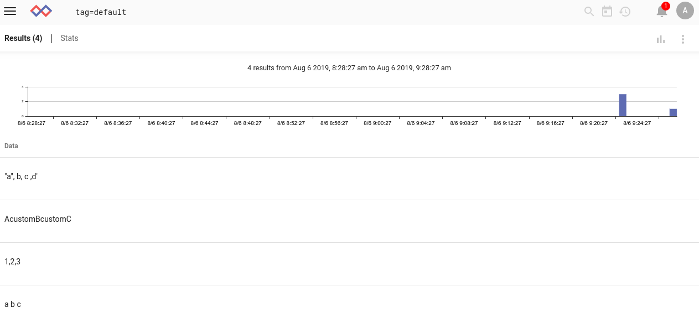
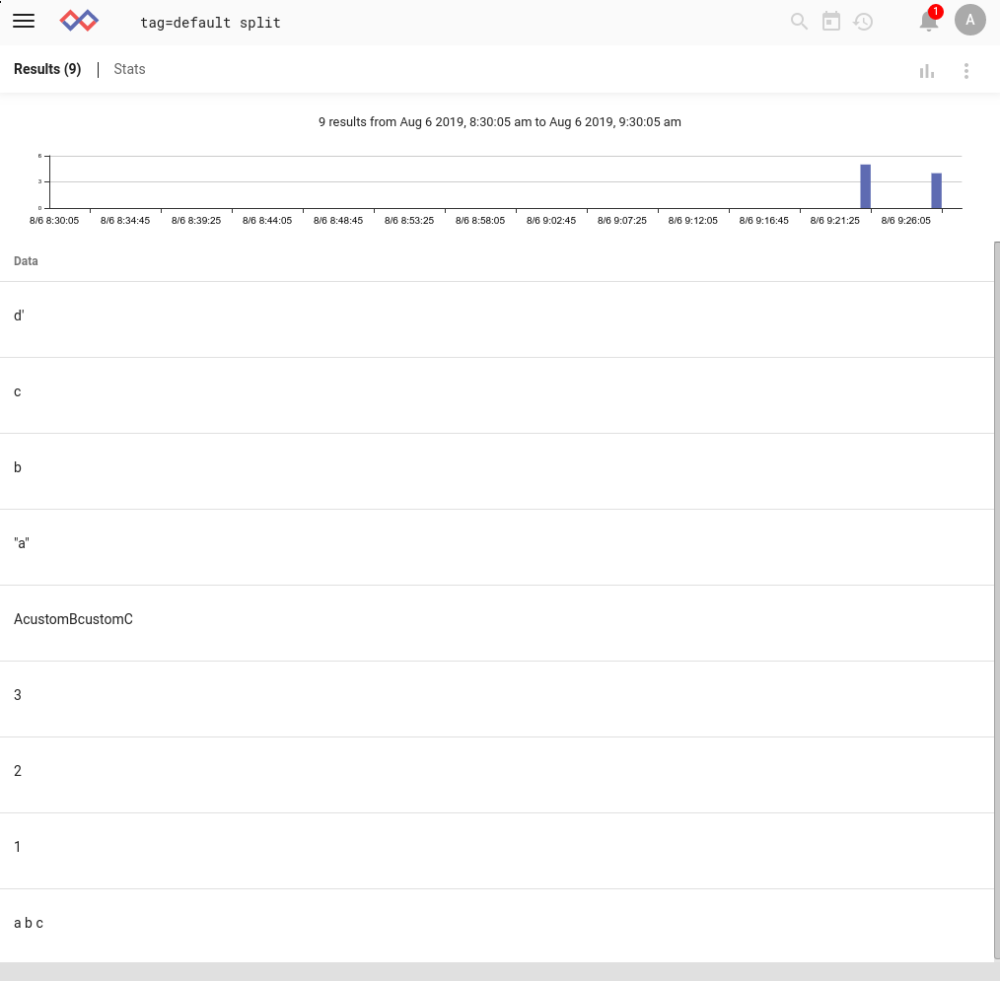
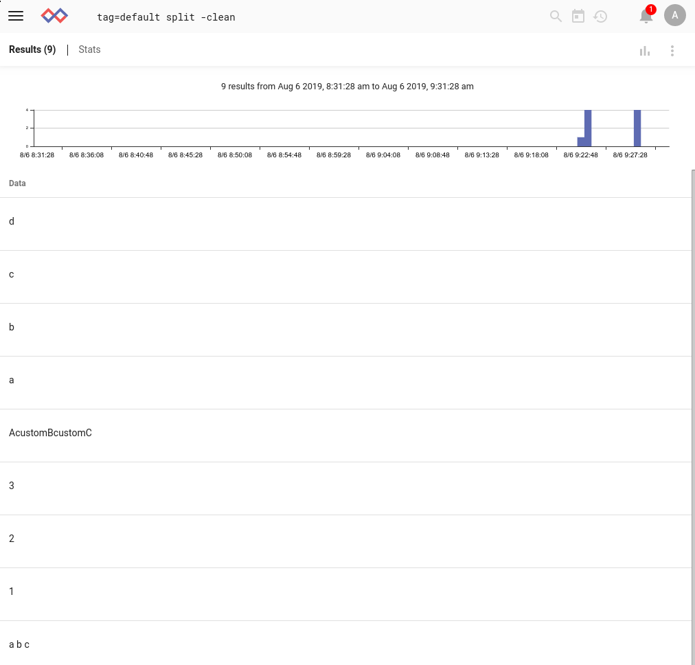
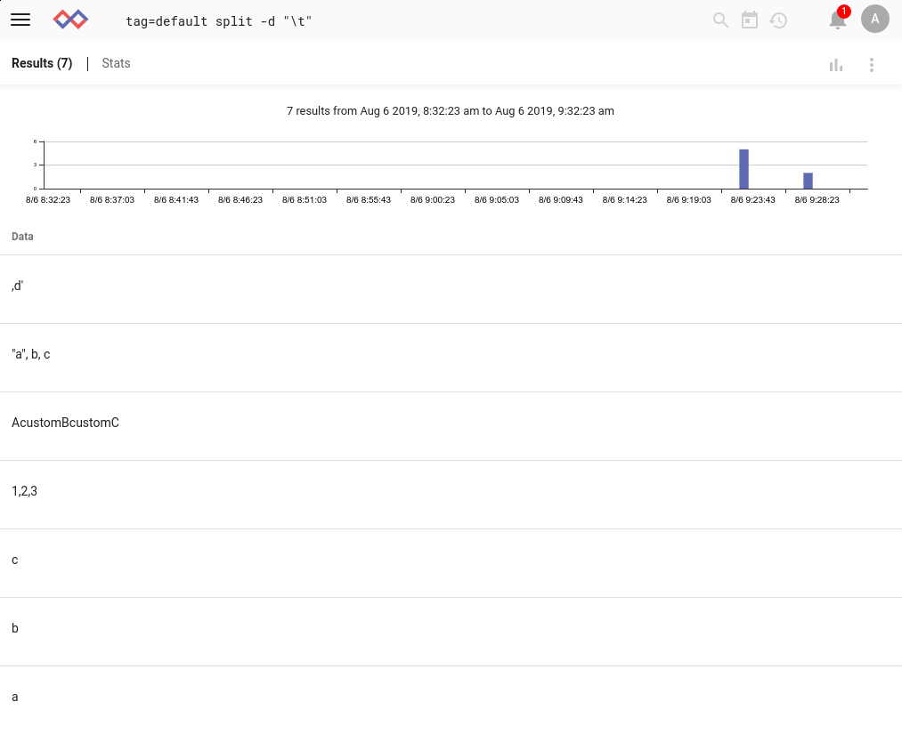
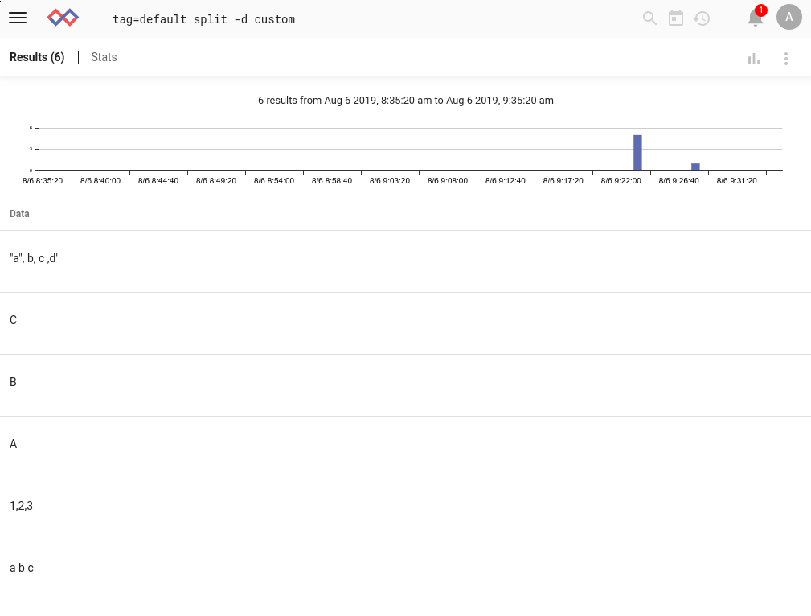
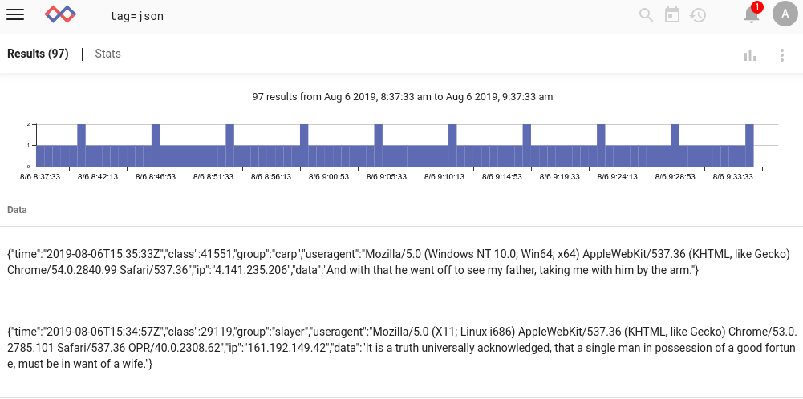
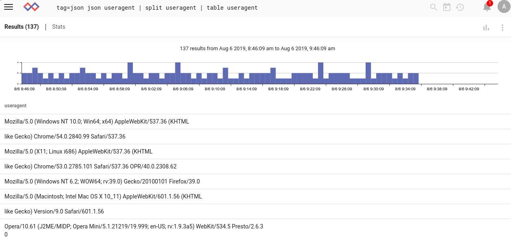
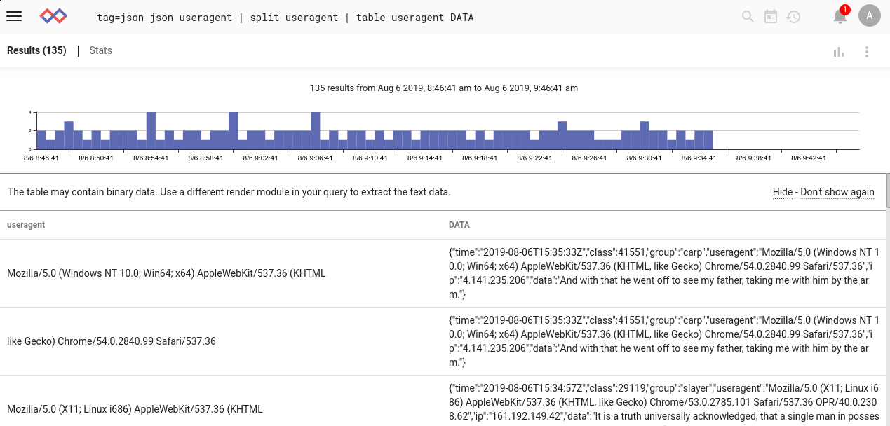

# split

split モジュールを使用すると、エントリまたは列挙された値の内容を複数のエントリに分割することができます。

## サポートされているオプション

任意のオプションの後に名前を指定すると、split モジュールは、エントリ自体の内容ではなく、名前付きの列挙された値を分割すべきであることを通知します。名前を省略すると、そのエントリに対して操作することになります。

* `-d <delim>`: デリミタを指定します。これはセミコロンのような一文字でもいいし、文字列であっても構いません。ただし、スペースを含む文字列の場合には引用符で囲んで下さい。
* `-clean`: データを分割した後、各文字列の左端と右端のタブ、スペース、引用符を削除するようにモジュールに指示します。したがって、`foo   ,'bar', baz`を含むエントリは、`foo`, `bar`, `baz` を含む3つのエントリに分割されることになります。

## 使用例

これらの例において、以下のようなエントリの例を考えてみます。



### 基本的な分割

追加の引数なしでsplitモジュールを指定すると、デフォルトの区切り文字であるコンマに基づいてエントリが分割されます。

```
tag=default split
```



### clean フラグの使用

`-clean`フラグを追加すると、末尾や先頭の引用符や空白が削除されることに注意してください。

```
tag=default split -clean
```



### 区切り文字の指定

エントリの中にはタブを含むものがあります。これは `-d` フラグを使って分割することができます。

```
tag=default split -d "\t"
```



1つのエントリ `a b c` はすべてのフィールド間にタブがあるため、3つのエントリにきれいに分割され、もう1つのエントリ `"a", b, c ,d'` は'c'と','の間に1つのタブ文字が含まれているため、2つのエントリに分割されることに注意してください。

区切り文字として任意の文字列を指定することもできます。

```
tag=default split -d custom
```



## 列挙値での使用例

この例では、[JSON generator](https://github.com/gravwell/generators)のエントリを使用して、splitモジュールが列挙値に対してどのように操作できるかを示します。



JSON構造体から'useragent'フィールドを抽出し、カンマで分割することができます。

```
tag=json json useragent | split useragent | table useragent
```



エントリの生の *contents* は変更されないことに注意してください。

```
tag=json json useragent | split useragent | table useragent DATA
```


