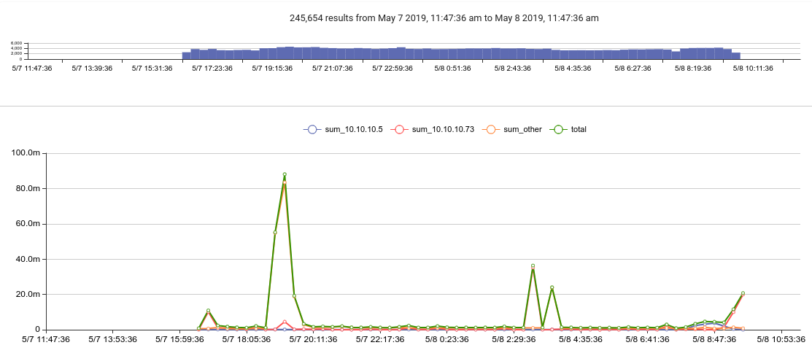

# statsモジュール

個々の数学モジュールでは1つの操作しか実行できませんが、statsモジュールでは複数の統計操作を同時に実行することができます。statsモジュールの典型的な例は、グラフ上にエラーバーを表示するために値の平均と標準偏差を計算することです。

## 構文

statsモジュールの呼び出しは、次のように構成されています。

* モジュール名 (`stats`)
* 操作のリストで、どの列挙された値を操作すべきかを指定し、オプションで出力の名前を指定します (`mean(length)`, `count as foo`)
* オプションの「by」引数で、by 引数の組み合わせごとに個別に操作を行うことを指定します (`mean(Length) by SrcIP` のように)
* オプションのタイムウィンドウ

これらの構成要素については後述します。

### サポートされているフラグ

* `-b`: このフラグは、エントリのオリジナルのボディを常に保持するようにstatsモジュールに指示します。例えば、`tag=* length | stats max(length) | text` とすると、通常、テキストレンダラでの表示を便利にするために、出力エントリの本文は最大の長さで上書きされます。`-b` フラグ (`tag=* length | stats -b max(length) | text`) を追加すると、元のボディが保存され、代わりにレンダラは表示されている最長のエントリの中身を表示します。

## 数学的演算

操作は、操作名、括弧内の「ソース」列挙値、およびオプションで出力列挙値の別の名前で構成されます。

以下の操作名をサポートしています。

* count: エントリの数を数えます
* sum: 値を足し合わせて合計を返します
* mean: 平均を計算します
* stddev: 標準偏差を計算します
* variance: 分散を計算します
* min: 最小値を返します
* max: 最大値を返します
* unique_count: ソースのユニークなインスタンスの数を返します

この操作は元の列挙値に対して実行されます。したがって、`stats sum(Bytes)`を指定すると、statsモジュールにBytesの列挙された値を合計するように指示し、合計を含む`sum`という名前の列挙された値を持つ単一のエントリを出力します。

注意: ソースが指定されていない場合は、代わりにエントリの本文に対して操作が行われます。`stats sum`を指定することは、`stats sum(DATA)`を指定することと同じです。

複数の操作を指定することができます。

```
stats sum(Bytes) mean(Bytes)
```

```
stats mean(Bytes) stddev(bytes) min(Length)
```

演算の出力は、デフォルトでは演算の名前を持つ列挙型の値に代入されます。したがって、`stats sum(Bytes)` は `sum` という名前の列挙型の値を作成して出力を保持します。これは `as` オプションで変更することができます。

```
stats mean(Bytes) as BytesAvg
```

これは、複数の異なる列挙値に対して同じ操作を行う場合に特に便利です。

```
stats mean(Bytes) as BytesAvg mean(Length) as LengthAvg
```

## 「by」引数

異なるIPごとに個別に操作を行う必要がある場合などは、「by」引数を指定する必要があります。

```
stats mean(Bytes) stddev(Bytes) by SrcIP
```

これは、各固有のSrcIP値について個別に平均と標準偏差を計算するようにstatsモジュールに指示します。結果は、各 SrcIP に対して 1 つのエントリとなり、それぞれに適切な SrcIP、平均値、および標準偏差の列挙値が含まれます。

by引数は好きなだけ指定することができます。

```
stats mean(Bytes) stddev(Bytes) by SrcIP DstIP DstPort
```

このモジュールは、 *SrcIP、DstIP、およびDstPortのすべての組み合わせ*について、個別の平均と標準偏差を計算します。

注意：メモリが限られたシステムで非常に大きなデータセットを扱う場合、引数であまりにも多くの数を指定すると、statsモジュールが何百万もの組み合わせをメモリに保持しようとするため、メモリを使い果たしてしまう可能性があります。

### 複雑な「by」引数の使用

「by」引数が1つだけ与えられ、それが最後の操作に適用された場合、statsはそれをすべての操作に適用します。 これは省略可能な方法です。 すべての操作に適用したくない場合は、最後の操作に「by」引数がないことを確認してください。

例えば、以下は `SrcIP DstIP DstPort` をキーにして「mean」操作を実行しますが、stddev 操作はキーなしで適用されます。

```
stats mean(Bytes) by SrcIP DstIP DstPort stddev(Bytes)
```

これは、すべての操作に対してキーセットを提供できることを意味します（または提供できないことを意味します）。 これは、単一のテーブルやグラフで異なるキーを持つ複数の操作を表示したい場合に便利です。

例えば、これはIP別のパケットサイズの合計を計算するクエリですが、すべてのパケットのベースラインの合計も計算します。

```
tag=pcap packet ipv4.IP ~ 10.10.10.0/24 | length | stats sum(length) by IP sum(length) as total | chart total sum by IP
```



## タイム・ウィンドウ

statsモジュールは、一時モードと凝縮モードで動作させることができます。

凝縮モードでは、結果は一度だけ出力されます。これは、テキストレンダラを使用しているときや、`-nt` フラグがテーブルレンダラに渡されているときに自動的に発生します。

一時モードでは、stats モジュールはタイム・ウィンドウにわたって動作し、デフォルトは 1 秒です。データの1秒ごとに、モジュールは結果エントリのセットを出力します。これは、チャートレンダラにデータを送信するときに使用されます。

デフォルトのウィンドウは1秒ですが、「over」オプションでウィンドウサイズを変更することができます。

```
stats mean(Bytes) stddev(Bytes) by SrcIP over 5m
```

チャートモジュールに送信すると、結果は標準の1秒ではなく5分ウィンドウで計算されます。

注意：タイムウィンドウは1つだけ指定でき、そのタイムウィンドウはすべての操作に適用されます。 タイムウィンドウは stats の最後の引数でなければなりません。
