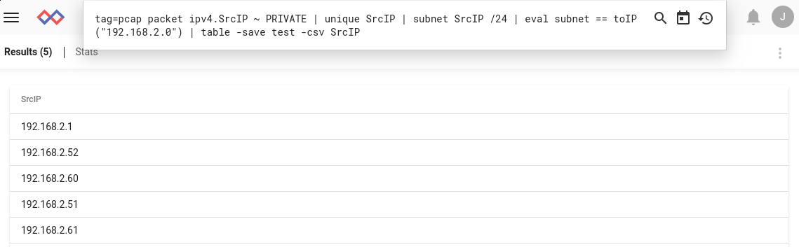
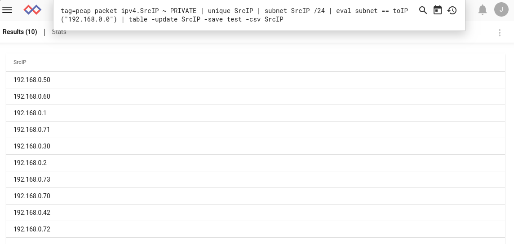

# table

tableの作成にはテーブルレンダラーを使用します。テーブルの構築は、テーブルレンダラーに引数を提供することで行われます。引数には、列挙値、tag、timestamp、またはsrcを指定する必要があります。引数はテーブルの列として使用されます。

カラム引数を指定しないと、テーブルは列挙されたすべての値を代わりにカラムとして表示します。

## サポートされているオプション

* `-save <destination>`: 結果のテーブルを[lookupモジュール](#!search/lookup/lookup.md)のリソースとして保存します。これは、ある検索の結果を保存して(例えば、DHCPログからMAC->IPマッピングを抽出するなど)、後の検索で使用するのに便利な方法です。
* `-csv`: -saveフラグと組み合わせて、テーブルをネイティブのGravwell形式ではなくCSV形式で保存します（CSVはルックアップモジュールとの互換性もあります）。データをエクスポートする場合に便利です。
* `-update <key>`: `save` フラグと組み合わせて、既存のテーブルを上書きするのではなく更新します。これは、例えばネットワーク上で見たことのあるすべてのMACアドレスのリストを保持するためにスケジュールされた検索を使用する場合に便利です。既存の lookup テーブルのカラムは、引数として与えられたカラムと一致しなければなりません。新旧の lookup テーブルをマージする際、古いテーブルの行は、そのキーとなるカラムの値が新しいテーブルに存在しない場合にのみ含まれます。
* `-nt`: テーブルを非テンポラリモードにします。これにより、テーブルが結果を凝縮させるのではなく、上流の数学モジュールが結果を凝縮させます。これは、時間的な部分選択を必要としない場合に、大量のデータの検索を著しく高速化します。これは、現在のところ、[statsモジュール](#!search/stats/stats.md)を使用する際にも必要とされています。

注意: `-save`オプションを使用する場合、テーブルはデフォルトでGravwellのネイティブパックバイナリ形式で保存されます。CSVを使いたい場合は、`-csv` フラグを指定してください。`-update`フラグは、`-csv`を指定しない限り、バイナリテーブルでCSVリソースを上書きしてしまうことに注意してください。

## クエリの例

### 基本的な table の使い方

Netflow レコードからいくつかの要素を抽出し、それらをテーブルに自動的に表示させます。

```
tag=netflow netflow Src Dst SrcPort DstPort | table
```

ブルートフォース SSH 攻撃を見つけます。

```
tag=syslog grep sshd | regex "authentication error for (?P<user>\S+)" | count by user | table user count
```


### -nt オプションの使用

大量のデータがある状況では、テーブルを強制的に非テンポラリモードにして、代わりにcountモジュールが結果を凝縮するようにします。

```
tag=jsonlogs json source | count by source | table -nt source count
```

### -save オプションの使用

DHCPログを使用して、IPからMACへのマッピングを含む lookup テーブルを構築します。

```
tag=syslog regex "DHCPACK on (?P<ip>\S+) to (?P<mac>\S+)" | unique ip mac | table -save ip2mac ip mac
```

そして、lookup テーブルを使ってSSHログインに関連するMACを探します。

```
tag=syslog grep sshd | regex "Accepted .* for (?P<user>\S+) from (?P<ip>\S+)" | lookup -r ip2mac ip ip mac as mac |table user ip mac
```


### -update オプションの使用

この例では、ローカルネットワーク上で見られるIPアドレスを含むテーブルを構築し、さらにそれを更新します。

まず、192.168.2.0/24 ネットワーク上で見られるすべてのユニークなプライベートIPv4アドレスを含むテーブルを構築します。

```
tag=pcap packet ipv4.SrcIP ~ PRIVATE | unique SrcIP | subnet SrcIP /24 | eval subnet == toIP("192.168.2.0") | table -save test -csv SrcIP
```



結果のリソース (名前は「test」) をダウンロードすると、期待されるテーブルが表示されます。

```
SrcIP
192.168.2.1
192.168.2.52
192.168.2.60
192.168.2.51
192.168.2.61
```

次に、192.168.0.0/24 サブネットで見られるIPを追加するために別の検索を実行します。

```
tag=pcap packet ipv4.SrcIP ~ PRIVATE | unique SrcIP | subnet SrcIP /24 | eval subnet == toIP("192.168.0.0") | table -update SrcIP -save test -csv SrcIP
```



表示されているテーブルには新しいIPアドレスのみが表示されますが、リソースには両方の検索結果が含まれるようになりました。

```
SrcIP
192.168.0.50
192.168.0.60
192.168.0.1
192.168.0.71
192.168.0.30
192.168.0.2
192.168.0.73
192.168.0.70
192.168.0.42
192.168.0.72
192.168.2.1
192.168.2.52
192.168.2.60
192.168.2.51
192.168.2.61
```

updateには'SrcIP'を引数として渡しています。これは重複排除のために使用されます。古いテーブルの行でSrcIPが新しいテーブルの行と一致するものは、更新されたリソースには含まれません。
