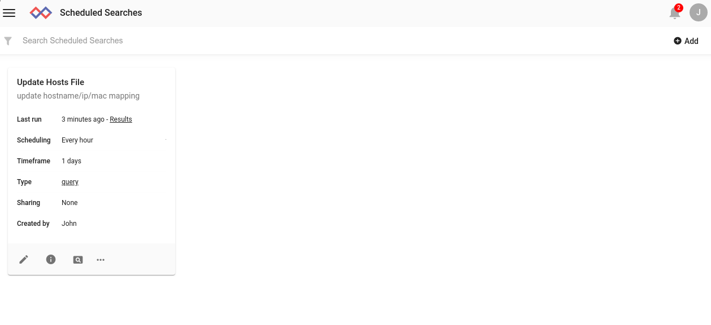
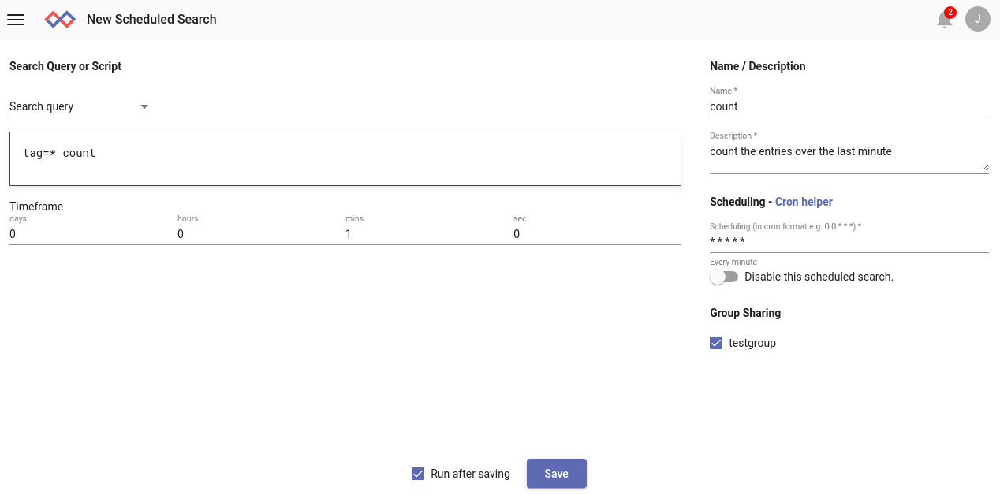

# 検索エージェントを使用した検索とスクリプトのスケジューリング

たとえば、毎朝検索を実行して前夜からの悪意のある動作を検出するなど、検索を実行したり、スクリプトを自動的に実行したりすることはしばしば有利です。 Gravwellの検索エージェントを使用すると、カスタマイズされたスケジュールで検索と[検索スクリプト](scriptingsearch.md)を実行できます。

スケジューリング機能により、ユーザーは通常の検索と[検索スクリプト](scriptingsearch.md)の両方をスケジュールできます。

## 検索エージェントのセットアップ

Gravwell Search AgentはメインのGravwellインストールパッケージに含まれるようになり、デフォルトでインストールされます。 `--no-webserver`フラグでwebserverコンポーネントを無効にするか、` --no-searchagent`フラグを設定すると、検索エージェントのインストールが無効になります。 検索エージェントはGravwell Debianパッケージによって自動的にインストールされます。

次のコマンドを使用して、検索エージェントが実行されていることを確認します。

```
$ ps aux | grep gravwell_searchagent
```

### 検索エージェントを無効にする

検索エージェントはデフォルトでインストールされますが、必要に応じて次を実行して無効にすることができます。

```
systemctl stop gravwell_searchagent.service
systemctl disable gravwell_searchagent.service
```

### 検索エージェントスクリプトでネットワーク機能を無効にする

デフォルトでは、検索エージェントによって実行されるスケジュールされたスクリプトは、httpライブラリ、sftp、sshなどのネットワークユーティリティを使用できます。`/opt/gravwell/etc/searchagent.conf`でオプション`Disable-Network-Script-Functions=true`を設定すると、これが無効になります。

## スケジュール検索の管理

スケジュール検索は、`スケジュール検索`ページから管理されます。 次のスクリーンショットは、1時間ごとに実行される単一のスケジュール検索を示しています。



## スケジュール検索の作成

新しいスケジュール検索を作成するには、[スケジュール検索]ページの右上隅にある[追加]ボタンをクリックします。 新しいページが開きます：


検索クエリを提供し、実行する時間枠を指定し、名前と説明を指定して、スケジュールを定義する必要があります。 オプションで、このスケジュールされた検索の結果をメンバーに表示できる1つ以上のグループを選択することもできます。

注：Gravwellは、cronスケジュール形式を使用して、検索をいつ実行するかを指定します。 cronに慣れていない場合は、[Wikipediaの記事](https://en.wikipedia.org/wiki/Cron)を確認し、[このサイトでスケジューリングを試してみてください](https://cron.help/)

以下に、毎分実行され、最後の1分間に入力されたエントリの数をカウントする単純なスケジュール検索を定義しました。



「保存後に実行」オプションを選択したことに注意してください。 これにより、できるだけ早く検索を実行し、通常のスケジュールを開始するように検索エージェントに指示します。 これは、検索を実行してルックアップテーブルを更新する場合に特に便利です。

[保存]をクリックすると、検索がスケジュール検索リストに表示され、すぐに実行され、[最終実行]フィールドが更新されます。


## スケジュールされたスクリプトの作成

検索クエリの代わりにスクリプトをスケジュールするには、通常どおり「追加」ボタンをクリックしますが、右上のドロップダウンを「検索クエリ」から「Ankoスクリプト」に変更します。


## 検索結果の表示

スケジュールされた検索の最後の結果を表示するには、「結果の表示」アイコンをクリックします。


スケジュール検索の最新の結果セットがロードされます。


## スケジュール検索を無効にする

スケジュールされた検索を無効にすると、再び有効になるまで再度実行されなくなります。 検索を無効にするには、3つのドットメニューを開いて追加のオプションを表示し、無効を選択します。


再度有効にするには、プロセスを繰り返します。 「無効」ではなく、メニューに「有効」と表示されます。

## 検索をすぐにスケジュールする

いつでもスケジュール検索をすぐに実行できます。 その検索の3ドットメニューを開き、[すぐにスケジュール]を選択します。 検索エージェントは、できるだけ早くクエリを実行します。


## スケジュール検索の削除

スケジュール検索を削除するには、「削除」オプションを選択します。

