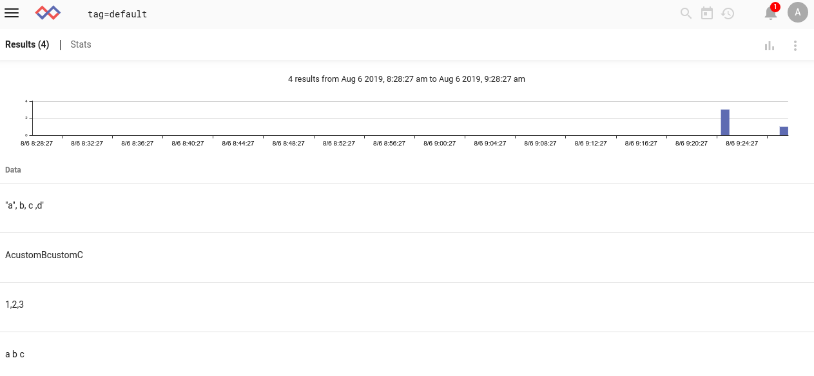

# Split

splitモジュールを使用すると、エントリまたは列挙値の内容を複数のエントリに分割できます。

## サポートされているオプション

オプションの後に名前を指定すると、エントリ自体の内容ではなく、名前付き列挙値を分割する必要があることが分割モジュールに通知されます。名前を省略すると、そのエントリで動作します。

* `-d <delim>`: 区切り文字を指定します。これは、セミコロンなどの単一の文字、または文字列です。引用符で囲むと、スペースを含む文字列になります。
* `-clean`: モジュールに、データを分割した後、各文字列の左端と右端のタブ、スペース、引用符をクリーンアップするよう指示します。したがって、`foo,'bar',baz`を含むエントリは、`foo`,`bar`,および`baz`を含む3つのエントリに分割されます。

## 使用例

これらの例では、次のエントリ例を検討します:



### 基本的な分割

追加の引数なしでsplitモジュールを指定すると、デフォルトの区切り文字であるコンマに基づいてエントリが分割されます:

```
tag=default split
```


###クリーンフラグの使用

`-clean`フラグを追加すると、末尾/先頭の引用符と空白が削除されることに注意してください
```
tag=default split -clean
```


### 区切り文字を指定する

全体の一部にはタブが含まれています。 `-d`フラグを使用してそれを分割できます:

```
tag=default split -d "\t"
```


注:1つのエントリ `a	b	c`はすべてのフィールド間にタブがあるため、3つのエントリにきれいに分割されていますが、別のエントリ、`"a",  b, c	,d'`では、'c'と','の間に単一のタブ文字が含まれていたため、2つに分割されます。

区切り文字として使用する任意の文字列を指定することもできます:

```
tag=default split -d custom
```


## 列挙値での使用例

この例では、[JSON generator](https://github.com/gravwell/generators)のエントリを使用して、分割モジュールが列挙値をどのように操作できるかを示します。


JSON構造から'useragent'フィールドを抽出し、コンマで分割できます。

```
tag=json json useragent | split useragent | table useragent
```


エントリの未加工の*contents*は変更されないことに注意してください:

```
tag=json json useragent | split useragent | table useragent DATA
```

